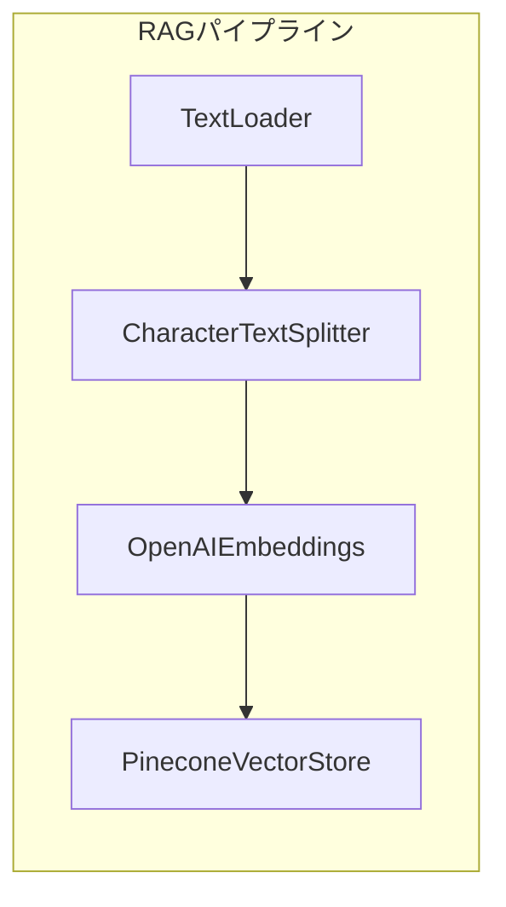

import Quiz from '@/components/content/Quiz.astro'

## 概要

このレクチャーでは，RAGパイプラインで使用する主要なLangChainクラス（TextLoader，CharacterTextSplitter，OpenAIEmbeddings，PineconeVectorStore）のソースコードを確認しながら理解を深めます．

## TextLoader



ファイルシステムからテキストを読み込む最もシンプルなDocument Loaderです．

```python
from langchain_community.document_loaders import TextLoader

loader = TextLoader("path/to/file.txt")
documents = loader.load()
```

内部的には，ファイルを開いてテキストを読み取り，メタデータ（ソースファイルパス）を付与してDocumentオブジェクトを返すだけです．

## CharacterTextSplitter

長いテキストを指定されたサイズのチャンクに分割します．

```python
from langchain.text_splitter import CharacterTextSplitter

text_splitter = CharacterTextSplitter(
    chunk_size=1000,
    chunk_overlap=0
)
chunks = text_splitter.split_documents(documents)
```

- `chunk_size`: チャンクの最大文字数
- `chunk_overlap`: チャンク間の重複文字数（文脈の連続性を保つため）

## OpenAIEmbeddings

```text
統一インターフェース（LangChain Embeddings）
┌─────────────────────────────────────────────┐
│  embed_query("テキスト") → [0.1, 0.3, ...]  │
├─────────────────────────────────────────────┤
│  OpenAI  │  Cohere  │  HuggingFace  │ ...  │
└─────────────────────────────────────────────┘
```

OpenAIのEmbeddings APIを使ってテキストをベクトルに変換します．

```python
from langchain_openai import OpenAIEmbeddings

embeddings = OpenAIEmbeddings(model="text-embedding-3-small")
```

LangChainの統一インターフェースにより，Cohere，HuggingFaceなど他のプロバイダーにも簡単に切り替えられます．

## PineconeVectorStore

ベクトルを永続化し，類似検索を提供するマネージドベクトルデータベースです．

```python
from langchain_pinecone import PineconeVectorStore

vector_store = PineconeVectorStore.from_documents(
    documents=chunks,
    embedding=embeddings,
    index_name="my-index"
)
```

## まとめ

- TextLoaderはファイルからDocumentオブジェクトを生成するシンプルなラッパー
- CharacterTextSplitterはチャンクサイズとオーバーラップを制御してテキストを分割する
- OpenAIEmbeddingsはテキストをベクトル空間のベクトルに変換する
- PineconeVectorStoreはベクトルの永続化と類似検索を提供する

<Quiz questions={[
  {
    question: "TextLoaderが返すDocumentオブジェクトに含まれるメタデータは何ですか？",
    options: [
      "ファイルの作成日時",
      "ソースファイルのパス",
      "テキストの文字数",
      "Embeddingベクトル"
    ],
    answer: 1,
    explanation: "TextLoaderはファイルを読み込む際に，メタデータとしてソースファイルのパスを付与してDocumentオブジェクトを返します．"
  },
  {
    question: "CharacterTextSplitterのchunk_sizeパラメータは何を制御しますか？",
    options: [
      "分割後のチャンク数",
      "チャンクの最大文字数",
      "チャンク間の重複文字数",
      "ベクトルの次元数"
    ],
    answer: 1,
    explanation: "chunk_sizeはチャンクの最大文字数を指定します．この値を超えないようにテキストが分割されます．"
  },
  {
    question: "LangChainのEmbeddings抽象化の利点は何ですか？",
    options: [
      "ベクトルの次元数を自動調整できる",
      "異なるプロバイダー間で統一インターフェースを使える",
      "Embeddingsの精度が自動的に向上する",
      "無料でEmbeddingsを生成できる"
    ],
    answer: 1,
    explanation: "LangChainのEmbeddings抽象化により，OpenAI，Cohere，HuggingFaceなど異なるプロバイダー間で同一のインターフェースを使用でき，切り替えが容易です．"
  },
  {
    question: "PineconeVectorStore.from_documentsメソッドが内部で行う処理はどれですか？",
    options: [
      "ドキュメントをチャンクに分割する",
      "テキストをベクトル化してインデックスに格納する",
      "ドキュメントをPDF形式に変換する",
      "LLMに質問を送信して回答を取得する"
    ],
    answer: 1,
    explanation: "from_documentsメソッドは各ドキュメントのテキストをEmbeddingsモデルでベクトル化し，バッチ処理でPineconeインデックスに格納します．"
  },
  {
    question: "chunk_overlapを0に設定した場合の動作はどうなりますか？",
    options: [
      "テキストが分割されなくなる",
      "全てのチャンクが完全に同じ内容になる",
      "チャンク間でテキストの重複がなくなる",
      "エラーが発生する"
    ],
    answer: 2,
    explanation: "chunk_overlapを0に設定すると，分割されたチャンク間でテキストの重複が発生しません．文脈の連続性よりもデータの冗長性を避ける場合に使用します．"
  }
]} />
