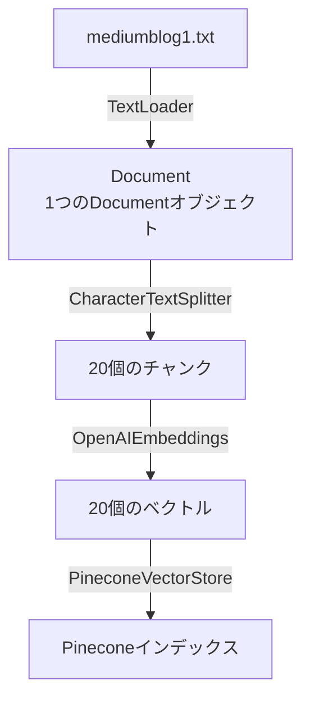

import Quiz from '@/components/content/Quiz.astro'

## 概要

このレクチャーでは，Mediumブログ記事を読み込み，チャンクに分割し，ベクトル化してPineconeに格納する一連のIngestionパイプラインを実装します．



## Ingestionパイプラインの実装

```python
from langchain_community.document_loaders import TextLoader
from langchain.text_splitter import CharacterTextSplitter
from langchain_openai import OpenAIEmbeddings
from langchain_pinecone import PineconeVectorStore

# 1. ドキュメントの読み込み
loader = TextLoader("mediumblog1.txt")
document = loader.load()  # List[Document]（1要素）

# 2. チャンクに分割
text_splitter = CharacterTextSplitter(
    chunk_size=1000,
    chunk_overlap=0
)
texts = text_splitter.split_documents(document)
# → 20個のチャンクが生成される

# 3. EmbeddingsモデルとVector Storeへのインデックス
embeddings = OpenAIEmbeddings(
    openai_api_key=os.environ.get("OPENAI_API_KEY")
)

PineconeVectorStore.from_documents(
    texts,
    embeddings,
    index_name=os.environ.get("INDEX_NAME")
)
```

## チャンクサイズの考え方

- 小さすぎると意味が失われる
- 大きすぎるとコンテキストウィンドウに収まらない
- 人間が読んで意味が理解できるサイズが目安（1000文字程度）

## Pineconeのデータ構造

| フィールド | 値 |
|---|---|
| id | `"abc-123"` |
| text | `"チャンクのテキスト内容..."` |
| source | `"mediumblog1.txt"` |
| vector | `[0.012, -0.034, 0.056, ..., 0.078]`（1536次元） |

インデックスに格納される各レコードは以下を含みます:
- `text`: チャンクのテキスト内容
- `source`: 元のファイルパス（メタデータ）
- ベクトル: 数値の配列（Embeddingの結果）

## LangChainの内部動作

`from_documents`メソッドは内部で以下を実行します:
1. 各ドキュメントのテキストをEmbeddingsモデルでベクトル化
2. バッチ処理とAsync I/Oで効率的にインデックスに格納
3. レート制限のハンドリング

## まとめ

- Ingestionパイプラインはたった数行のコードで実装できる
- LangChainが重い処理（バッチ処理，非同期処理，レート制限）を代行する
- チャンクサイズは人間が読んで理解できるサイズが目安
- ベクトルからテキストへの逆変換は不可能なので，テキストも一緒に保存する

<Quiz questions={[
  {
    question: "TextLoaderのload()メソッドが返すのは何ですか？",
    options: [
      "文字列のリスト",
      "Documentオブジェクトのリスト",
      "ベクトルの配列",
      "辞書のリスト"
    ],
    answer: 1,
    explanation: "TextLoaderのload()メソッドはLangChainのDocumentオブジェクトのリストを返します．テキストファイルの場合は1つのDocumentを含むリストです．"
  },
  {
    question: "chunk_sizeを1000に設定した場合，なぜ一部のチャンクが1000文字を超えることがありますか？",
    options: [
      "バグが原因である",
      "Embeddingsモデルが文字を追加するから",
      "セパレータでの分割が厳密でないため",
      "Pineconeが文字を追加するから"
    ],
    answer: 2,
    explanation: "CharacterTextSplitterはセパレータ（改行など）で分割するため，厳密にchunk_size以下にならない場合があります．"
  },
  {
    question: "チャンクサイズの適切な目安は何ですか？",
    options: [
      "できるだけ小さくする",
      "できるだけ大きくする",
      "人間が読んで意味が理解できるサイズ",
      "LLMのトークン制限と同じサイズ"
    ],
    answer: 2,
    explanation: "チャンクサイズの目安は人間が読んで意味が理解できるサイズです．小さすぎると意味が失われ，大きすぎるとコンテキストウィンドウに収まりません．"
  },
  {
    question: "from_documentsメソッドがバッチ処理を行う理由は何ですか？",
    options: [
      "チャンクの品質を向上させるため",
      "効率的にインデックスに格納しレート制限を処理するため",
      "テキストの文法を検証するため",
      "ベクトルの次元数を最適化するため"
    ],
    answer: 1,
    explanation: "from_documentsメソッドはバッチ処理とAsync I/Oを使用して効率的にインデックスに格納し，APIのレート制限にも対応します．"
  },
  {
    question: "ベクトルと共にテキストも保存する理由は何ですか？",
    options: [
      "検索速度を向上させるため",
      "ベクトルからテキストへの逆変換が不可能なため",
      "Pineconeの仕様で必須だから",
      "LangChainのバージョン互換性のため"
    ],
    answer: 1,
    explanation: "Embeddingで生成されたベクトルからは元のテキストを復元できないため，LLMに提供するコンテキストとして使えるようテキストも一緒に保存します．"
  }
]} />
