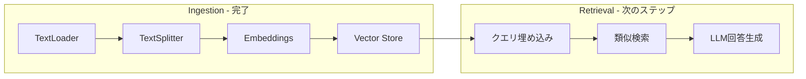

import Quiz from '@/components/content/Quiz.astro'

## 概要

このレクチャーでは，データインデックス（Ingestion）フェーズの完了を振り返り，次に実装するRetrievalフェーズの概要を説明します．

## Ingestionフェーズの完了

これまでに以下を完了しました:
1. MediumブログをTextLoaderで読み込み
2. CharacterTextSplitterでチャンクに分割
3. OpenAI Embeddingsでベクトル化
4. PineconeにインデックスとしてVectorStoreに格納

## Retrievalフェーズの概要

次のフェーズでは以下を実装します:

1. ユーザーのクエリをベクトルに変換
2. ベクトルデータベースからTop K件の類似チャンクを検索
3. 関連チャンクとユーザークエリをLLMに送信
4. LLMが回答を生成

## 技術的な更新点

LangChainは頻繁に更新されるため，Retrievalの動画は最新バージョンに合わせて再録画されています．IDE はCursorを使用し，パッケージマネージャーはuvを使用します．

## まとめ

- Ingestionフェーズではデータをベクトル化してVector Storeに格納した
- Retrievalフェーズではユーザークエリに基づく類似検索と回答生成を実装する
- 既存のIngestionコードは最新のLangChainでも変更なく動作する

<Quiz questions={[
  {
    question: "Ingestionフェーズで最初に行う処理は何ですか？",
    options: [
      "テキストをベクトルに変換する",
      "MediumブログをTextLoaderで読み込む",
      "Pineconeに格納する",
      "ユーザーのクエリを処理する"
    ],
    answer: 1,
    explanation: "Ingestionフェーズでは，最初にTextLoaderを使ってMediumブログのテキストデータを読み込みます．"
  },
  {
    question: "Retrievalフェーズで「Top K件」とは何を意味しますか？",
    options: [
      "最も古いK件のドキュメント",
      "ランダムに選ばれたK件のチャンク",
      "クエリベクトルに最も類似するK件のチャンク",
      "最も長いK件のテキスト"
    ],
    answer: 2,
    explanation: "Top Kとは，ユーザーのクエリベクトルとの類似度が高い上位K件のチャンクを検索結果として取得することを意味します．"
  },
  {
    question: "IngestionフェーズとRetrievalフェーズの違いは何ですか？",
    options: [
      "Ingestionは検索，Retrievalは格納",
      "Ingestionはデータの格納，Retrievalはデータの検索と回答生成",
      "Ingestionはオンライン処理，Retrievalはオフライン処理",
      "両者は同じ処理を行う"
    ],
    answer: 1,
    explanation: "Ingestionフェーズはデータをベクトル化してVector Storeに格納する前処理で，Retrievalフェーズはユーザークエリに基づく類似検索と回答生成を行います．"
  },
  {
    question: "LangChainのRetrievalコードが再録画された理由は何ですか？",
    options: [
      "Ingestionのコードにバグがあったから",
      "Pineconeのサービスが変更されたから",
      "LangChainが頻繁に更新されRetrievalの実装が大きく変わったから",
      "新しいEmbeddingsモデルが登場したから"
    ],
    answer: 2,
    explanation: "LangChainは頻繁に更新されるため，特にRetrievalの実装が大きく変わりました．Ingestionコードは変更なく動作しています．"
  },
  {
    question: "Retrievalフェーズの正しい実行順序はどれですか？",
    options: [
      "LLM回答生成 → クエリベクトル化 → 類似検索",
      "類似検索 → クエリベクトル化 → LLM回答生成",
      "クエリベクトル化 → 類似検索 → LLM回答生成",
      "クエリベクトル化 → LLM回答生成 → 類似検索"
    ],
    answer: 2,
    explanation: "Retrievalフェーズではまずユーザーのクエリをベクトルに変換し，次にVector Storeで類似チャンクを検索し，最後にLLMが回答を生成します．"
  }
]} />
