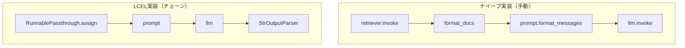
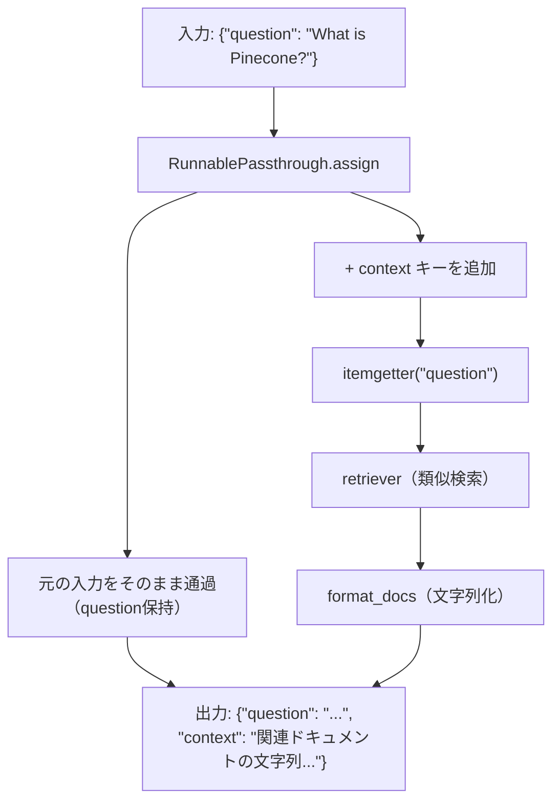

import Quiz from '@/components/content/Quiz.astro'

## 概要

このレクチャーでは，RAGのRetrievalパイプラインを2通りの方法で実装します．まずナイーブな（手動の）実装，次にLCEL（LangChain Expression Language）を使った洗練された実装を行います．



## ナイーブな実装

```python
def retrieval_chain_without_lcel(query: str) -> str:
    # 1. 類似ドキュメントを検索
    docs = retriever.invoke(query)

    # 2. ドキュメントを文字列にフォーマット
    context = format_docs(docs)

    # 3. プロンプトテンプレートに埋め込む
    messages = prompt.format_messages(
        context=context, question=query
    )

    # 4. LLMを呼び出す
    response = llm.invoke(messages)
    return response.content
```

この実装の制限: ストリーミング非対応，非同期非対応，LangSmithでのトレースが分断される

## LCELを使った実装

```python
from langchain_core.runnables import RunnablePassthrough
from operator import itemgetter

retrieval_chain = (
    RunnablePassthrough.assign(
        context=itemgetter("question")
        | retriever
        | format_docs
    )
    | prompt
    | llm
    | StrOutputParser()
)

result = retrieval_chain.invoke(
    {"question": "What is Pinecone in machine learning?"}
)
```

### RunnablePassthrough.assignの仕組み



1. 入力辞書`{"question": "..."}`がそのまま通過する
2. `context`キーの値として，サブチェーン（retriever | format_docs）が実行される
3. 結果として`{"question": "...", "context": "..."}`がプロンプトに渡される

## LCELの利点

- 宣言的で読みやすいコード
- ストリーミング/非同期/バッチ処理のサポート
- LangSmithでの完全なトレース可視化
- 他のチェーンとの簡単な合成

## まとめ

- ナイーブな実装は理解しやすいが，本番利用には制限がある
- LCELでチェーンとして構築すると，トレースの可視化と機能拡張が容易
- `RunnablePassthrough.assign`で入力辞書に計算結果を追加できる
- Retrieverの`invoke`メソッドが類似検索を実行する

<Quiz questions={[
  {
    question: "ナイーブなRetrieval実装の主な制限は何ですか？",
    options: [
      "LLMを呼び出せない",
      "ストリーミング非対応でLangSmithのトレースが分断される",
      "ベクトル検索ができない",
      "プロンプトテンプレートが使えない"
    ],
    answer: 1,
    explanation: "ナイーブな実装はストリーミング非対応，非同期非対応で，LangSmithでのトレースが各ステップごとにバラバラに表示されます．"
  },
  {
    question: "RunnablePassthrough.assignの役割は何ですか？",
    options: [
      "入力を完全に置き換える",
      "入力辞書を保持しつつ新しいキーと値を追加する",
      "LLMの出力をパースする",
      "ベクトルデータベースを初期化する"
    ],
    answer: 1,
    explanation: "RunnablePassthrough.assignは入力辞書をそのまま通過させつつ，サブチェーンの結果を新しいキーとして追加します．"
  },
  {
    question: "LCELチェーンでformat_docsのような通常のPython関数はどのように扱われますか？",
    options: [
      "エラーになり使用できない",
      "自動的にRunnableLambdaに変換される",
      "手動でRunnableクラスにラップする必要がある",
      "非同期関数に変換する必要がある"
    ],
    answer: 1,
    explanation: "LCELチェーン内で通常のPython関数を使用すると，LangChainが自動的にRunnableLambdaに変換し，Runnableインターフェースに準拠させます．"
  },
  {
    question: "Retrieverのsearch_kwargsでk=3を設定した場合の動作はどうなりますか？",
    options: [
      "検索を3回繰り返す",
      "3つのVector Storeを同時に検索する",
      "類似度上位3件のドキュメントを返す",
      "チャンクを3分割する"
    ],
    answer: 2,
    explanation: "k=3を設定すると，クエリベクトルに最も類似する上位3件のドキュメントがVector Storeから返されます．"
  },
  {
    question: "itemgetterの役割は何ですか？",
    options: [
      "APIからデータを取得する",
      "辞書から指定したキーの値を抽出する",
      "リストをソートする",
      "ファイルを読み込む"
    ],
    answer: 1,
    explanation: "itemgetterはPythonのoperatorモジュールの関数で，辞書から指定したキーの値を抽出するcallableオブジェクトを作成します．"
  }
]} />
