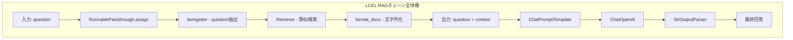

import Quiz from '@/components/content/Quiz.astro'

## 概要

このレクチャーでは，LCEL版のRAGチェーンを完成させ，LangSmithでの詳細なトレースを確認します．ナイーブ実装との可視化の違いを比較します．

## LCELチェーンの詳細な動作

### RunnablePassthrough.assignの内部動作

入力: `{"question": "What is Pinecone in machine learning?"}`

1. `itemgetter("question")` → 質問文字列を抽出
2. `retriever` → 類似ドキュメント3件を検索
3. `format_docs` → ドキュメントを1つの文字列に結合
4. 結果を`context`キーに割り当て

出力: `{"question": "...", "context": "関連ドキュメントの文字列"}`

### プロンプトテンプレート

```python
prompt = ChatPromptTemplate.from_template(
    """Answer the question based only on the following context:
    {context}
    Question: {question}
    Provide a detailed answer."""
)
```



## LangSmithでのトレース比較

### ナイーブ実装のトレース
- 各ステップがバラバラに表示される
- デバッグが困難

### LCEL実装のトレース
- 全ステップが1つのRunnable Sequenceの下にまとまる
- 各ステップの入出力，実行時間が明確に表示される
- ボトルネックの特定が容易

## RAGの結果比較

- RAGなし（GPT-3.5）: Pineconeを「ハイパーパラメータ検索のアルゴリズム」と誤答（ハルシネーション）
- RAGあり（GPT-3.5）: Pineconeを「クラウドベースのベクトルデータベース」と正しく回答
- GPT-5.2（RAGなし）: 正しく回答（新しいモデルは学習データにPineconeの情報を含む）

## まとめ

- LCELでRAGチェーンを構築すると，LangSmithでの可視化が劇的に改善される
- `RunnablePassthrough.assign`は入力辞書にサブチェーンの結果を追加する強力なパターン
- RAGにより，古いモデルでも正確な回答を生成できる
- LangSmithのトレースでボトルネック特定とデバッグが容易になる

<Quiz questions={[
  {
    question: "LCEL実装のトレースがナイーブ実装より優れている点は何ですか？",
    options: [
      "トレースが不要になる",
      "全ステップが1つのRunnable Sequenceにまとまり可視化しやすい",
      "LangSmithを使わなくてもデバッグできる",
      "実行速度が10倍速くなる"
    ],
    answer: 1,
    explanation: "LCEL実装では全ステップが1つのRunnable Sequenceの下にまとまり，各ステップの入出力や実行時間が明確に表示されます．"
  },
  {
    question: "RAGなしのGPT-3.5がPineconeについて誤った回答をした理由は何ですか？",
    options: [
      "GPT-3.5にバグがあったから",
      "プロンプトが英語だったから",
      "学習データにPineconeのベクトルストアとしての情報が不足していたから",
      "APIキーが間違っていたから"
    ],
    answer: 2,
    explanation: "GPT-3.5はPineconeがベクトルストアとして確立される前に学習されたため，正確な情報を持っておらずハルシネーションが発生しました．"
  },
  {
    question: "StrOutputParserの役割は何ですか？",
    options: [
      "プロンプトテンプレートを初期化する",
      "LLMの応答からテキスト内容（content）を抽出する",
      "ドキュメントをチャンクに分割する",
      "ベクトルを文字列に変換する"
    ],
    answer: 1,
    explanation: "StrOutputParserはLLMの応答（AIMessage）から.content属性のテキストを抽出するパーサーです．"
  },
  {
    question: "RAGを使うことでGPT-3.5でも正確な回答が得られた理由は何ですか？",
    options: [
      "モデルが自動的にアップグレードされたから",
      "関連するコンテキスト情報がプロンプトに含まれたから",
      "インターネット検索が自動で行われたから",
      "Pineconeが回答を生成したから"
    ],
    answer: 1,
    explanation: "RAGにより関連するチャンクがコンテキストとしてプロンプトに含まれるため，学習データに含まれない情報でも正確に回答できます．"
  },
  {
    question: "RunnablePassthrough.assignの出力辞書に含まれるキーは何ですか？",
    options: [
      "questionのみ",
      "contextのみ",
      "questionとcontext",
      "question，context，answer"
    ],
    answer: 2,
    explanation: "RunnablePassthrough.assignは元の入力のquestionキーを保持しつつ，サブチェーンの結果をcontextキーとして追加した辞書を出力します．"
  }
]} />
