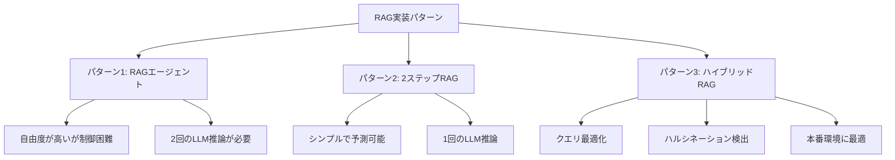

import Quiz from '@/components/content/Quiz.astro'

## 概要

このレクチャーでは，LangChain公式ドキュメントに記載されているRAG実装パターンを批判的に分析し，本番環境に適した実装アプローチを考察します．

## LangChainドキュメントのRAGパターン

### パターン1: RAGエージェント（公式推奨）

公式ドキュメントでは，検索をツールとしてReActエージェントに持たせるパターンが紹介されています．

問題点:
- LLMにツール呼び出しの判断を委ねるため，制御が困難
- 不必要な検索をスキップしたり，余分な検索を行う可能性がある
- 2回のLLM推論が必要（クエリ生成 + 回答生成）でレイテンシが増加
- 本番環境のカスタマーサポートでは不適切な回答をする危険性がある

### パターン2: 2ステップRAG（コースで教えた方法）

検索を常に実行し，結果をコンテキストとしてLLMに渡す固定パイプライン．

利点:
- 1回のLLM推論でレイテンシが低い
- 動作が予測可能で制御しやすい

### パターン3: ハイブリッドRAG（LangGraph）

クエリの前処理，検索の検証，回答の検証を含む高度なアーキテクチャ．

特徴:
- クエリの最適化（Query Enhancement）
- 検索結果の検証（Retrieval Validation）
- ハルシネーション検出（Answer Validation）
- 研究論文に基づいた実装

## 推奨アプローチ

本番環境では:
- RAGエージェント（パターン1）は自由度が高すぎて危険
- 2ステップRAGは簡単だが柔軟性に欠ける
- ハイブリッドRAG（LangGraph）が最もバランスが良い

## まとめ

- LangChain公式ドキュメントのRAGエージェントパターンは本番環境には不向き
- 2ステップRAGはシンプルだが予測可能で信頼性が高い
- LangGraphを使ったハイブリッドRAGが本番環境のベストプラクティス
- 検索の検証やハルシネーション検出などの中間ステップが品質向上に寄与する

<Quiz questions={[
  {
    question: "RAGエージェントパターンが本番環境に不向きとされる主な理由は何ですか？",
    options: [
      "実装が複雑すぎるから",
      "LLMにツール呼び出しの判断を委ねるため制御が困難だから",
      "ベクトル検索ができないから",
      "LangChainに対応していないから"
    ],
    answer: 1,
    explanation: "RAGエージェントパターンではLLMにツール呼び出しの判断を委ねるため，不必要な検索のスキップや余分な検索が発生し，本番環境では制御が困難です．"
  },
  {
    question: "2ステップRAGの利点はどれですか？",
    options: [
      "複数のLLM推論を並列実行できる",
      "ツール呼び出しが柔軟にできる",
      "1回のLLM推論で済みレイテンシが低い",
      "ハルシネーション検出が自動で行われる"
    ],
    answer: 2,
    explanation: "2ステップRAGは検索を常に実行し結果をコンテキストとしてLLMに渡す固定パイプラインのため，1回のLLM推論で完了しレイテンシが低くなります．"
  },
  {
    question: "ハイブリッドRAG（LangGraph）に含まれる機能でないものはどれですか？",
    options: [
      "クエリの最適化",
      "検索結果の検証",
      "自動的なモデル切り替え",
      "ハルシネーション検出"
    ],
    answer: 2,
    explanation: "ハイブリッドRAGにはクエリ最適化，検索結果の検証，ハルシネーション検出が含まれますが，自動的なモデル切り替えは含まれません．"
  },
  {
    question: "RAGエージェントで2回のLLM推論が必要になる理由は何ですか？",
    options: [
      "エラーハンドリングのため",
      "クエリ生成と回答生成の2段階があるため",
      "ベクトル検索を2回実行するため",
      "プロンプトの検証のため"
    ],
    answer: 1,
    explanation: "RAGエージェントではツール呼び出し用のクエリを生成する推論と，検索結果を基に回答を生成する推論の2回が必要です．"
  },
  {
    question: "カスタマーサポートのRAGシステムで最も推奨されるアプローチはどれですか？",
    options: [
      "RAGなしでLLMのみ使用する",
      "ReActエージェントで自由に応答させる",
      "LangGraphを使ったハイブリッドRAG",
      "全文をプロンプトに埋め込む"
    ],
    answer: 2,
    explanation: "本番環境のカスタマーサポートにはLangGraphを使ったハイブリッドRAGが最もバランスが良く，検索の検証やハルシネーション検出も含まれます．"
  }
]} />
