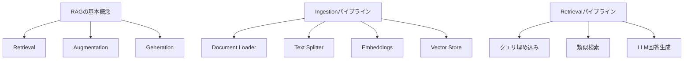

import Quiz from '@/components/content/Quiz.astro'

## 概要

このクイズでは，RAGの基本概念，Ingestion/Retrievalパイプライン，Vector Store，Embeddingsに関する理解度を確認します．

## 主要なトピック

- RAGの3つの要素（Retrieval，Augmentation，Generation）
- Document Loaderの役割と種類
- Text Splitterのチャンクサイズとオーバーラップ
- Embeddingsモデルの動作原理
- Vector Storeの類似検索メカニズム
- LCELを使ったRAGチェーンの構築
- RunnablePassthrough.assignのパターン

## 学習のポイント

- RAGはLLMのトークン制限，精度低下，コスト，レイテンシの4つの問題を解決する
- Embeddingsは意味的に類似したテキストをベクトル空間で近くに配置する
- ベクトルからテキストへの逆変換は不可能（一方向関数）
- LCELでチェーンを構築するとLangSmithでの可視化が改善される

<Quiz questions={[
  {
    question: "RAGが解決する4つの問題に含まれないものはどれですか？",
    options: [
      "トークン制限の超過",
      "Needle in the Haystack問題",
      "モデルの学習時間",
      "コストとレイテンシ"
    ],
    answer: 2,
    explanation: "RAGが解決する4つの問題はトークン制限，Needle in the Haystack問題，コスト，レイテンシです．モデルの学習時間はRAGの対象外です．"
  },
  {
    question: "Embeddingsが「一方向関数」と呼ばれる理由は何ですか？",
    options: [
      "1つの言語にしか対応しないから",
      "テキストからベクトルへの変換は可能だがベクトルからテキストへの逆変換は不可能だから",
      "1つのモデルしか使えないから",
      "1回しか実行できないから"
    ],
    answer: 1,
    explanation: "Embeddingsモデルはテキストをベクトルに変換できますが，ベクトルから元のテキストを復元することは不可能な一方向の処理です．"
  },
  {
    question: "RunnablePassthrough.assignパターンの主な用途は何ですか？",
    options: [
      "LLMのモデルを切り替える",
      "入力辞書に計算結果を新しいキーとして追加する",
      "エラーハンドリングを行う",
      "ベクトルデータベースを作成する"
    ],
    answer: 1,
    explanation: "RunnablePassthrough.assignは入力辞書を保持しながら，サブチェーンの計算結果を新しいキーとして追加するパターンです．"
  },
  {
    question: "Vector Storeの類似検索でk=5と設定した場合の動作はどうなりますか？",
    options: [
      "ランダムに5件のドキュメントを返す",
      "全ドキュメントを5つのグループに分割する",
      "クエリに最も類似する上位5件のドキュメントを返す",
      "5回の検索を繰り返す"
    ],
    answer: 2,
    explanation: "kパラメータはクエリベクトルに最も類似するドキュメントの取得件数を指定し，k=5では上位5件が返されます．"
  },
  {
    question: "LCELでRAGチェーンを構築する最大の利点は何ですか？",
    options: [
      "コードの行数が減る",
      "LangSmithでの完全なトレース可視化とストリーミング対応",
      "ベクトル検索の精度が上がる",
      "LLMの応答速度が速くなる"
    ],
    answer: 1,
    explanation: "LCELでチェーンを構築すると，LangSmithでの完全なトレース可視化に加え，ストリーミング，非同期，バッチ処理のサポートが得られます．"
  }
]} />
