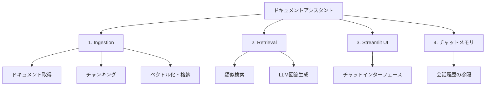

import Quiz from '@/components/content/Quiz.astro'

## 概要

このレクチャーでは，LangChainドキュメントに対する質問応答システム「ドキュメントアシスタント」をエンドツーエンドで構築するプロジェクトの全体像を紹介します．

## プロジェクトの構成

1. ドキュメントの取得とインデックス作成（Ingestion）
2. 検索チェーンの実装（Retrieval）
3. StreamlitによるフロントエンドUI
4. チャットメモリの統合

## 学習するトピック

- ベクトルデータベースとSimilarity Search
- Retrievalパイプラインの構築
- Streamlitでのフロントエンド構築
- LangChainのソースコード理解
- Generative UIの基礎

## まとめ

- ドキュメントアシスタントはRAGの実践的な応用例
- Ingestion，Retrieval，UI，メモリの4つのフェーズで構築する
- エンドツーエンドの実装を通じて本番レベルのRAGを理解する

<Quiz questions={[
  {
    question: "ドキュメントアシスタントプロジェクトの4つのフェーズに含まれないものはどれですか？",
    options: [
      "Ingestion（ドキュメント取り込み）",
      "Retrieval（検索チェーン）",
      "モデルのファインチューニング",
      "StreamlitによるフロントエンドUI"
    ],
    answer: 2,
    explanation: "ドキュメントアシスタントはIngestion，Retrieval，Streamlit UI，チャットメモリの4フェーズで構成され，モデルのファインチューニングは含まれません．"
  },
  {
    question: "このプロジェクトでフロントエンドの構築に使用するフレームワークは何ですか？",
    options: [
      "React",
      "Flask",
      "Streamlit",
      "Django"
    ],
    answer: 2,
    explanation: "このプロジェクトではStreamlitを使用してフロントエンドのチャットインターフェースを構築します．"
  },
  {
    question: "チャットメモリを統合する目的は何ですか？",
    options: [
      "検索速度を向上させるため",
      "過去の会話を参照して文脈のある応答を可能にするため",
      "ベクトルデータベースの容量を増やすため",
      "APIコストを削減するため"
    ],
    answer: 1,
    explanation: "チャットメモリの統合により，過去の質問や回答を参照でき，文脈を踏まえた応答が可能になります．"
  },
  {
    question: "Similarity Searchはプロジェクトのどのフェーズで使用されますか？",
    options: [
      "Ingestionフェーズ",
      "Retrievalフェーズ",
      "UI構築フェーズ",
      "メモリ統合フェーズ"
    ],
    answer: 1,
    explanation: "Similarity Search（類似検索）はRetrievalフェーズでユーザーのクエリに関連するチャンクを検索するために使用されます．"
  },
  {
    question: "このプロジェクトで対象とするドキュメントは何ですか？",
    options: [
      "Pythonの公式ドキュメント",
      "LangChainのドキュメント",
      "OpenAIのAPIドキュメント",
      "Pineconeのドキュメント"
    ],
    answer: 1,
    explanation: "このプロジェクトではLangChainのドキュメントを対象としてRAGシステムを構築します．"
  }
]} />
