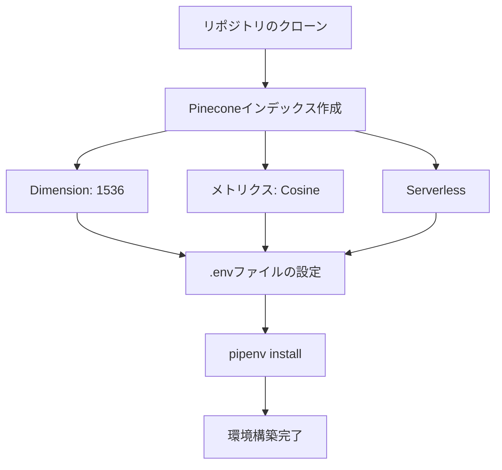

import Quiz from '@/components/content/Quiz.astro'

## 概要

このレクチャーでは，ドキュメントアシスタントプロジェクトの環境を構築します．リポジトリのクローン，Pineconeインデックスの作成，APIキーの設定を行います．

## セットアップ手順



### 1. リポジトリのクローン

```bash
git clone <repository-url> -b 1-start-here
```

### 2. Pineconeインデックスの作成

- インデックス名: `langchain-doc-index`
- Embeddingsモデル: `text-embedding-3-small`（OpenAI）
- Dimension: 1536
- メトリクス: Cosine
- 容量モード: Serverless

### 3. 環境変数の設定

```bash
# .envファイル
PINECONE_API_KEY=your_pinecone_key
OPENAI_API_KEY=your_openai_key
```

### 4. 依存パッケージのインストール

```bash
pipenv install
```

## Pineconeのクラウドプロバイダー選択

- AWS，GCP，Azureから選択可能
- レイテンシ削減のため，アプリケーションと同じリージョンを推奨
- GDPR準拠が必要な場合はヨーロッパのデータセンターを選択

## まとめ

- プロジェクトは専用ブランチからクローンする
- Pineconeインデックスの次元数はEmbeddingsモデルと一致させる
- 環境変数にはAPIキーを安全に格納する
- クラウドプロバイダーとリージョンの選択は本番環境で重要になる

<Quiz questions={[
  {
    question: "Pineconeインデックスの次元数を1536に設定する理由は何ですか？",
    options: [
      "Pineconeのデフォルト値だから",
      "text-embedding-3-smallモデルの出力ベクトル次元数と一致させるため",
      "検索速度を最大化するため",
      "無料枠の制限内に収めるため"
    ],
    answer: 1,
    explanation: "インデックスの次元数は使用するEmbeddingsモデルの出力次元数と一致させる必要があり，text-embedding-3-smallは1536次元を出力します．"
  },
  {
    question: "Pineconeのクラウドプロバイダーとリージョンの選択が重要な理由は何ですか？",
    options: [
      "料金が変わるだけ",
      "レイテンシ削減とGDPR等のコンプライアンス対応のため",
      "ベクトルの精度が変わるため",
      "使用できるEmbeddingsモデルが変わるため"
    ],
    answer: 1,
    explanation: "アプリケーションと同じリージョンにデプロイすることでレイテンシが削減され，GDPR準拠にはヨーロッパのデータセンター選択が必要です．"
  },
  {
    question: "Cosineメトリクスは何を測定しますか？",
    options: [
      "ベクトル間のユークリッド距離",
      "ベクトル間の角度に基づく類似度",
      "ベクトルの長さの差",
      "ベクトルの次元数の差"
    ],
    answer: 1,
    explanation: "Cosineメトリクスはベクトル間の角度に基づく類似度を測定し，意味的な類似性の比較に広く使われています．"
  },
  {
    question: "プロジェクトのブランチ名「1-start-here」の意味は何ですか？",
    options: [
      "最終完成版のコード",
      "テスト用のブランチ",
      "ボイラープレートコードが含まれる開始地点のブランチ",
      "デプロイ用のブランチ"
    ],
    answer: 2,
    explanation: "1-start-hereブランチにはプロジェクトの開始に必要なボイラープレートコードが含まれており，ここからコーディングを始めます．"
  },
  {
    question: ".envファイルをGitにコミットしない理由は何ですか？",
    options: [
      "ファイルサイズが大きすぎるから",
      "APIキーなどの機密情報が含まれるから",
      "Pythonの実行に不要だから",
      "Pineconeが禁止しているから"
    ],
    answer: 1,
    explanation: ".envファイルにはAPIキーなどの機密情報が含まれるため，.gitignoreに追加してGitリポジトリにコミットしないのがセキュリティ上の標準的な慣行です．"
  }
]} />
