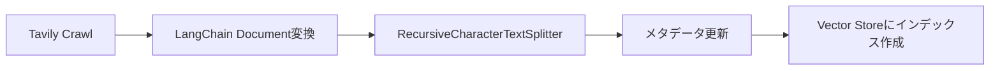

import Quiz from '@/components/content/Quiz.astro'

## 概要

このレクチャーでは，Tavily Crawlを使ったドキュメントのクロール・スクレイピングから，チャンキング，インデックス作成までのIngestionパイプラインの全体像を紹介します．

## パイプラインの全体像

1. Tavily Crawlで最新のLangChainドキュメントを取得
2. 取得したデータをLangChain Documentオブジェクトに変換
3. RecursiveCharacterTextSplitterでチャンクに分割
4. メタデータを更新
5. ベクトル化してVector Storeにインデックス作成

## なぜTavily Crawlを使うのか

以前は手動でスクリプトを書いてクローリングしていましたが，多くの問題がありました:
- ボット保護への対応
- 動的にレンダリングされるページの取得
- レート制限の管理
- マシンごとに異なる動作

Tavily Crawlはこれらの問題を全て解決し，数行のAPIコールで完了します．

## 料金について

Tavilyは非常に寛大な無料枠を提供しており，このコースの目的には十分です．

## まとめ

- Ingestionパイプラインはデータ取得→変換→チャンキング→インデックス作成の流れ
- Tavily Crawlを使うことでクローリングの複雑さから解放される
- 重い処理はLangChainとTavilyが代行する

<Quiz questions={[
  {
    question: "Tavily Crawlを使う最大の利点は何ですか？",
    options: [
      "無料で無制限に使える",
      "ボット保護や動的レンダリングなどクローリングの複雑さから解放される",
      "ベクトル検索も同時に行える",
      "LLMの学習データを自動更新できる"
    ],
    answer: 1,
    explanation: "Tavily Crawlはボット保護への対応，動的にレンダリングされるページの取得，レート制限の管理などの複雑な問題を全て解決します．"
  },
  {
    question: "Ingestionパイプラインの正しい処理順序はどれですか？",
    options: [
      "チャンキング → クロール → インデックス作成",
      "クロール → Document変換 → チャンキング → インデックス作成",
      "インデックス作成 → クロール → チャンキング",
      "Document変換 → クロール → メタデータ更新"
    ],
    answer: 1,
    explanation: "Ingestionパイプラインは，Tavily Crawlによるクロール，Document変換，チャンキング，メタデータ更新，インデックス作成の順に進行します．"
  },
  {
    question: "手動クローリングスクリプトで発生していた問題に含まれないものはどれですか？",
    options: [
      "ボット保護への対応",
      "動的にレンダリングされるページの取得",
      "LLMの精度低下",
      "マシンごとに異なる動作"
    ],
    answer: 2,
    explanation: "手動クローリングの問題はボット保護，動的レンダリング，レート制限，マシン依存の動作でした．LLMの精度低下はクローリングとは別の問題です．"
  },
  {
    question: "RecursiveCharacterTextSplitterの特徴は何ですか？",
    options: [
      "ランダムにテキストを分割する",
      "意味的なまとまりを考慮してチャンキングを行う",
      "1文字ずつ分割する",
      "PDFファイル専用のスプリッター"
    ],
    answer: 1,
    explanation: "RecursiveCharacterTextSplitterは段落，文，単語の順に再帰的にテキストを分割し，意味的なまとまりを保ったチャンキングを行います．"
  },
  {
    question: "Tavilyの料金体系について正しい記述はどれですか？",
    options: [
      "完全有料で無料枠はない",
      "寛大な無料枠がありコースの目的には十分",
      "オープンソースで完全無料",
      "月額固定料金のみ"
    ],
    answer: 1,
    explanation: "Tavilyは非常に寛大な無料枠を提供しており，このコースの目的には無料枠で十分対応できます．"
  }
]} />
