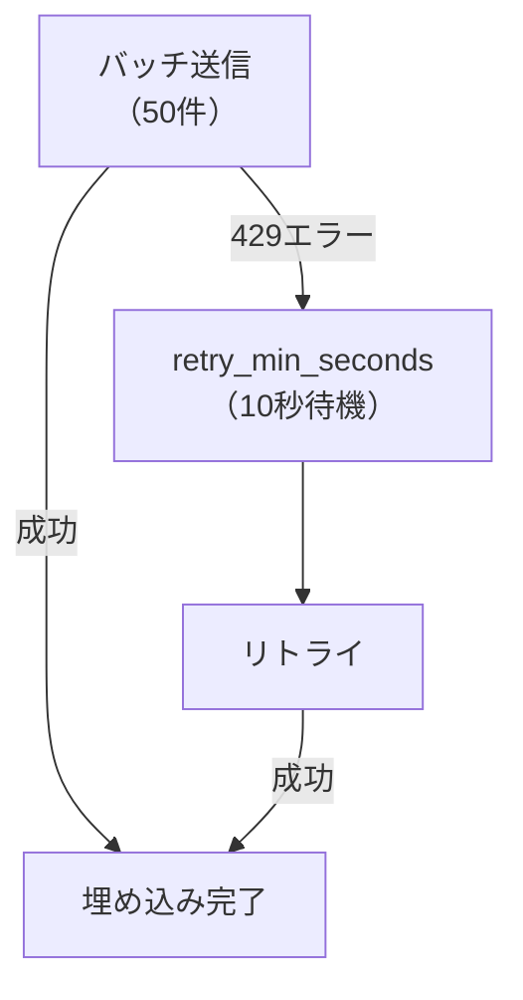

import Quiz from '@/components/content/Quiz.astro'

## 概要

このレクチャーでは，Ingestionパイプラインで使用する各クラスのインポートと初期化を行います．OpenAI Embeddings，Pinecone Vector Store，Tavily Crawlの設定を詳しく解説します．

## 主要なインポート

```python
from langchain.text_splitter import RecursiveCharacterTextSplitter
from langchain_pinecone import PineconeVectorStore
from langchain_core.documents import Document
from langchain_openai import OpenAIEmbeddings
from langchain_tavily import TavilyCrawl
```

## OpenAI Embeddingsの初期化

```python
embeddings = OpenAIEmbeddings(
    model="text-embedding-3-small",
    show_progress_bar=True,
    chunk_size=50,
    retry_min_seconds=10,
)
```

### パラメータの解説

- `chunk_size=50`: 1リクエストあたり50ドキュメントを埋め込む（レート制限対策）
- `retry_min_seconds=10`: 失敗時に最低10秒待ってからリトライ
- `show_progress_bar=True`: 進捗バーを表示

### レート制限の管理



大量のドキュメントを並行してバッチ処理すると，HTTP 429（レート制限）エラーが発生することがあります．`retry_min_seconds`を設定することでリトライ間隔を制御できます．

## Vector Storeの初期化

```python
# Pinecone（クラウド）
vector_store = PineconeVectorStore(
    index_name="langchain-docs-2025",
    embedding=embeddings,
)

# ChromaDB（ローカル，代替）
# from langchain_chroma import Chroma
# vector_store = Chroma(
#     persist_directory="./chroma_db",
#     embedding_function=embeddings,
# )
```

## まとめ

- RecursiveCharacterTextSplitterは意味的なチャンキングを行う
- Embeddingsの`chunk_size`と`retry_min_seconds`でレート制限を管理する
- PineconeとChromaDBの両方に対応可能
- LangChainの統一インターフェースでVector Storeの切り替えが容易

<Quiz questions={[
  {
    question: "OpenAIEmbeddingsのchunk_sizeパラメータは何を制御しますか？",
    options: [
      "テキストの分割サイズ",
      "1リクエストあたりの埋め込みドキュメント数",
      "ベクトルの次元数",
      "Pineconeのバッチサイズ"
    ],
    answer: 1,
    explanation: "chunk_sizeは1リクエストでOpenAI APIに送信して埋め込むドキュメントの数を制限するパラメータで，レート制限対策に使用します．"
  },
  {
    question: "HTTP 429エラーの意味は何ですか？",
    options: [
      "認証エラー",
      "サーバー内部エラー",
      "レート制限超過",
      "リクエストが大きすぎる"
    ],
    answer: 2,
    explanation: "HTTP 429はToo Many Requestsを示すステータスコードで，APIのレート制限を超えたことを意味します．"
  },
  {
    question: "retry_min_secondsを10に設定した場合の動作はどうなりますか？",
    options: [
      "10秒後に全ての処理が終了する",
      "エラー発生時に最低10秒待ってからリトライする",
      "10秒ごとにバッチを送信する",
      "最大10回リトライする"
    ],
    answer: 1,
    explanation: "retry_min_seconds=10は，バッチ処理が失敗した場合に最低10秒間待機してからリトライすることを意味します．"
  },
  {
    question: "PineconeとChromaDBの違いは何ですか？",
    options: [
      "PineconeはクラウドベースでChromaDBはローカルで動作する",
      "ChromaDBはクラウドベースでPineconeはローカルで動作する",
      "両方ともクラウドベースのみで動作する",
      "両方ともローカルのみで動作する"
    ],
    answer: 0,
    explanation: "Pineconeはクラウドベースのマネージドベクトルデータベースで，ChromaDBはローカルでも動作するオープンソースのベクトルデータベースです．"
  },
  {
    question: "RecursiveCharacterTextSplitterが通常のCharacterTextSplitterより優れている点は何ですか？",
    options: [
      "処理速度が速い",
      "複数の区切り文字を再帰的に試みて意味的なまとまりを保つ",
      "メモリ使用量が少ない",
      "日本語にのみ対応している"
    ],
    answer: 1,
    explanation: "RecursiveCharacterTextSplitterは段落，改行，スペースなど複数の区切り文字を再帰的に試みて，意味的なまとまりを保ったチャンキングを行います．"
  }
]} />
