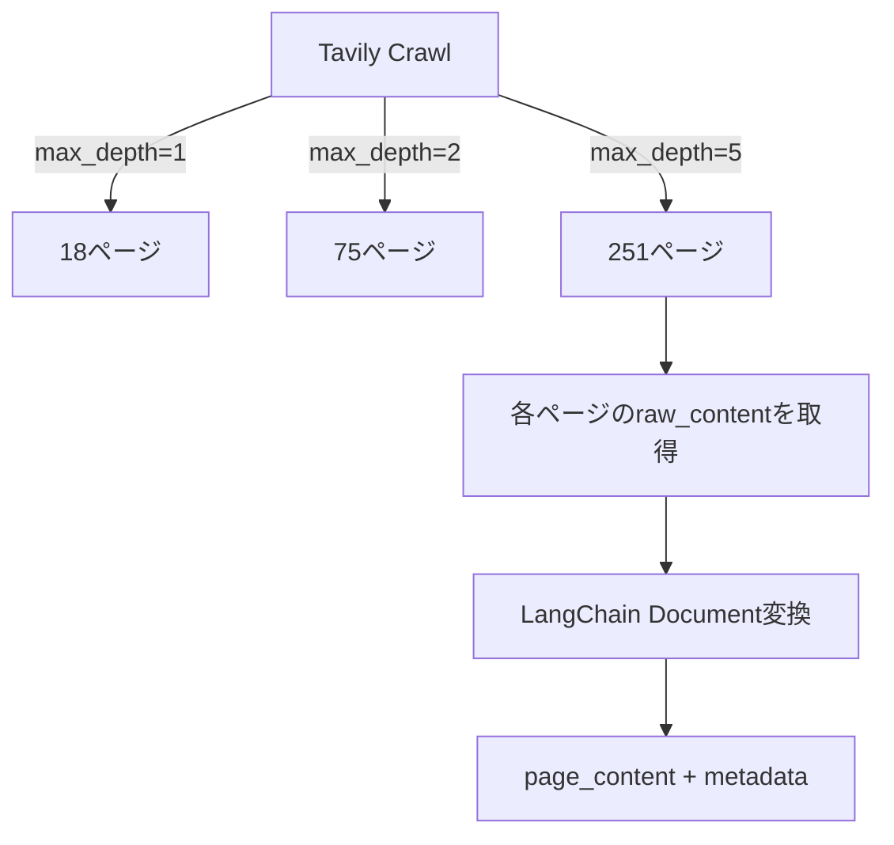

import Quiz from '@/components/content/Quiz.astro'

## 概要

このレクチャーでは，Tavily Crawlを使ってLangChainドキュメントをクロールし，取得したデータをLangChain Documentオブジェクトに変換します．



## Tavily Crawlの使用

```python
result = await crawl.invoke(
    url="https://python.langchain.com",
    max_depth=5,
    extract_depth="advanced"
)
```

### max_depthの設定

- `max_depth=1`: 18ページ（高速）
- `max_depth=2`: 75ページ
- `max_depth=5`: 251ページ（最大，約26秒）

ベストプラクティスとして，小さい値から始めて結果を確認してから増やします．

### instructionsパラメータ

自然言語でクローラーにフィルタリング指示を出せます:

```python
result = await crawl.invoke(
    url="https://python.langchain.com",
    max_depth=5,
    instructions="Search for content on AI agents"
)
```

## LangChain Documentへの変換

```python
all_docs = [
    Document(
        page_content=result["raw_content"],
        metadata={"source": result["url"]}
    )
    for result in crawl_result["results"]
]
```

`metadata`の`source`フィールドは，回答の根拠となったドキュメントのURLをユーザーに示すために使用します．

## まとめ

- Tavily Crawlは数行のコードでWebサイト全体をクロールできる
- `max_depth`は小さい値から始めて段階的に増やすのがベストプラクティス
- `instructions`パラメータで不要なページをフィルタリングできる
- メタデータの`source`フィールドはユーザーの信頼構築に重要

<Quiz questions={[
  {
    question: "Tavily Crawlのmax_depthパラメータの推奨される使い方は何ですか？",
    options: [
      "最初から最大値の5を設定する",
      "小さい値から始めて結果を確認してから段階的に増やす",
      "常に1に固定する",
      "ページ数に応じて自動設定される"
    ],
    answer: 1,
    explanation: "ベストプラクティスとして小さい値から始めて結果を確認し，必要に応じて段階的にmax_depthを増やします．"
  },
  {
    question: "instructionsパラメータの正しい使い方はどれですか？",
    options: [
      "LLMへの質問を入力する",
      "クローラーにURLのフィルタリング指示を自然言語で出す",
      "出力形式を指定する",
      "認証情報を渡す"
    ],
    answer: 1,
    explanation: "instructionsパラメータはクローラーのマッピングプロセスでURLのフィルタリングに使われる自然言語の指示です．"
  },
  {
    question: "metadataのsourceフィールドにURLを格納する理由は何ですか？",
    options: [
      "クローリング速度を上げるため",
      "回答の根拠となったソースをユーザーに示すため",
      "ベクトルの精度を上げるため",
      "Pineconeの仕様で必須だから"
    ],
    answer: 1,
    explanation: "sourceフィールドにURLを格納することで，RAGの回答がどのドキュメントに基づいているかユーザーに示し，信頼性を構築できます．"
  },
  {
    question: "max_depth=5で約何ページが取得されましたか？",
    options: [
      "約18ページ",
      "約75ページ",
      "約251ページ",
      "約1000ページ"
    ],
    answer: 2,
    explanation: "max_depth=5の設定で約251ページのLangChainドキュメントが取得され，処理時間は約26秒でした．"
  },
  {
    question: "extract_depthを「advanced」に設定した場合の効果は何ですか？",
    options: [
      "ページのタイトルのみ取得する",
      "テーブルや埋め込みコンテンツを含むより多くのデータを取得する",
      "画像のみを抽出する",
      "ページの読み込み速度が速くなる"
    ],
    answer: 1,
    explanation: "advanced抽出モードではテーブルや埋め込みコンテンツを含むより多くのデータが取得され，成功率も向上しますが，レイテンシが増加する場合があります．"
  }
]} />
