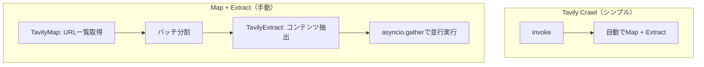

import Quiz from '@/components/content/Quiz.astro'

## 概要

このレクチャーはオプションです．Tavily MapとExtractを個別に使用し，クローリングプロセスをより細かく制御する方法を学びます．

## Tavily Map

サイトのURLマップを生成します．

```python
from langchain_tavily import TavilyMap

tavily_map = TavilyMap()
sitemap = await tavily_map.invoke(
    url="https://python.langchain.com/docs/introduction",
    max_depth=5,
    max_breadth=10,
    limit=500
)
```

## Tavily Extract

個別のURLからコンテンツを抽出します．

```python
from langchain_tavily import TavilyExtract

extract = TavilyExtract()
result = await extract.ainvoke({
    "urls": ["url1", "url2", "url3"]
})
```

## バッチ処理と並行実行

大量のURLを効率的に処理するため，バッチに分割して並行実行します:

```python
async def extract_batch(batch, batch_num):
    result = await extract.ainvoke({"urls": batch})
    return result["results"]

# バッチを並行実行
tasks = [extract_batch(batch, i) for i, batch in enumerate(batches)]
results = await asyncio.gather(*tasks)
```



## Crawl vs Map+Extract

- Crawl: シンプル，自動フィルタリング，ほとんどのケースで推奨
- Map+Extract: 細かい制御が必要な場合，特定のURLだけを処理したい場合

## まとめ

- Tavily MapでサイトマップのURL一覧を取得できる
- Tavily Extractで個別URLからコンテンツを抽出できる
- バッチ処理と`asyncio.gather`で並行実行すると効率的
- 多くの場合はTavily Crawlの方がシンプルで推奨される

<Quiz questions={[
  {
    question: "Tavily MapとTavily Extractの役割の違いは何ですか？",
    options: [
      "MapはコンテンツをExtractはURLを取得する",
      "MapはURL一覧を取得しExtractは個別URLからコンテンツを抽出する",
      "MapはベクトルをExtractはテキストを生成する",
      "両方とも同じ機能を持つ"
    ],
    answer: 1,
    explanation: "Tavily MapはサイトのURL一覧（サイトマップ）を取得し，Tavily Extractは個別のURLからコンテンツを抽出します．"
  },
  {
    question: "asyncio.gatherを使う目的は何ですか？",
    options: [
      "データを集約して1つにまとめる",
      "複数のバッチリクエストを並行実行する",
      "エラーを収集してログに出力する",
      "メモリ使用量を削減する"
    ],
    answer: 1,
    explanation: "asyncio.gatherは複数の非同期タスクを並行実行し，全ての結果を一度に取得するPythonの非同期処理ユーティリティです．"
  },
  {
    question: "Map+ExtractよりCrawlが推奨される理由は何ですか？",
    options: [
      "Crawlの方が取得データ量が多い",
      "Crawlの方がシンプルで自動フィルタリングが含まれる",
      "Crawlの方が安価",
      "CrawlはMap+Extractより高速"
    ],
    answer: 1,
    explanation: "Tavily CrawlはURLの検出とコンテンツ抽出を自動で行い，フィルタリング機能も含まれるためシンプルに使用できます．"
  },
  {
    question: "Tavily Mapのmax_breadthパラメータは何を制御しますか？",
    options: [
      "クロールの深さ",
      "各レベルでの探索幅（URL数）",
      "バッチサイズ",
      "タイムアウト時間"
    ],
    answer: 1,
    explanation: "max_breadthは各深さレベルで探索するURLの幅（数）を制御するパラメータです．"
  },
  {
    question: "バッチ処理でエラーが発生した場合の適切な対処法はどれですか？",
    options: [
      "全ての処理を中止する",
      "バッチ単位でtry/exceptを実装し部分的な成功でも結果を収集する",
      "エラーを無視して続行する",
      "バッチサイズを1に変更する"
    ],
    answer: 1,
    explanation: "バッチ単位でエラーハンドリングを実装し，失敗したバッチのログを記録しつつ，成功した結果は収集する方法が適切です．"
  }
]} />
