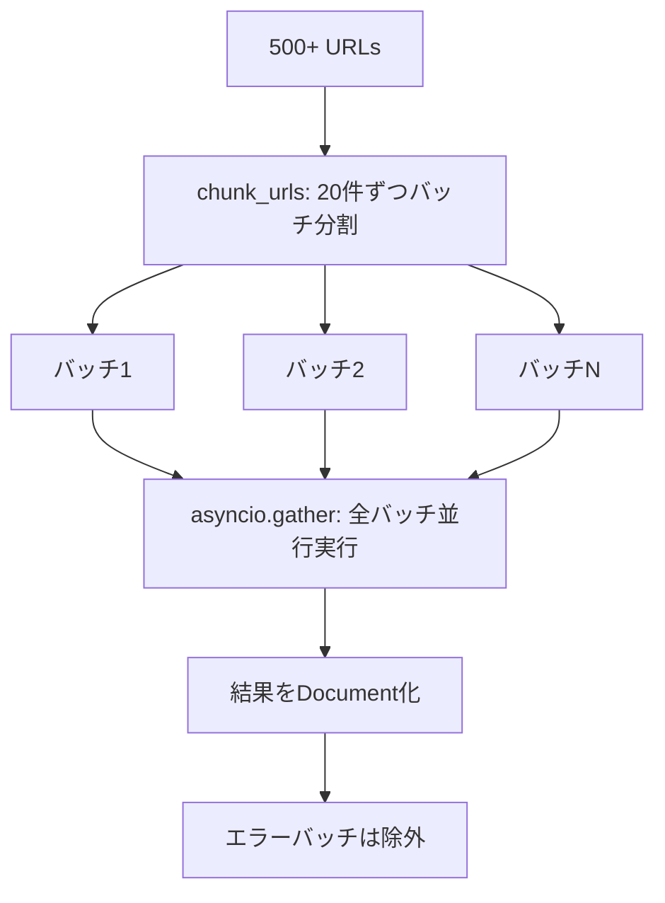

import Quiz from '@/components/content/Quiz.astro'

## 概要

このレクチャーはオプションです．Tavily Map/Extractを使った500以上のURLの並行バッチ処理を実装し，本番スケールのクローリング手法を学びます．



## 並行バッチ処理の実装

### URLのバッチ分割

```python
def chunk_urls(urls, chunk_size=20):
    return [urls[i:i + chunk_size] for i in range(0, len(urls), chunk_size)]
```

### 非同期バッチ抽出

```python
async def async_extract(url_batches):
    tasks = [
        extract_batch(batch, i)
        for i, batch in enumerate(url_batches)
    ]
    results = await asyncio.gather(*tasks)

    all_pages = []
    for batch_result in results:
        if not isinstance(batch_result, Exception):
            for result in batch_result:
                doc = Document(
                    page_content=result["raw_content"],
                    metadata={"source": result["url"]}
                )
                all_pages.append(doc)
    return all_pages
```

### 2レベルの並行処理

1. API側: 1リクエスト内の複数URLを並行処理
2. アプリケーション側: 複数バッチリクエストを`asyncio.gather`で並行実行

## エラーハンドリング

- バッチ単位でtry/exceptを実装
- 失敗したバッチのカウントとログ記録
- 部分的な成功でも結果を収集

## まとめ

- バッチ処理と非同期実行で大量URLを効率的にクロールできる
- `asyncio.gather`で全バッチを並行実行する
- エラーハンドリングをバッチ単位で実装することで部分的な失敗に対応
- 本番環境ではデータ取得が最も困難なフェーズであることが多い

<Quiz questions={[
  {
    question: "URLを20件ずつのバッチに分割する理由は何ですか？",
    options: [
      "Pythonの制限で20件までしか処理できないから",
      "APIのレート制限を考慮して一度に処理するURL数を制限するため",
      "20件がPineconeの最大格納数だから",
      "メモリが不足するから"
    ],
    answer: 1,
    explanation: "大量のURLを一度に送信するとAPIのレート制限に抵触するため，バッチに分割して処理します．"
  },
  {
    question: "2レベルの並行処理とは何ですか？",
    options: [
      "2つのLLMを同時に使うこと",
      "API側の並行処理とアプリケーション側のasyncio.gatherによる並行実行",
      "2つのVector Storeに同時にインデックスすること",
      "フロントエンドとバックエンドの並行開発"
    ],
    answer: 1,
    explanation: "1つ目はAPI側で1リクエスト内の複数URLを並行処理し，2つ目はアプリケーション側でasyncio.gatherにより複数バッチを並行実行します．"
  },
  {
    question: "isinstance(batch_result, Exception)のチェックを行う理由は何ですか？",
    options: [
      "型の安全性を確認するため",
      "asyncio.gatherが失敗したタスクの結果をExceptionとして返すため",
      "Pythonの構文規則で必須だから",
      "パフォーマンスを最適化するため"
    ],
    answer: 1,
    explanation: "asyncio.gatherは失敗したタスクの結果をException型として返すことがあるため，正常な結果とエラーを区別する必要があります．"
  },
  {
    question: "本番環境でデータ取得が最も手間がかかる理由は何ですか？",
    options: [
      "LLMの応答が遅いから",
      "レート制限，ボット保護，エラーハンドリングなど多くの考慮事項があるから",
      "ベクトル化の計算が重いから",
      "Pineconeの容量制限があるから"
    ],
    answer: 1,
    explanation: "データ取得フェーズでは外部APIとの連携，レート制限の管理，エラーハンドリング，ボット保護への対応など多くの考慮事項があります．"
  },
  {
    question: "部分的な失敗に対応するバッチ処理の正しい実装はどれですか？",
    options: [
      "1つでも失敗したら全バッチを再実行する",
      "失敗したバッチのカウントとログ記録を行い成功分は結果を収集する",
      "失敗したバッチを無視する",
      "バッチ処理をやめて1件ずつ処理する"
    ],
    answer: 1,
    explanation: "バッチ単位でtry/exceptを実装し，失敗をログに記録しつつ成功した結果は収集する方法が，部分的な失敗への適切な対応です．"
  }
]} />
