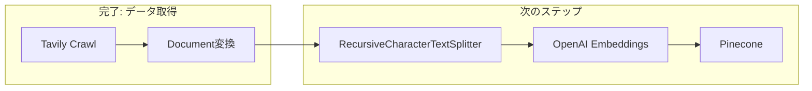

import Quiz from '@/components/content/Quiz.astro'

## 概要

このレクチャーでは，ドキュメント取得フェーズの完了を振り返り，次のチャンキング・インデックス作成フェーズの概要を説明します．

## 完了した作業

- ソースドキュメント（LangChainドキュメント）の取得
- 外部API（Tavily Map/Extract，Tavily Crawl）を使用
- 並行処理によるスケーラブルなデータ取得
- LangChain Documentオブジェクトへの変換

## 次のステップ

1. ドキュメントをチャンクに分割（RecursiveCharacterTextSplitter）
2. チャンクをベクトル化（OpenAI Embeddings）
3. Vector Storeにインデックス作成（Pinecone）

## 本番環境での教訓

本番RAGアプリケーションでは，データ取得（Ingestion）が最も手間のかかるフェーズです．外部APIとの連携，レート制限の管理，エラーハンドリングなど，多くの考慮事項があります．

## まとめ

- データ取得フェーズはRAGパイプラインで最も複雑な部分
- チャンキングとインデックス作成は比較的シンプル
- LangChainが重い処理を代行してくれる

<Quiz questions={[
  {
    question: "Ingestionパイプラインで最も複雑な部分はどれですか？",
    options: [
      "チャンキング",
      "ベクトル化",
      "データ取得（クローリング）",
      "インデックス作成"
    ],
    answer: 2,
    explanation: "本番RAGアプリケーションでは外部APIとの連携，レート制限，エラーハンドリングなどを含むデータ取得フェーズが最も複雑です．"
  },
  {
    question: "次のチャンキング・インデックス作成フェーズで使用するText Splitterは何ですか？",
    options: [
      "CharacterTextSplitter",
      "RecursiveCharacterTextSplitter",
      "TokenTextSplitter",
      "SentenceTextSplitter"
    ],
    answer: 1,
    explanation: "RecursiveCharacterTextSplitterを使用して，段落や改行を考慮しながらセマンティックにドキュメントを分割します．"
  },
  {
    question: "LangChain Documentオブジェクトに含まれる2つの主要な属性は何ですか？",
    options: [
      "title と content",
      "page_content と metadata",
      "text と vector",
      "source と embedding"
    ],
    answer: 1,
    explanation: "LangChain DocumentオブジェクトはテキストデータのPage_contentとソース情報などを含むmetadataの2つの主要属性を持ちます．"
  },
  {
    question: "並行処理によるデータ取得の利点は何ですか？",
    options: [
      "データの精度が向上する",
      "処理時間を大幅に短縮できる",
      "ベクトルの次元数が増える",
      "APIの料金が無料になる"
    ],
    answer: 1,
    explanation: "並行処理を使用すると複数のリクエストを同時に実行できるため，逐次処理と比較して処理時間を大幅に短縮できます．"
  },
  {
    question: "データ取得フェーズの完了後にVector Storeにインデックスを作成する際に使用するサービスは何ですか？",
    options: [
      "Tavily",
      "OpenAI GPT",
      "Pinecone",
      "Streamlit"
    ],
    answer: 2,
    explanation: "チャンクのベクトルをインデックスとして格納するために，Pineconeマネージドベクトルデータベースを使用します．"
  }
]} />
