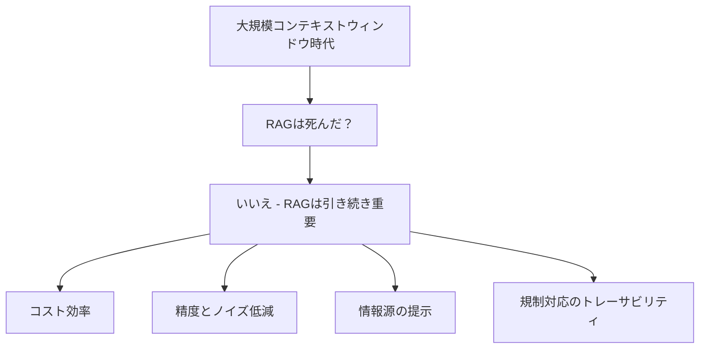

import Quiz from '@/components/content/Quiz.astro'

## 概要

このレクチャーでは，RecursiveCharacterTextSplitterを使ったチャンキングの実装と，大規模コンテキストウィンドウ時代におけるRAGの意義を考察します．

## チャンキングの実装

```python
from langchain.text_splitter import RecursiveCharacterTextSplitter

text_splitter = RecursiveCharacterTextSplitter(
    chunk_size=4000,
    chunk_overlap=200,
)
split_docs = text_splitter.split_documents(all_docs)
```

- `chunk_size=4000`: チャンクの最大文字数
- `chunk_overlap=200`: チャンク間の重複文字数（文脈の連続性を保つ）



## RAGは死んだのか?

大規模コンテキストウィンドウ（100万〜200万トークン）の時代でも，RAGは重要であり続けます:

### コスト効率
100万トークンのドキュメントを毎回送るよりも，関連スニペットだけを検索する方がはるかに安価

### 精度とノイズ低減
RAGは最も関連性の高いチャンクだけをフィルタリングし，ハルシネーションや位置バイアスを大幅に低減

### ユーザー向け機能
回答の根拠となった情報源を示すことで，AIシステムへの信頼を構築

### 規制環境での必要性
回答のトレーサビリティは規制対応において極めて重要

## まとめ

- RecursiveCharacterTextSplitterは段落→改行の順でセマンティックに分割する
- 大規模コンテキストウィンドウはRAGを殺すのではなく補完する
- RAGはコスト効率，精度，信頼性の面で引き続き重要
- チャンキング戦略は多数存在し，ユースケースに応じて選択する

<Quiz questions={[
  {
    question: "RecursiveCharacterTextSplitterのchunk_overlapを200に設定する目的は何ですか？",
    options: [
      "チャンク数を減らすため",
      "チャンク間の文脈の連続性を保つため",
      "ベクトルの次元数を合わせるため",
      "メモリ使用量を削減するため"
    ],
    answer: 1,
    explanation: "chunk_overlap=200はチャンク間で200文字の重複を設け，文脈が途切れないよう連続性を保つために使用します．"
  },
  {
    question: "大規模コンテキストウィンドウの時代でもRAGが重要な理由に含まれないものはどれですか？",
    options: [
      "コスト効率",
      "モデルの学習速度の向上",
      "精度とノイズ低減",
      "回答のトレーサビリティ"
    ],
    answer: 1,
    explanation: "RAGの重要性はコスト効率，精度向上，情報源の提示，規制対応のトレーサビリティにありますが，モデルの学習速度はRAGとは無関係です．"
  },
  {
    question: "RecursiveCharacterTextSplitterの「Recursive」が意味するものは何ですか？",
    options: [
      "同じドキュメントを複数回処理すること",
      "段落，改行，スペースの順で再帰的に区切り文字を試みること",
      "チャンクを更に小さく再分割すること",
      "ベクトル化を再帰的に実行すること"
    ],
    answer: 1,
    explanation: "Recursiveは段落→改行→スペースの順で複数の区切り文字を再帰的に試み，意味的なまとまりを保って分割することを意味します．"
  },
  {
    question: "chunk_sizeを4000に設定した場合の意味は何ですか？",
    options: [
      "4000個のチャンクを生成する",
      "各チャンクの最大文字数が4000文字になる",
      "4000個のドキュメントを処理する",
      "ベクトルの次元数が4000になる"
    ],
    answer: 1,
    explanation: "chunk_size=4000は各チャンクの最大文字数を4000文字に制限する設定です．"
  },
  {
    question: "RAGが提供する「ユーザー向け機能」として最も重要なものは何ですか？",
    options: [
      "より速い応答速度",
      "回答の根拠となった情報源を示すこと",
      "複数言語での回答",
      "チャットの履歴管理"
    ],
    answer: 1,
    explanation: "RAGは回答の根拠となった情報源（ソースURL等）をユーザーに示すことができ，AIシステムへの信頼構築に貢献します．"
  }
]} />
