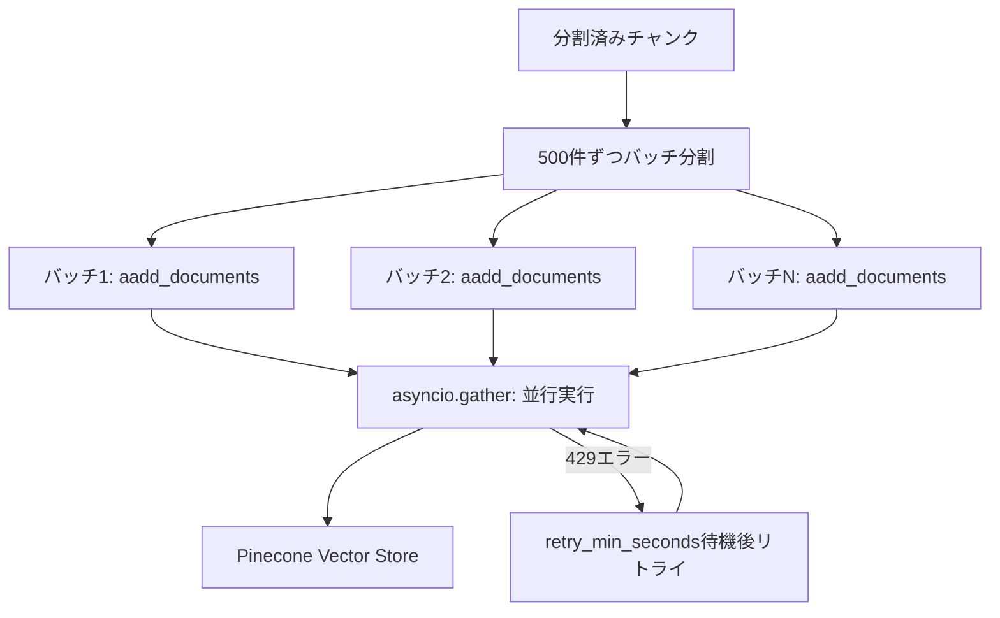

import Quiz from '@/components/content/Quiz.astro'

## 概要

このレクチャーでは，チャンクをバッチに分割し，並行処理でVector Storeにインデックスを作成します．レート制限への対処法も学びます．



## バッチインデックスの実装

```python
async def index_documents_async(documents, batch_size=500):
    batches = [
        documents[i:i + batch_size]
        for i in range(0, len(documents), batch_size)
    ]

    async def add_batch(batch, batch_num):
        try:
            await vector_store.aadd_documents(batch)
            return True
        except Exception as e:
            log_error(f"Batch {batch_num} failed: {e}")
            return False

    tasks = [
        add_batch(batch, i)
        for i, batch in enumerate(batches)
    ]
    results = await asyncio.gather(*tasks)
```

## レート制限の管理

Embeddingsモデルにはトークン/分の制限があります:

- バッチサイズが大きすぎるとHTTP 429エラーが発生
- `retry_min_seconds`でリトライ間隔を制御
- バッチサイズの調整が必要

## ベクトルからテキストへの逆変換

Embedding関数は一方向関数です:
- テキスト → ベクトル: 可能
- ベクトル → テキスト: 不可能

そのため，ベクトルと一緒に元のテキストも保存します．

## ChromaDB vs Pinecone

- Pinecone: クラウドベース，マネージド，スケーラブル
- ChromaDB: ローカル，オープンソース，SQLiteベース

## まとめ

- バッチ処理と並行実行でインデックス作成を効率化する
- レート制限はEmbeddingsモデルの主要なボトルネック
- `retry_min_seconds`でリトライ戦略を制御する
- ベクトルとテキストの両方をVector Storeに保存する必要がある

<Quiz questions={[
  {
    question: "バッチインデックス作成でaadd_documentsを使う理由は何ですか？",
    options: [
      "同期処理より精度が高い",
      "非同期処理でasyncio.gatherによる並行実行が可能になる",
      "Pineconeの仕様で必須だから",
      "メモリ使用量が減るから"
    ],
    answer: 1,
    explanation: "aadd_documentsは非同期版のadd_documentsメソッドで，asyncio.gatherと組み合わせて複数バッチの並行実行を可能にします．"
  },
  {
    question: "Embedding関数が一方向関数である意味は何ですか？",
    options: [
      "1つの入力に対して1つの出力しかない",
      "テキストからベクトルへの変換は可能だがベクトルからテキストへの逆変換は不可能",
      "1回しか実行できない",
      "片方向の通信のみ対応している"
    ],
    answer: 1,
    explanation: "Embedding関数はテキストをベクトルに変換できますが，ベクトルから元のテキストを復元することは数学的に不可能な一方向の変換です．"
  },
  {
    question: "バッチサイズ500でインデックスを作成する場合，1000件のチャンクはいくつのバッチに分割されますか？",
    options: [
      "1バッチ",
      "2バッチ",
      "5バッチ",
      "10バッチ"
    ],
    answer: 1,
    explanation: "1000件のチャンクをバッチサイズ500で分割すると，500件ずつの2バッチになります．"
  },
  {
    question: "ChromaDBとPineconeの最も大きな違いは何ですか？",
    options: [
      "対応するEmbeddingsモデルが異なる",
      "ChromaDBはローカルのSQLiteベースでPineconeはクラウドのマネージドサービス",
      "ChromaDBの方が検索精度が高い",
      "Pineconeは無料で使えない"
    ],
    answer: 1,
    explanation: "ChromaDBはローカルで動作するSQLiteベースのオープンソースDBで，Pineconeはクラウドベースのマネージドベクトルデータベースです．"
  },
  {
    question: "レート制限がEmbeddingsモデルの主要なボトルネックとなる理由は何ですか？",
    options: [
      "Embeddingsモデルの計算が遅いから",
      "大量のドキュメントを並行バッチ処理するとトークン/分の制限に達するから",
      "ベクトルデータベースの書き込みが遅いから",
      "ネットワーク帯域が不足するから"
    ],
    answer: 1,
    explanation: "大量のドキュメントを並行してバッチ処理すると，Embeddingsモデル提供元のトークン/分の制限に達しHTTP 429エラーが発生します．"
  }
]} />
