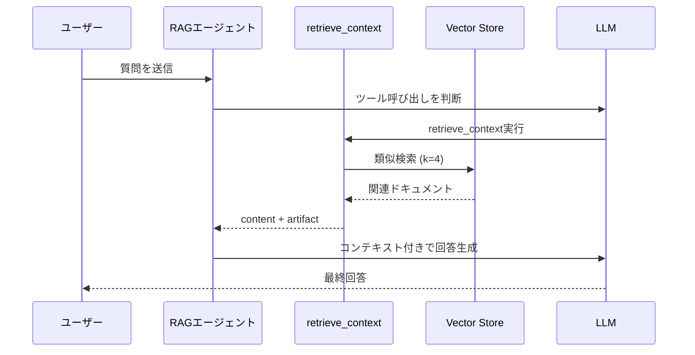

import Quiz from '@/components/content/Quiz.astro'

## 概要

このレクチャーでは，`create_agent`関数を使ってRetrievalツール付きのRAGエージェントを実装します．`content_and_artifact`レスポンスフォーマットの使い方も学びます．



## Retrievalツールの定義

```python
from langchain_core.tools import tool

@tool(response_format="content_and_artifact")
def retrieve_context(query: str):
    """Retrieve relevant documentation to help answer
    user queries about LangChain."""
    retriever = vector_store.as_retriever()
    docs = retriever.invoke(query, k=4)

    serialized = "\n\n".join(
        f"Source: {doc.metadata.get('source', 'Unknown')}\n"
        f"Content: {doc.page_content}"
        for doc in docs
    )
    return serialized, docs
```

### content_and_artifactの意味

- `content`: LLMに送信される文字列（シリアライズされたドキュメント）
- `artifact`: アプリケーション側で使用するオブジェクト（Documentリスト）

artifactはLLMには送信されず，アプリケーションのToolMessageからアクセスできます．

## エージェントの構築

```python
from langchain.agents import create_agent
from langchain.chat_models import init_chat_model

model = init_chat_model(model_provider="openai", model="gpt-5.2")

agent = create_agent(
    model=model,
    tools=[retrieve_context],
    system_prompt="You are a helpful AI assistant..."
)

response = agent.invoke({"messages": [user_message]})
```

## run_llm関数

```python
def run_llm(query: str) -> dict:
    response = agent.invoke({"messages": [{"role": "user", "content": query}]})

    # ToolMessageからartifactを抽出
    context_docs = []
    for msg in response["messages"]:
        if isinstance(msg, ToolMessage) and hasattr(msg, "artifact"):
            context_docs.extend(msg.artifact)

    return {
        "answer": response["messages"][-1].content,
        "context": context_docs,
    }
```

## まとめ

- `@tool`デコレータの`response_format="content_and_artifact"`で2つの戻り値を返せる
- contentはLLMに送信され，artifactはアプリケーション側で使用される
- `init_chat_model`で簡単にLLMプロバイダーを切り替えられる
- ToolMessageのartifactからソースドキュメントを抽出して信頼性を向上させる

<Quiz questions={[
  {
    question: "content_and_artifactレスポンスフォーマットの目的は何ですか？",
    options: [
      "2つのLLMを同時に呼び出す",
      "LLMに送信するcontentとアプリケーション側で使うartifactを分離する",
      "ツールを2回実行する",
      "コンテンツを暗号化する"
    ],
    answer: 1,
    explanation: "content_and_artifactフォーマットはLLMに送信されるcontent（文字列）とアプリケーション側で使用するartifact（オブジェクト）を分離して返します．"
  },
  {
    question: "artifactがLLMに送信されない理由は何ですか？",
    options: [
      "LLMが処理できないデータ形式だから",
      "アプリケーション側でのみ必要なデータでLLMのトークンを節約するため",
      "セキュリティ上の理由",
      "Pineconeの制限"
    ],
    answer: 1,
    explanation: "artifactはDocumentオブジェクトのリストなどアプリケーション側でのみ必要なデータであり，LLMに送る必要がないためトークンを節約できます．"
  },
  {
    question: "init_chat_modelの利点は何ですか？",
    options: [
      "モデルの学習を自動化できる",
      "LLMプロバイダーを簡単に切り替えられる",
      "無料でLLMを使える",
      "ベクトル検索ができる"
    ],
    answer: 1,
    explanation: "init_chat_modelはmodel_providerパラメータでOpenAI，Anthropicなど異なるLLMプロバイダーを簡単に切り替えることができます．"
  },
  {
    question: "retrieve_contextツールがDocumentリストをartifactとして返す用途は何ですか？",
    options: [
      "ベクトルデータベースに再格納するため",
      "ソースURLをUIでユーザーに表示するため",
      "次のクエリに再利用するため",
      "LLMの学習データにするため"
    ],
    answer: 1,
    explanation: "Documentオブジェクトのmetadataに含まれるソースURLをUIでユーザーに表示し，回答の根拠を示すために使用されます．"
  },
  {
    question: "create_agent関数でRAGエージェントを構築するために必要な要素はどれですか？",
    options: [
      "model，tools，system_prompt",
      "embeddings，vector_store，retriever",
      "prompt_template，llm，parser",
      "document_loader，text_splitter，embeddings"
    ],
    answer: 0,
    explanation: "create_agent関数にはLLMモデル，ツール（検索ツールなど），システムプロンプトを渡してエージェントを構築します．"
  }
]} />
