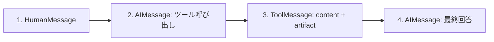

import Quiz from '@/components/content/Quiz.astro'

## 概要

このレクチャーでは，RAGエージェントをデバッグモードで実行してメッセージの流れを確認し，LangSmithでトレースを可視化します．

## デバッグでの確認

エージェントの`invoke`結果のメッセージリスト:

1. HumanMessage: ユーザーの質問
2. AIMessage: ツール呼び出し（retrieve_contextへの呼び出し情報）
3. ToolMessage: ツール実行結果（content + artifact）
4. AIMessage: 最終回答

### ToolMessageの構造

- `content`: シリアライズされたドキュメント文字列（LLMに送信される）
- `artifact`: LangChain Documentオブジェクトのリスト（LLMには送信されない）

## LangSmithのトレース

LangSmithでは以下が確認できます:

1. LangGraphのグラフ構造（create_agentの内部実装）
2. システムプロンプト
3. ツール呼び出しのクエリ（LLMが質問を再構成することがある）
4. Retrieverの実行（類似検索の結果とソースURL）
5. 最終回答の生成

### as_retrieverを使う理由

`vector_store.similarity_search()`の代わりに`vector_store.as_retriever()`を使うと，LangSmithでのトレースがより詳細に表示されます．

## まとめ

- デバッグモードでメッセージリストの各要素を確認できる
- artifactはLLMに送信されず，アプリケーション側で利用可能
- LangSmithでエージェントの全実行フローを視覚的に追跡できる
- `as_retriever`を使うとLangSmithでの可視性が向上する

<Quiz questions={[
  {
    question: "RAGエージェントのメッセージリストで最終回答はどの位置にありますか？",
    options: [
      "最初のメッセージ",
      "2番目のメッセージ",
      "3番目のメッセージ",
      "最後のメッセージ"
    ],
    answer: 3,
    explanation: "メッセージリストはHumanMessage，AIMessage（ツール呼び出し），ToolMessage，AIMessage（最終回答）の順で，最終回答は最後の位置にあります．"
  },
  {
    question: "ToolMessageのcontentとartifactの違いは何ですか？",
    options: [
      "contentは短くartifactは長い",
      "contentはLLMに送信されartifactはアプリケーション側のみで使用される",
      "contentはテキストでartifactは画像",
      "両者は同じ内容"
    ],
    answer: 1,
    explanation: "contentはシリアライズされた文字列としてLLMに送信され，artifactはDocumentオブジェクトのリストとしてアプリケーション側でのみ使用されます．"
  },
  {
    question: "similarity_searchの代わりにas_retrieverを使う主な理由は何ですか？",
    options: [
      "検索精度が向上する",
      "LangSmithでのトレースがより詳細に表示される",
      "非同期処理が可能になる",
      "メモリ使用量が減少する"
    ],
    answer: 1,
    explanation: "as_retrieverを使用するとLangSmithでのトレースがより詳細に表示され，デバッグと分析が容易になります．"
  },
  {
    question: "LangSmithのトレースで確認できない情報はどれですか？",
    options: [
      "ツール呼び出しのクエリ",
      "Retrieverの検索結果",
      "モデルの内部パラメータの学習過程",
      "最終回答の生成過程"
    ],
    answer: 2,
    explanation: "LangSmithはLLMの呼び出しやツール実行のトレースを表示しますが，モデルの内部パラメータの学習過程は表示されません．"
  },
  {
    question: "LLMがツール呼び出し時にユーザーの質問を再構成することがある理由は何ですか？",
    options: [
      "バグが原因",
      "検索に最適化されたクエリを自動生成するため",
      "ユーザーの質問が間違っているから",
      "Pineconeの仕様"
    ],
    answer: 1,
    explanation: "LLMはReActエージェントとして，ユーザーの質問を検索に最適化された形に再構成してツール呼び出しのクエリを生成することがあります．"
  }
]} />
