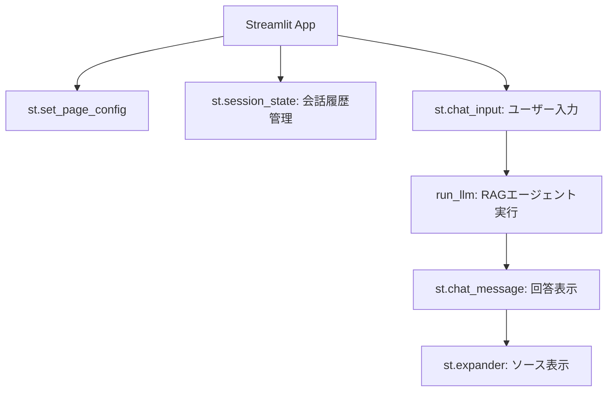

import Quiz from '@/components/content/Quiz.astro'

## 概要

このレクチャーでは，Streamlitを使ってRAGエージェントのチャットインターフェースを構築します．Pythonだけで直感的なUIを実現します．



## Streamlitの基本設定

```python
import streamlit as st
from backend.core import run_llm

st.set_page_config(
    page_title="LangChain Documentation Helper",
    layout="centered"
)
st.title("LangChain Documentation Helper")
```

## セッション状態の管理

```python
# 初期メッセージの設定
if "messages" not in st.session_state:
    st.session_state["messages"] = [{
        "role": "assistant",
        "content": "Ask me anything about LangChain docs.",
        "sources": []
    }]
```

## メッセージの表示

```python
for message in st.session_state["messages"]:
    with st.chat_message(message["role"]):
        st.markdown(message["content"])
        if message.get("sources"):
            with st.expander("Sources"):
                for link in message["sources"]:
                    st.markdown(f"- {link}")
```

## ユーザー入力とRAG実行

```python
if prompt := st.chat_input("Ask a question about LangChain"):
    st.session_state["messages"].append({
        "role": "user", "content": prompt, "sources": []
    })

    with st.chat_message("assistant"):
        with st.spinner("Retrieving docs and generating answer..."):
            response = run_llm(prompt)
            answer = response.get("answer", "No answer returned.")
            sources = _format_sources(response.get("context", []))

        st.markdown(answer)
        if sources:
            with st.expander("Sources"):
                for link in sources:
                    st.markdown(f"- {link}")

    st.session_state["messages"].append({
        "role": "assistant",
        "content": answer,
        "sources": sources
    })
```

## 実行方法

```bash
streamlit run main.py
```

## まとめ

- Streamlitは数十行のPythonコードでチャットUIを構築できる
- `st.session_state`で会話履歴を永続化する
- ソースの引用をExpanderで表示してユーザーの信頼を構築する
- 本番用ではないが，プロトタイピングとQAに最適

<Quiz questions={[
  {
    question: "st.session_stateの目的は何ですか？",
    options: [
      "CSSスタイルを管理する",
      "ページのリロード間で会話履歴などのデータを永続化する",
      "APIキーを安全に保存する",
      "ベクトルデータベースへの接続を管理する"
    ],
    answer: 1,
    explanation: "st.session_stateはStreamlitのリレンダリング間でデータを保持するための仕組みで，会話履歴の永続化に使用されます．"
  },
  {
    question: "st.expanderを使ってソースを表示する理由は何ですか？",
    options: [
      "ソースの表示が必須だから",
      "デフォルトでは折りたたまれ，ユーザーが必要時に展開できるため",
      "ソースを暗号化するため",
      "APIのレート制限を回避するため"
    ],
    answer: 1,
    explanation: "st.expanderはデフォルトで折りたたまれたUIコンポーネントで，ソース情報を必要な時だけ展開して確認できるようにします．"
  },
  {
    question: "Streamlitアプリの起動コマンドはどれですか？",
    options: [
      "python main.py",
      "streamlit run main.py",
      "npm start",
      "flask run"
    ],
    answer: 1,
    explanation: "Streamlitアプリはstreamlit run main.pyコマンドで起動します．"
  },
  {
    question: "st.spinnerの役割は何ですか？",
    options: [
      "ページのレイアウトを回転させる",
      "処理中であることをユーザーに視覚的に伝える",
      "エラーメッセージを表示する",
      "ページをリロードする"
    ],
    answer: 1,
    explanation: "st.spinnerはRAGエージェントの実行中にローディングインジケーターを表示し，処理中であることをユーザーに伝えます．"
  },
  {
    question: "Streamlitがプロトタイピングに適している理由は何ですか？",
    options: [
      "大規模な本番デプロイに対応しているから",
      "数十行のPythonコードだけでチャットUIを構築できるから",
      "JavaScriptの知識が必要だから",
      "自動的にスケールするから"
    ],
    answer: 1,
    explanation: "Streamlitは数十行のPythonコードで直感的なチャットUIを構築でき，HTMLやJavaScriptの知識なしにプロトタイプを素早く作成できます．"
  }
]} />
