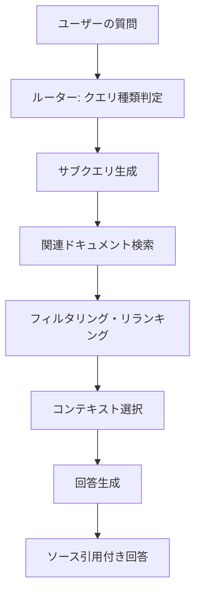

import Quiz from '@/components/content/Quiz.astro'

## 概要

このレクチャーでは，LangChainが構築した本番レベルのドキュメントアシスタント「Chat LangChain」を分析し，プロトタイプから本番環境への進化を学びます．

## Chat LangChainの特徴

chat.langchain.comは，このコースで構築したドキュメントアシスタントの本番バージョンです:

1. ユーザーの質問からサブクエリを自動生成
2. 各サブクエリで関連ドキュメントを検索
3. 検索結果をフィルタリング/リランキング
4. コンテキストを選択して回答を生成
5. ソースを引用

## Agentic RAGアーキテクチャ

- LangChain + LangGraph + Next.jsで構築
- マルチエージェントシステム
- ルーターがクエリの種類を判定
- サブクエリ生成でより良い検索結果を取得
- Generative UIでエージェントの状態を可視化

## Generative UIの重要性

エージェントが何をしているかをユーザーに伝えることで信頼を構築:
- 検索クエリの表示
- 検索結果のプレビュー
- 処理ステータスのリアルタイム表示

## Co-reference Resolution

会話の文脈を理解して代名詞を解決:
- 「LangChainとは?」→ 回答
- 「誰が作ったの?」→ 「LangChainを誰が作ったの?」と解釈

## まとめ

- Chat LangChainはオープンソースの本番レベルRAGアプリケーション
- サブクエリ生成やドキュメント検証などの高度な技術を使用
- LangGraphによるマルチエージェントアーキテクチャ
- Generative UIでユーザーの信頼を構築

<Quiz questions={[
  {
    question: "Chat LangChainで使用されているフレームワークの組み合わせはどれですか？",
    options: [
      "Flask + React + ChromaDB",
      "LangChain + LangGraph + Next.js",
      "Django + Vue.js + Pinecone",
      "FastAPI + Angular + Weaviate"
    ],
    answer: 1,
    explanation: "Chat LangChainはLangChain + LangGraph + Next.jsの組み合わせで構築された本番レベルのRAGアプリケーションです．"
  },
  {
    question: "Generative UIの目的は何ですか？",
    options: [
      "UIを自動生成すること",
      "エージェントの処理状態をリアルタイムでユーザーに可視化すること",
      "ユーザーインターフェースのデザインを改善すること",
      "フロントエンドのコードを自動生成すること"
    ],
    answer: 1,
    explanation: "Generative UIはエージェントが何をしているか（検索クエリ，検索結果など）をリアルタイムで可視化し，ユーザーの信頼を構築します．"
  },
  {
    question: "Co-reference Resolutionとは何ですか？",
    options: [
      "複数のデータベースを同時に検索すること",
      "会話の文脈を理解して代名詞を元の対象に解決すること",
      "複数の回答を比較して最良のものを選ぶこと",
      "コードの競合を解決すること"
    ],
    answer: 1,
    explanation: "Co-reference Resolutionは会話の文脈から「それ」「誰が」などの代名詞を元の対象語に解決する技術です．"
  },
  {
    question: "サブクエリ生成の目的は何ですか？",
    options: [
      "ユーザーの質問を短くする",
      "1つの質問から複数の検索クエリを生成してより良い検索結果を得る",
      "質問を翻訳する",
      "質問のスペルチェックを行う"
    ],
    answer: 1,
    explanation: "サブクエリ生成は1つのユーザー質問から複数の検索クエリを自動生成し，より網羅的で関連性の高い検索結果を取得するためです．"
  },
  {
    question: "Chat LangChainがオープンソースであることの利点は何ですか？",
    options: [
      "無料で商用利用できる",
      "本番レベルのRAGアーキテクチャを学習し参考にできる",
      "自動的にデプロイされる",
      "サポートが受けられる"
    ],
    answer: 1,
    explanation: "オープンソースであるため，本番レベルのRAGアプリケーションのアーキテクチャとコードを学習し，自身のプロジェクトの参考にできます．"
  }
]} />
