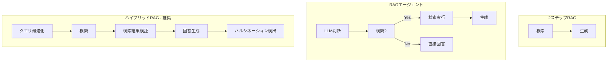

import Quiz from '@/components/content/Quiz.astro'

## 概要

このレクチャーでは，コースで学んだ3つのRAGアーキテクチャを比較し，本番環境に最適なアプローチを考察します．

## 3つのRAGアーキテクチャ

### 1. 2ステップRAG（LCEL）

検索→生成の固定パイプライン:

- 検索は常に実行される
- シンプルで予測可能
- 高速（1回のLLM推論）
- 柔軟性は低い

### 2. RAGエージェント

ReActエージェントに検索ツールを持たせる:

- LLMが検索の要否を判断
- 高い柔軟性
- 制御が困難
- レイテンシが大きい（複数のLLM推論）

### 3. ハイブリッドRAG（推奨）

両方のアプローチの長所を組み合わせ:

- クエリの前処理（Query Enhancement）
- 検索結果の検証（Retrieval Validation）
- 回答の検証（Answer Validation / ハルシネーション検出）

## 比較表

| 項目 | 2ステップRAG | RAGエージェント | ハイブリッドRAG |
|------|------------|--------------|-------------|
| 制御 | 高い | 低い | 中程度 |
| 柔軟性 | 低い | 高い | 中程度 |
| レイテンシ | 低い | 高い | 中程度 |
| 品質 | 中程度 | 変動的 | 高い |

## 本番環境での推奨

- RAGエージェントは自由度が高すぎて本番環境には不向き
- 2ステップRAGはシンプルだが品質向上の余地が限られる
- ハイブリッドRAG（LangGraphで実装）が最も推奨される

ハイブリッドRAGの詳細はLangGraphのセクションで解説されます．

## まとめ

- 3つのRAGアーキテクチャにはそれぞれトレードオフがある
- 本番環境ではハイブリッドRAGが最もバランスが良い
- RAGエージェントは柔軟すぎて本番では推奨されない
- LangGraphを使ったハイブリッドRAGの実装は後のセクションで学ぶ

<Quiz questions={[
  {
    question: "2ステップRAGの最大の利点は何ですか？",
    options: [
      "最も高い回答品質",
      "シンプルで予測可能，レイテンシが低い",
      "最も柔軟性が高い",
      "ハルシネーション検出が含まれる"
    ],
    answer: 1,
    explanation: "2ステップRAGは検索→生成の固定パイプラインのため，シンプルで予測可能であり，1回のLLM推論で済むためレイテンシも低くなります．"
  },
  {
    question: "RAGエージェントが本番環境に不向きとされる主な理由は何ですか？",
    options: [
      "実装が難しいから",
      "LLMが検索の要否を自律的に判断するため制御が困難だから",
      "ベクトル検索ができないから",
      "コストが高すぎるから"
    ],
    answer: 1,
    explanation: "RAGエージェントはLLMが検索の要否を自律的に判断するため，不必要な検索スキップや余分な検索が発生し，本番環境では制御が困難です．"
  },
  {
    question: "ハイブリッドRAGに含まれる機能で2ステップRAGにないものはどれですか？",
    options: [
      "ベクトル検索",
      "LLMによる回答生成",
      "クエリの前処理とハルシネーション検出",
      "プロンプトテンプレートの使用"
    ],
    answer: 2,
    explanation: "ハイブリッドRAGにはクエリの前処理（Query Enhancement），検索結果の検証，ハルシネーション検出など2ステップRAGにない高度な機能が含まれます．"
  },
  {
    question: "比較表でレイテンシが最も低いアーキテクチャはどれですか？",
    options: [
      "RAGエージェント",
      "ハイブリッドRAG",
      "2ステップRAG",
      "全て同じ"
    ],
    answer: 2,
    explanation: "2ステップRAGは1回のLLM推論で完了するため，レイテンシが最も低いアーキテクチャです．"
  },
  {
    question: "ハイブリッドRAGの実装に使用されるフレームワークは何ですか？",
    options: [
      "LangChain LCEL",
      "LangGraph",
      "Streamlit",
      "FastAPI"
    ],
    answer: 1,
    explanation: "ハイブリッドRAGはLangGraphを使って実装され，クエリ最適化，検索検証，ハルシネーション検出などの高度なワークフローを構築します．"
  }
]} />
