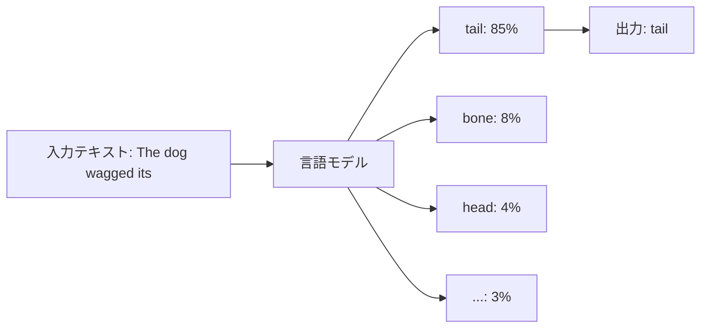
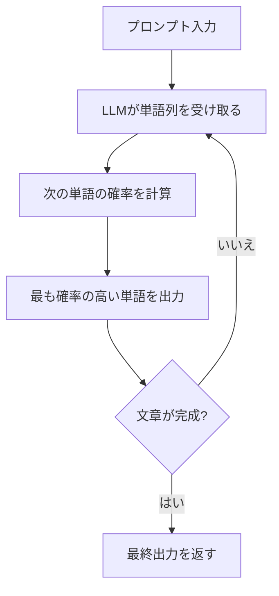

import Quiz from '@/components/content/Quiz.astro'

## 概要

このレクチャーでは，言語モデル（Language Model）とは何かという基本概念から始め，大規模言語モデル（LLM）がどのように動作するかを解説します．LLMが「次の単語を予測する」仕組みであることを理解することで，プロンプトエンジニアリングの土台を築きます．

## 言語モデルとは

言語モデルとは，単語の並びに対する確率分布を計算するモデルです．簡単に言えば，「次にどの単語が来るか」を予測する超高性能なオートコンプリートのようなものです．

例えば，「The dog wagged its」という文があった場合，言語モデルは候補となる各単語に確率を割り当て，最も確率の高い単語を出力します．

### 数学的な定義

言語モデルの形式的な定義は非常に直感的です．

- 単語の並びを X1, X2, ..., Xt とする
- 次の単語 Xt+1 の確率分布を計算したい
- P(Xt+1 | X1, X2, ..., Xt) を求める
- Xt+1 は語彙 V に含まれる単語である必要がある

つまり，これまでの文脈（単語の並び）を元に，次に来る単語の確率を計算するのが言語モデルの本質です．

## 大規模言語モデル（LLM）とは

大規模言語モデル（Large Language Model，略称LLM）は，膨大なデータで学習された言語モデルです．大量のデータで訓練されているため，確率の計算が非常に高精度になっています．

LLMにプロンプトを入力すると，実際に行われているのは以下の処理です．

1. 入力された単語列をLLMに渡す
2. LLMが次の単語の確率を計算する
3. 最も確率の高い単語を出力する
4. これを繰り返して文章を生成する

## LLMの限界

LLMは確率に基づいて単語を推測しているだけなので，時として現実から大きく外れた回答（ハルシネーション）を生成することがあります．これは，LLMが「真実」を理解しているのではなく，統計的に最も確率の高い出力を選んでいるに過ぎないためです．

## まとめ

- 言語モデルは「次の単語を予測する」仕組みである
- LLMは大量のデータで学習された高精度な言語モデル
- プロンプトを入力すると，LLMは確率に基づいて一語ずつ出力を生成する
- 統計的な予測に基づくため，ハルシネーション（事実と異なる出力）が起こり得る

<Quiz questions={[
  {
    question: "言語モデルの主な機能は何ですか？",
    options: [
      "次に来る単語を予測する",
      "文章の文法を修正する",
      "テキストを翻訳する",
      "画像を生成する"
    ],
    answer: 0,
    explanation: "言語モデルの本質は，単語の並びに対する確率分布を計算し，次に来る単語を予測することです．"
  },
  {
    question: "LLMの「L」が意味するものはどれですか？",
    options: [
      "Learning",
      "Linguistic",
      "Large",
      "Logical"
    ],
    answer: 2,
    explanation: "LLMはLarge Language Modelの略で，「Large」は大量のデータで訓練されていることを示します．"
  },
  {
    question: "言語モデルの数学的定義において，P(Xt+1 | X1, X2, ..., Xt) は何を表しますか？",
    options: [
      "これまでの全単語の出現確率",
      "文全体が正しい確率",
      "これまでの単語列を条件とした次の単語の確率",
      "語彙の中からランダムに単語を選ぶ確率"
    ],
    answer: 2,
    explanation: "この式は，これまでの単語列 X1 から Xt を条件として，次の単語 Xt+1 が出現する条件付き確率を表しています．"
  },
  {
    question: "LLMがハルシネーションを起こす原因は何ですか？",
    options: [
      "インターネット接続が不安定だから",
      "学習データが古いから",
      "確率に基づいて単語を推測しているだけだから",
      "ユーザーの入力が曖昧だから"
    ],
    answer: 2,
    explanation: "LLMは「真実」を理解しているのではなく，統計的に最も確率の高い出力を選んでいるだけなので，現実とは異なる回答を生成することがあります．"
  },
  {
    question: "LLMと通常の言語モデルの最大の違いは何ですか？",
    options: [
      "アルゴリズムが全く異なる",
      "LLMはルールベースで動作する",
      "LLMは画像も処理できる",
      "膨大なデータで学習されており確率計算が高精度である"
    ],
    answer: 3,
    explanation: "LLMは通常の言語モデルと同じ原理ですが，膨大なデータで訓練されているため，確率の計算が非常に高精度になっています．"
  }
]} />
