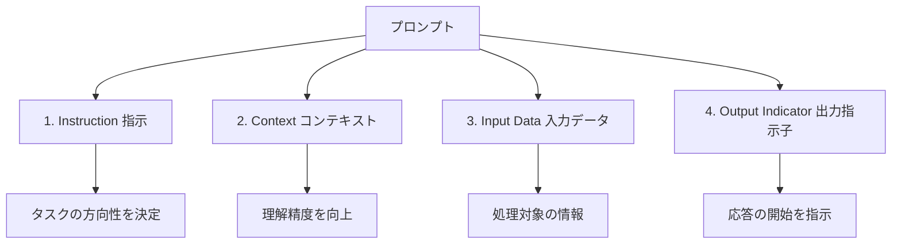

import Quiz from '@/components/content/Quiz.astro'

## 概要

このレクチャーでは，プロンプトの構成要素を形式的に定義します．共通の用語を確立することで，AIに関するコミュニケーションを円滑にし，プロンプトの最適化に役立てます．

## プロンプトとは

プロンプトとは，AIモデルに出力を生成させるために与える入力のことです．プロンプトは，モデルがコンテキストを理解し，情報を処理し，関連性のある意味のある応答を生成するためのガイドと考えることができます．

## プロンプトの4つの構成要素

### 1. Instruction（指示）

プロンプトの心臓部です．AIモデルに実行してほしいタスクを伝えます．テキストの要約，翻訳，分類など，指示がAIの応答の方向性を決定します．

### 2. Context（コンテキスト）

AIモデルがタスクをより良く理解し，より正確な応答を生成するための追加情報です．タスクによってはコンテキストが不要な場合もありますが，含めることでAIの性能が大幅に向上する場合があります．

### 3. Input Data（入力データ）

AIモデルがタスクを完了するために処理する情報です．テキスト，画像，その他タスクに関連するあらゆるデータが該当します．

### 4. Output Indicator（出力指示子）

AIモデルに対して「ここで応答を期待している」と伝えるシグナルです．指示に暗黙的に含まれる場合もあれば，明示的に指定する場合もあります．

## なぜ形式的な定義が重要か

プロンプトの構成要素を理解することには，以下のメリットがあります．

- AI分野での共通言語を確立し，コラボレーションを促進する
- プロンプトのどの部分を修正すべきか特定しやすくなる
- プロンプトのカスタマイズと最適化が効率的になる

## まとめ

- プロンプトはAIモデルへの入力であり，出力生成のガイドとなる
- プロンプトは「指示」「コンテキスト」「入力データ」「出力指示子」の4要素で構成される
- 各構成要素を理解することで，プロンプトの最適化が容易になる
- 形式的な用語を使うことで，AIに関するコミュニケーションが効率化される

<Quiz questions={[
  {
    question: "プロンプトの4つの構成要素に含まれないものはどれですか？",
    options: [
      "Instruction（指示）",
      "Context（コンテキスト）",
      "Temperature（温度）",
      "Output Indicator（出力指示子）"
    ],
    answer: 2,
    explanation: "プロンプトの4つの構成要素は，Instruction，Context，Input Data，Output Indicatorです．Temperatureはプロンプトの構成要素ではなく，モデルのパラメータです．"
  },
  {
    question: "プロンプトの「心臓部」と呼ばれる構成要素はどれですか？",
    options: [
      "Context",
      "Input Data",
      "Output Indicator",
      "Instruction"
    ],
    answer: 3,
    explanation: "Instruction（指示）はプロンプトの心臓部であり，AIモデルに実行してほしいタスクを伝え，応答の方向性を決定します．"
  },
  {
    question: "Contextの役割として正しいものはどれですか？",
    options: [
      "AIモデルの応答速度を上げる",
      "AIモデルがタスクをより良く理解し，より正確な応答を生成するための追加情報を提供する",
      "AIモデルの出力形式を指定する",
      "AIモデルの学習データを更新する"
    ],
    answer: 1,
    explanation: "Contextは，AIモデルがタスクをより良く理解し，より正確な応答を生成するための追加情報を提供します．"
  },
  {
    question: "Output Indicatorの役割は何ですか？",
    options: [
      "出力のフォーマットを整形する",
      "出力の文字数を制限する",
      "AIモデルに「ここで応答を期待している」と伝えるシグナル",
      "出力を複数の言語に翻訳する"
    ],
    answer: 2,
    explanation: "Output Indicatorは，AIモデルに対して「ここで応答を期待している」と伝えるシグナルです．指示に暗黙的に含まれる場合もあれば，明示的に指定する場合もあります．"
  },
  {
    question: "プロンプトの構成要素を理解するメリットとして適切でないものはどれですか？",
    options: [
      "AI分野での共通言語を確立できる",
      "プロンプトのどの部分を修正すべきか特定しやすくなる",
      "AIモデルの内部パラメータを直接制御できるようになる",
      "プロンプトのカスタマイズと最適化が効率的になる"
    ],
    answer: 2,
    explanation: "プロンプトの構成要素を理解しても，AIモデルの内部パラメータを直接制御できるようにはなりません．メリットは共通言語の確立，修正箇所の特定，最適化の効率化です．"
  }
]} />
