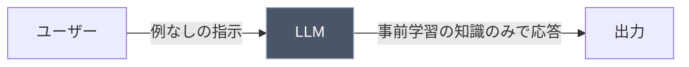

import Quiz from '@/components/content/Quiz.astro'

## 概要

このレクチャーでは，ゼロショットプロンプティングの概念を解説します．LLMが持つ事前学習済みの知識を活用して，具体的な例を提供せずにタスクを実行させる手法です．

## ゼロショットプロンプティングとは

ゼロショットプロンプティングとは，モデルに対して特定のタスクに関する学習データや例を一切提供せずに，出力を生成させるプロンプティング手法です．モデルは事前学習で獲得した知識のみに基づいてタスクを実行します．

例えば，英語のテキストで学習されていないモデルでも，フランス語のテキストに対して正確な出力を生成できることがあります．これは，モデルがすでに持っている知識に依存しているためです．

## ゼロショットプロンプトの例

以下は典型的なゼロショットプロンプトの例です．

```
世界で必ず訪れるべき10都市を，特に順序なくリストアップしてください．
```

このプロンプトでは以下のことが分かります．

- 例やサンプルデータを提供していない
- AIモデルの事前知識のみに依存している
- モデルは最善の努力で応答を生成する



## ゼロショットプロンプティングの特徴

ゼロショットプロンプティングは，AI初心者が最も頻繁に使うプロンプティング手法です．モデルとの対話を始めたばかりの段階では，例を提供せずに質問するのが最も直感的だからです．

## 限界

- 正確性の問題: 例やガイダンスを提供しないため，期待通りの結果が得られない場合がある
- スコープの制限: モデルの事前知識に依存するため，対応範囲が限られる
- 制御の不足: 特定のユースケースに合わせた微調整ができない

## まとめ

- ゼロショットプロンプティングは，例を提供せずにLLMにタスクを実行させる手法
- モデルの事前学習済み知識のみに依存する
- AI初心者が最もよく使うプロンプティング手法
- 正確性やカスタマイズ性に限界があり，より高度な手法（Few-shot，CoTなど）が必要になる場合がある

<Quiz questions={[
  {
    question: "ゼロショットプロンプティングの「ゼロ」が意味するものは何ですか？",
    options: [
      "モデルの学習データがゼロである",
      "プロンプトに例を一切提供しない",
      "出力の精度がゼロに近い",
      "応答時間がゼロに近い"
    ],
    answer: 1,
    explanation: "「ゼロショット」とは，プロンプトに例やサンプルデータを一切提供せずにタスクを実行させることを意味します．"
  },
  {
    question: "ゼロショットプロンプティングでモデルが正確な応答を生成できるのはなぜですか？",
    options: [
      "リアルタイムでインターネットを検索するから",
      "ユーザーの過去の質問履歴を参照するから",
      "事前学習で獲得した膨大な知識に基づいているから",
      "他のAIモデルと連携して回答を生成するから"
    ],
    answer: 2,
    explanation: "ゼロショットプロンプティングでは，モデルは事前学習で獲得した膨大な知識のみに基づいてタスクを実行します．"
  },
  {
    question: "ゼロショットプロンプティングの限界として正しくないものはどれですか？",
    options: [
      "期待通りの結果が得られない場合がある",
      "モデルの事前知識に対応範囲が限られる",
      "特定のユースケースに合わせた微調整ができない",
      "処理速度が他の手法より遅い"
    ],
    answer: 3,
    explanation: "ゼロショットプロンプティングの限界は正確性，スコープの制限，制御の不足です．処理速度が遅いことは限界に含まれません．"
  },
  {
    question: "ゼロショットプロンプティングを最もよく使うのは誰ですか？",
    options: [
      "プロンプトエンジニアの専門家",
      "AI初心者",
      "機械学習の研究者",
      "データサイエンティスト"
    ],
    answer: 1,
    explanation: "ゼロショットプロンプティングはAI初心者が最も頻繁に使う手法です．モデルとの対話を始めたばかりの段階では，例を提供せずに質問するのが最も直感的だからです．"
  },
  {
    question: "ゼロショットプロンプティングの正確性を向上させたい場合，どの手法に移行すべきですか？",
    options: [
      "より長い指示文を書く",
      "同じプロンプトを複数回送信する",
      "Fewショットプロンプティングや Chain of Thought を使う",
      "モデルの温度パラメータを上げる"
    ],
    answer: 2,
    explanation: "ゼロショットプロンプティングの限界を超えるためには，Fewショットプロンプティングや Chain of Thought などのより高度な手法を使うことが推奨されます．"
  }
]} />
