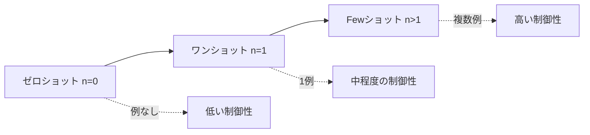

import Quiz from '@/components/content/Quiz.astro'

## 概要

このレクチャーでは，Fewショットプロンプティングの概念と実践を学びます．AIモデルに少数の例を提供することで，出力の質を向上させる手法を，ゼロショット・ワンショットとの比較を通じて理解します．

## Fewショットプロンプティングとは

Fewショットプロンプティングは，AIモデルに対して少数の例（ショット）を提示し，それに基づいて新しいデータを生成・分類させる手法です．特にデータが限られた新しい言語やドメインで有用であり，大量の新データなしに既存モデルを素早く新しいタスクに適応させることができます．

### プロンプティング手法の分類

- ゼロショット（n=0）: 例なしでタスクを実行
- ワンショット（n=1）: 1つの例を提供
- Fewショット（n>1）: 複数の例を提供



## 実践例: 画像生成プロンプト

レクチャーでは，Blue Willowという画像生成ツール向けのプロンプトを例に，3つの手法を比較しています．

### ゼロショット

```
ブラジルの冬景色の中を走るヨークシャーテリアの画像説明を，
形容詞と名詞を使って書いてください．
```

結果: 十分な説明は生成されるが，モデルに創作の自由が大きい．

### ワンショット

```
ブラジルの冬景色の中を走るヨークシャーテリアの，
簡潔で完璧な画像説明を書いてください．
例: blue dog, shimmering snow, ...
```

結果: より簡潔で形容詞が豊富な説明が生成される．

### Fewショット

```
（3つの例を提供）
例1: blue dog ...
例2: red dog ...
例3: green dog ...
```

結果: モデルがパターンを理解し，「vivacious violet Yorkshire dog」のように色で犬を表現するパターンを学習．

## Fewショットプロンプティングの効果

例の数が多いほど，モデルは以下のように改善されます．

- 出力がより正確でユーザーの期待に近くなる
- モデルの創作上の自由度が適切に制限される
- 結果がより一貫性を持つようになる

## まとめ

- Fewショットプロンプティングは少数の例を提供してLLMの出力を改善する手法
- ゼロショット（例なし），ワンショット（1例），Fewショット（複数例）に分類される
- 例が多いほど，モデルは期待するパターンを正確に学習できる
- 限られたデータしかない新しいタスクやドメインで特に有用

<Quiz questions={[
  {
    question: "Fewショットプロンプティングにおける「ショット」とは何を意味しますか？",
    options: [
      "モデルへの質問回数",
      "モデルに提供する例の数",
      "モデルの応答速度",
      "モデルの学習エポック数"
    ],
    answer: 1,
    explanation: "「ショット」はモデルに提供する例の数を指します．ゼロショットは例なし，ワンショットは1例，Fewショットは複数例です．"
  },
  {
    question: "ワンショットプロンプティングはFewショットプロンプティングのどのような位置づけですか？",
    options: [
      "まったく別の手法である",
      "Fewショットプロンプティングのサブセットである",
      "Fewショットプロンプティングの上位互換である",
      "ゼロショットプロンプティングの別名である"
    ],
    answer: 1,
    explanation: "ワンショットプロンプティングはFewショットプロンプティングのサブセット（部分集合）です．n=1のFewショットがワンショットに当たります．"
  },
  {
    question: "Fewショットプロンプティングが特に有用なシナリオはどれですか？",
    options: [
      "大量のデータが利用可能な場合",
      "モデルを一から再学習させたい場合",
      "データが限られた新しい言語やドメインの場合",
      "モデルの推論速度を上げたい場合"
    ],
    answer: 2,
    explanation: "Fewショットプロンプティングは，限られたデータしかない新しいタスクやドメインで特に有用であり，大量の新データなしに既存モデルを素早く適応させることができます．"
  },
  {
    question: "例の数を増やすことでモデルの出力はどのように変化しますか？",
    options: [
      "応答速度が低下する",
      "モデルの創作上の自由度が増す",
      "出力がより正確でユーザーの期待に近くなる",
      "出力の文字数が減少する"
    ],
    answer: 2,
    explanation: "例の数が多いほど，モデルは期待するパターンを正確に学習でき，出力がより正確でユーザーの期待に近くなり，一貫性も向上します．"
  },
  {
    question: "ゼロショットプロンプトで画像説明を生成した場合の特徴は何ですか？",
    options: [
      "生成されない",
      "必ず期待通りの結果になる",
      "モデルに創作の自由が大きく，結果が予測しにくい",
      "Fewショットより高品質になる"
    ],
    answer: 2,
    explanation: "ゼロショットプロンプトでは例を提供しないため，モデルに創作の自由が大きくなり，十分な説明は生成されるものの結果が予測しにくくなります．"
  }
]} />
