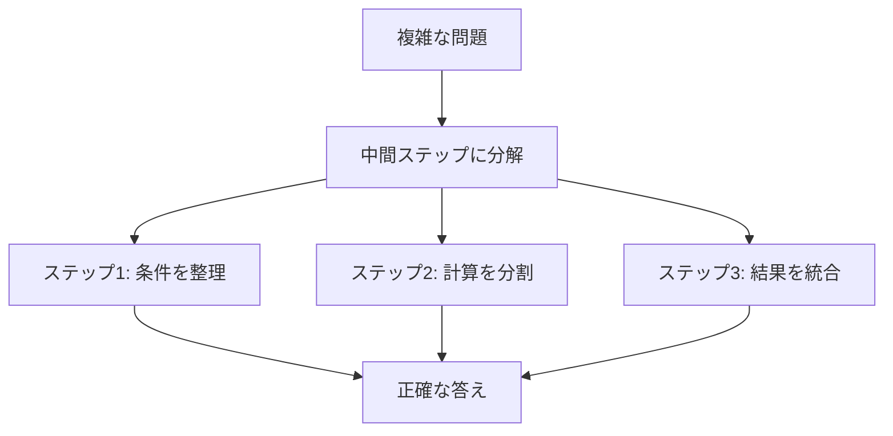

import Quiz from '@/components/content/Quiz.astro'

## 概要

このレクチャーでは，Chain of Thought（CoT: 思考の連鎖）プロンプティングを解説します．Googleの研究者が提案したこの手法は，LLMが複雑な推論タスクを中間ステップに分解して解決できるようにする画期的な方法です．

## Chain of Thoughtとは

1000億パラメータを超えるLLMでも，数学の文章問題や常識的推論などの多段階推論タスクには苦戦します．Chain of Thought（CoT）プロンプティングは，問題を一連の中間推論ステップに分解することで，LLMの推論能力を大幅に向上させる手法です．



## 標準プロンプティングの限界

研究者たちは以下の例で標準プロンプティングの限界を示しました．

問題: 「ジョンは10匹の犬の世話をしています．各犬の散歩と世話に1日5時間かかります．1週間でジョンは何時間必要ですか？」

標準プロンプティング（ゼロショット）での回答: 50時間（10 x 5 = 50，誤り）

正解: 35時間（5時間/日 x 7日 = 35時間）

## CoTによる解決

CoTプロンプティングでは，類似の問題について思考過程を示す例を提供します．

1. 以前の類似問題の回答と共に，解決の過程（Chain of Thought）を示す
2. モデルがその思考パターンを新しい問題に適用する
3. 中間ステップを踏んで正確な答えを導出する

```text
標準プロンプティング          Chain of Thoughtプロンプティング
┌──────────────────┐      ┌──────────────────────────────┐
│ 問題 → LLM → 50  │      │ 問題 → 類似例 + 思考過程     │
│      （不正解）    │      │ → LLM → 中間ステップ → 35   │
│                    │      │            （正解）           │
└──────────────────┘      └──────────────────────────────┘
```

## CoTの2つの種類

### ゼロショットCoT

プロンプトに「ステップバイステップで考えてみましょう」と追加するだけで，モデルが自ら推論過程を出力します．

- 事前の推論例を提供しない
- モデルに推論の自由度がある
- 推論過程を確認できる

### FewショットCoT

実際の期待する回答と，その回答に至る思考過程を例として提供します．

- 具体的な推論パターンを示す
- モデルがそのパターンを学習して類似問題に適用する
- より高精度な結果が得られる

## まとめ

- CoTプロンプティングは，複雑な問題を中間ステップに分解してLLMの推論を改善する
- 標準プロンプティングでは解けない多段階推論問題を解決可能にする
- ゼロショットCoT（「ステップバイステップで考える」を追加）とFewショットCoT（推論例を提供）がある
- LLMの問題解決をより人間に近いプロセスで実現する画期的な手法

<Quiz questions={[
  {
    question: "Chain of Thought プロンプティングの主な目的は何ですか？",
    options: [
      "モデルの応答速度を向上させる",
      "複雑な問題を中間推論ステップに分解してLLMの推論能力を改善する",
      "モデルの学習データ量を増やす",
      "プロンプトの文字数を削減する"
    ],
    answer: 1,
    explanation: "CoTプロンプティングは，問題を一連の中間推論ステップに分解することで，LLMの推論能力を大幅に向上させる手法です．"
  },
  {
    question: "ゼロショットCoTで追加する典型的なフレーズは何ですか？",
    options: [
      "「結論を先に述べてください」",
      "「箇条書きで回答してください」",
      "「ステップバイステップで考えてみましょう」",
      "「要約してください」"
    ],
    answer: 2,
    explanation: "ゼロショットCoTでは「ステップバイステップで考えてみましょう」と追加するだけで，モデルが自ら推論過程を出力します．"
  },
  {
    question: "レクチャーの犬の問題で，標準プロンプティングが誤った答え（50時間）を出した原因は何ですか？",
    options: [
      "計算能力の限界",
      "「1週間」という条件を無視し，1日あたりの時間だけで計算した",
      "犬の数を間違えた",
      "問題文を理解できなかった"
    ],
    answer: 1,
    explanation: "標準プロンプティングでは10匹 x 5時間 = 50時間と計算しましたが，問題は1週間の合計を聞いていたため，5時間/日 x 7日 = 35時間が正解です．"
  },
  {
    question: "FewショットCoTがゼロショットCoTと異なる点は何ですか？",
    options: [
      "推論ステップを使わない",
      "実際の期待する回答とその思考過程を例として提供する",
      "モデルの温度パラメータを変更する",
      "外部APIを使用する"
    ],
    answer: 1,
    explanation: "FewショットCoTでは，実際の期待する回答とその回答に至る思考過程を例として提供し，モデルがそのパターンを学習して類似問題に適用します．"
  },
  {
    question: "CoTプロンプティングを提案したのはどの組織の研究者ですか？",
    options: [
      "OpenAI",
      "Meta",
      "Google",
      "Microsoft"
    ],
    answer: 2,
    explanation: "Chain of Thoughtプロンプティングは，Googleの研究者が提案した手法です．"
  }
]} />
