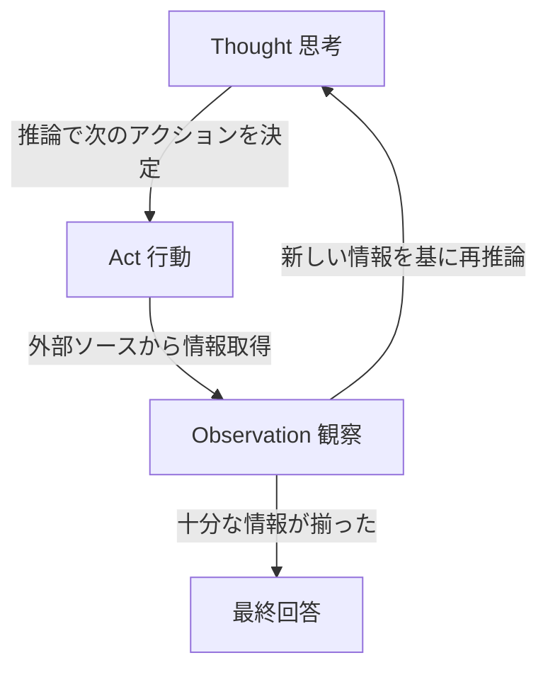

import Quiz from '@/components/content/Quiz.astro'

## 概要

このレクチャーでは，ReAct（Reasoning + Acting）プロンプティング手法を解説します．Chain of Thoughtの推論能力と外部ソースからの情報取得能力を組み合わせた，AIエージェントの基盤となる画期的な手法です．

## ReActとは

ReActは「Reasoning（推論）」と「Acting（行動）」を組み合わせた手法です．人間が複雑なタスクに取り組む際に行う「考え（推論）→実行→次のステップへ」というプロセスをLLMに適用します．

研究者たちが発見したのは，Chain of Thoughtの思考能力と外部アクションの実行能力を組み合わせることで，LLMが以下のことを実現できるということです．

- 自らタスクを生成する（推論部分）
- そのタスクを実行して外部情報を取得する（行動部分）
- 計画を追跡・更新する

## ReActの動作例

質問: 「Apple Remoteの他に，Apple Remoteがもともと操作するために設計されたプログラムを制御できるデバイスは何か？」

### 従来の手法の結果

- ゼロショット: 「iPad」（不正解）
- Chain of Thought: 「iPhone，iPad，iPod」（不正解）
- Act only: 「Yes」（不正解）

### ReActの推論プロセス

1. Thought（思考）: Apple Remoteを検索して，もともと操作するプログラムを見つける必要がある
2. Act（行動）: Apple Remoteを検索
3. Observation（観察）: Front Rowメディアセンター用に設計されていた
4. Thought: Front Rowについて調べる必要がある
5. Act: Front Row softwareを検索
6. Observation: Front RowはApple RemoteまたはキーボードのファンクションキーDe制御される
7. 最終回答: キーボードファンクションキー（正解）

## なぜReActが画期的なのか

ReActの仕組みは意外とシンプルです．

1. Chain of Thoughtでステップを生成（LLMが可能）
2. 各ステップに対してコードでアクション（検索など）を実行
3. 結果をプロンプトに追加して再度LLMに送信
4. 最終回答が得られるまで繰り返す

この手法は，LangChainフレームワークの基盤となっており，外部APIやツールとの連携，データの永続化など，複雑なLLMアプリケーションの構築を可能にしました．

## まとめ

- ReActはReasoning（推論）とActing（行動）を組み合わせた手法
- Chain of Thoughtに外部アクションの実行能力を追加
- LLMが「思考→行動→観察」のループで問題を解決する
- LangChainフレームワークの基盤となった画期的な手法
- 外部ソースからの情報取得により，より事実に基づいた回答が可能

<Quiz questions={[
  {
    question: "ReActの名前の由来は何ですか？",
    options: [
      "Reactive + Action",
      "Reasoning + Acting",
      "Reading + Activation",
      "Real + Action"
    ],
    answer: 1,
    explanation: "ReActは「Reasoning（推論）」と「Acting（行動）」を組み合わせた名前です．"
  },
  {
    question: "ReActプロンプティングのループで正しい順序はどれですか？",
    options: [
      "行動 → 思考 → 観察",
      "観察 → 行動 → 思考",
      "思考 → 行動 → 観察",
      "行動 → 観察 → 思考"
    ],
    answer: 2,
    explanation: "ReActでは「Thought（思考）→ Act（行動）→ Observation（観察）」の順序でループします．"
  },
  {
    question: "ReActがChain of Thoughtと異なる最大の特徴は何ですか？",
    options: [
      "推論ステップを使わない",
      "外部ソースからの情報取得（行動）能力を持つ",
      "ゼロショットでのみ動作する",
      "数学問題に特化している"
    ],
    answer: 1,
    explanation: "ReActはChain of Thoughtの推論能力に加えて，外部ソースからの情報取得という行動能力を組み合わせた点が最大の特徴です．"
  },
  {
    question: "Apple Remoteの問題で，ゼロショット・CoT・Act onlyがすべて失敗した理由は何ですか？",
    options: [
      "問題文が英語だったから",
      "推論だけ，または行動だけでは必要な情報を正しく統合できなかったから",
      "モデルのパラメータ数が不足していたから",
      "検索エンジンが利用できなかったから"
    ],
    answer: 1,
    explanation: "推論のみ（ゼロショット・CoT）では外部情報にアクセスできず，行動のみ（Act only）では推論が不足しており，両方の組み合わせが必要でした．"
  },
  {
    question: "ReActの手法が基盤となったフレームワークはどれですか？",
    options: [
      "TensorFlow",
      "PyTorch",
      "LangChain",
      "Hugging Face"
    ],
    answer: 2,
    explanation: "ReActの手法はLangChainフレームワークの基盤となっており，外部APIやツールとの連携を含む複雑なLLMアプリケーションの構築を可能にしました．"
  }
]} />
