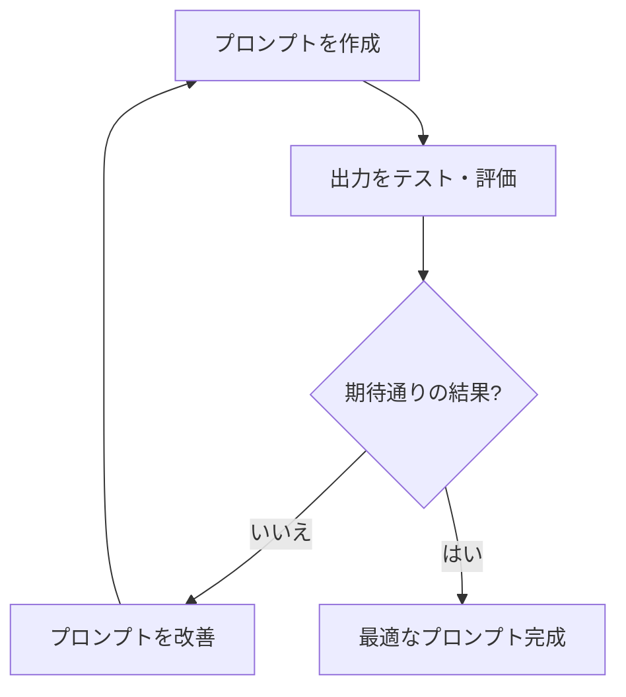

import Quiz from '@/components/content/Quiz.astro'

## 概要

このレクチャーでは，プロンプトエンジニアリングの品質を向上させるための実践的なヒントを紹介します．コンテキストの重要性，明確なタスク定義，具体性，反復プロセスについて解説します．

## ヒント1: コンテキストの重要性

コンテキストはプロンプトに対する文脈上の関連性を与え，一貫性のある正確な応答を生成するために不可欠です．コンテキストを提供しないと，LLMが自分で文脈を推測することになり，期待する結果から外れる可能性が高くなります．

### 例

```
シニアDevOpsエンジニアのポジション向けに，
クラウドを使用する高速開発文化のテックスタートアップでの
技術面接質問リストを生成してください．
```

このプロンプトでは，「シニアDevOpsエンジニア」「テックスタートアップ」「高速開発文化」「クラウド」という豊富なコンテキストにより，LLMが非常に的確な面接質問を生成できます．

## ヒント2: 明確なタスク定義

タスクの定義は曖昧にせず，明確で具体的にする必要があります．

### 悪い例（曖昧）

```
このEコマースサイトのユーザー体験を改善してください．
```

### 良い例（明確）

```
Eコマースサイトのユーザー体験における具体的なペインポイントを特定し，
顧客満足度と販売コンバージョン率を向上させてください．
```

良い例では，具体的な行動（ペインポイントの特定と対処）と成功指標（満足度，コンバージョン率）を明示しています．

## ヒント3: 具体性

プロンプトに含める詳細が多いほど，LLMはよりターゲットを絞った正確な応答を生成できます．プロンプトエンジニアリングは，優れたコミュニケーションスキルに似ています．人間同士の意思疎通と同様に，LLMに対しても簡潔で明確，かつ曖昧さのないメッセージを伝えることが重要です．



## ヒント4: 反復（イテレーション）

反復はプロンプトエンジニアリングにおいて極めて重要です．「The Lean Startup」でも紹介されているこのプロセスは，以下の流れで行います．

1. プロンプトを作成する
2. 出力をテスト・評価する
3. 結果に基づいてプロンプトを改善する
4. 1〜3を繰り返す

各イテレーションは前回の出力に基づいてプロンプトを洗練させ，最終的に最適なプロンプトを完成させます．

## まとめ

- コンテキストを豊富に提供することで，LLMの応答品質が大幅に向上する
- タスク定義は具体的かつ明確にし，曖昧さを排除する
- プロンプトの具体性が高いほど，LLMの応答精度が向上する
- 反復プロセスによりプロンプトを継続的に改善することが重要
- プロンプト作成に時間を投資することで，最終的に時間を節約できる

<Quiz questions={[
  {
    question: "プロンプトにコンテキストを提供しない場合，何が起こりますか？",
    options: [
      "LLMがエラーを返す",
      "LLMが自分で文脈を推測し，期待する結果から外れる可能性が高くなる",
      "LLMが質問を拒否する",
      "LLMがより創造的な回答を生成する"
    ],
    answer: 1,
    explanation: "コンテキストを提供しないと，LLMが自分で文脈を推測することになり，期待する結果から外れる可能性が高くなります．"
  },
  {
    question: "「Eコマースサイトのユーザー体験を改善してください」というプロンプトの問題点は何ですか？",
    options: [
      "文が長すぎる",
      "英語ではない",
      "タスクが曖昧で具体的な行動や成功指標が不明確",
      "技術的な用語が含まれている"
    ],
    answer: 2,
    explanation: "このプロンプトは曖昧であり，具体的な行動や成功指標が示されていないため，LLMが多様な解釈をする可能性があります．"
  },
  {
    question: "プロンプトエンジニアリングにおける「反復」のプロセスとして正しいものはどれですか？",
    options: [
      "同じプロンプトを何度も送信する",
      "プロンプトを作成し，出力を評価し，改善して繰り返す",
      "複数のLLMに同時にプロンプトを送信する",
      "プロンプトを短くしていく"
    ],
    answer: 1,
    explanation: "反復プロセスは，プロンプトを作成→出力をテスト・評価→結果に基づいて改善→繰り返すという流れで行います．"
  },
  {
    question: "プロンプトエンジニアリングに最も近いスキルは何ですか？",
    options: [
      "プログラミング",
      "数学",
      "コミュニケーション",
      "デザイン"
    ],
    answer: 2,
    explanation: "プロンプトエンジニアリングは優れたコミュニケーションスキルに似ています．LLMに対して簡潔で明確，かつ曖昧さのないメッセージを伝えることが重要です．"
  },
  {
    question: "プロンプトの具体性を高めることの効果は何ですか？",
    options: [
      "LLMの処理時間が短縮される",
      "LLMがよりターゲットを絞った正確な応答を生成できる",
      "LLMの学習データが更新される",
      "LLMのハルシネーションが完全に排除される"
    ],
    answer: 1,
    explanation: "プロンプトに含める詳細が多いほど，LLMはよりターゲットを絞った正確な応答を生成できます．"
  }
]} />
