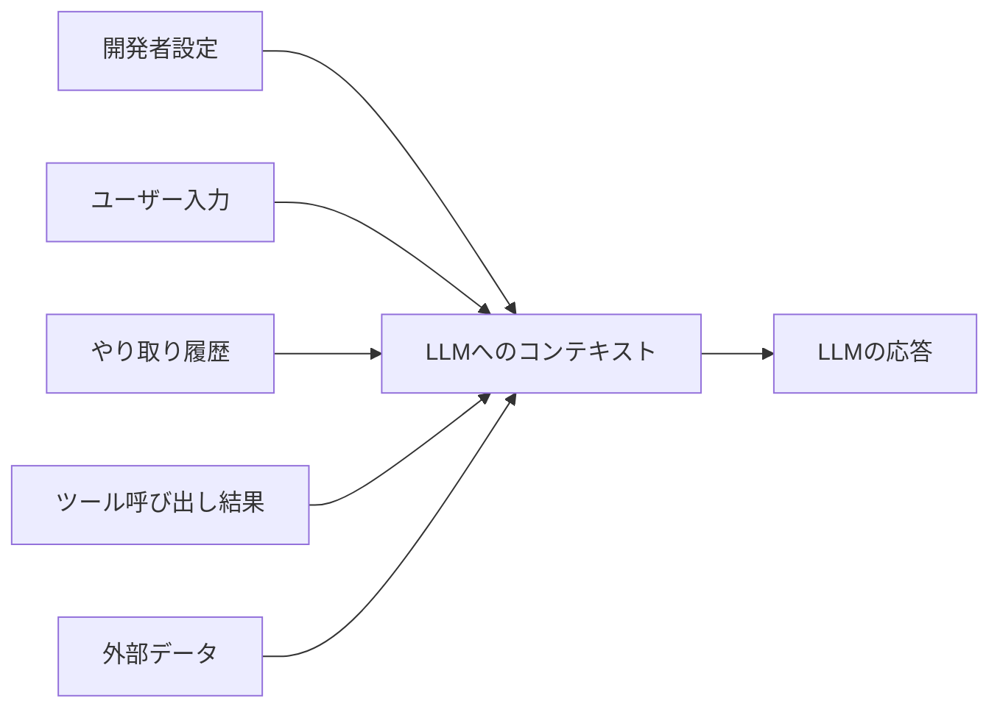

import Quiz from '@/components/content/Quiz.astro'

## 概要

このレクチャーでは，プロンプトエンジニアリングの自然な進化形であるコンテキストエンジニアリングの概念を解説します．静的なプロンプトでは対応しきれない動的なコンテキストソースをどのように管理するかを学びます．

## コンテキストエンジニアリングとは

AIエージェントやCursorやClaude Codeなどのコーディングエージェントを使った経験があれば，最終的にはすべてがLLMへのプロンプト送信とその周辺のエンジニアリングに帰結することを実感しているでしょう．

LLMへの呼び出しには様々なソースからのコンテキストが伴います．

- 開発者が設定するコンテキスト
- ユーザーが提供するコンテキスト
- 過去のやり取りの履歴
- ツール呼び出しからの結果
- 外部データ

## なぜプロンプトエンジニアリングだけでは不十分か

プロンプトは静的ですが，コンテキストのソースは極めて動的です．動的なコンテキストに対応するには，動的なシステムが必要です．これが，プロンプトエンジニアリングからコンテキストエンジニアリングへの進化の理由です．

## エージェントにおけるコンテキストの課題

長時間実行されるタスクでは，ツール呼び出しのフィードバックが蓄積され，コンテキストウィンドウが継続的に成長します．これにより以下の問題が発生します．

- コンテキストウィンドウのサイズ超過
- コストとレイテンシの増加
- エージェントのパフォーマンス低下

### コンテキストに関する3つの問題

1. コンテキストポイズニング: 1つのツール呼び出しがハルシネーションをコンテキストに混入させる
2. コンテキストコンフュージョン: 不要なコンテキストが応答に影響を与える
3. コンテキストクラッシュ: コンテキストの各部分が互いに矛盾する

## 開発者とユーザーの両方に関係

コンテキストエンジニアリングのテクニックは2つの側面があります．

- 開発者側: アプリケーション開発者がLLMに適切なコンテキストを提供する仕組みを構築
- ユーザー側: ユーザー自身がAIシステムに提供するコンテキストの質を向上させる

つまり，非開発者であっても，コンテキストエンジニアリングの原則を理解する必要があります．

## まとめ

- コンテキストエンジニアリングは，LLMに正しいコンテキストを提供する技術
- プロンプトエンジニアリングの自然な進化形であり，動的なコンテキスト管理に焦点
- エージェントではコンテキストウィンドウの管理が特に重要
- コンテキストポイズニング，コンフュージョン，クラッシュに注意が必要
- 開発者とユーザーの両方がコンテキストエンジニアリングを理解すべき

<Quiz questions={[
  {
    question: "コンテキストエンジニアリングとは何ですか？",
    options: [
      "プロンプトの文字数を最適化する技術",
      "LLMに正しいコンテキストを提供する技術",
      "LLMのパラメータを調整する技術",
      "LLMの学習データを更新する技術"
    ],
    answer: 1,
    explanation: "コンテキストエンジニアリングは，LLMに正しいコンテキストを提供する技術であり，プロンプトエンジニアリングの自然な進化形です．"
  },
  {
    question: "プロンプトエンジニアリングだけでは不十分な理由は何ですか？",
    options: [
      "プロンプトの文字数に制限があるから",
      "プロンプトは静的だがコンテキストのソースは極めて動的だから",
      "LLMがプロンプトを理解できないから",
      "プロンプトエンジニアリングが古い技術だから"
    ],
    answer: 1,
    explanation: "プロンプトは静的ですが，コンテキストのソースは極めて動的です．動的なコンテキストに対応するには，動的なシステムが必要です．"
  },
  {
    question: "コンテキストポイズニングとはどのような問題ですか？",
    options: [
      "コンテキストの各部分が互いに矛盾する",
      "不要なコンテキストが応答に影響を与える",
      "ツール呼び出しがハルシネーションをコンテキストに混入させる",
      "コンテキストウィンドウのサイズが不足する"
    ],
    answer: 2,
    explanation: "コンテキストポイズニングとは，1つのツール呼び出しがハルシネーションをコンテキストに混入させ，システムの品質を低下させる問題です．"
  },
  {
    question: "長時間実行されるエージェントタスクで発生しやすい問題はどれですか？",
    options: [
      "LLMの学習データが失われる",
      "ツール呼び出し結果の蓄積によりコンテキストウィンドウが成長し続ける",
      "ユーザーの入力が無視される",
      "外部APIが利用不可になる"
    ],
    answer: 1,
    explanation: "長時間実行されるタスクでは，ツール呼び出しのフィードバックが蓄積され，コンテキストウィンドウが継続的に成長し，コストやレイテンシの増加，パフォーマンス低下を引き起こします．"
  },
  {
    question: "コンテキストエンジニアリングに関して正しい記述はどれですか？",
    options: [
      "開発者のみが理解すればよい",
      "ユーザーには関係がない",
      "開発者とユーザーの両方が理解すべき",
      "AIの専門家だけが使う技術である"
    ],
    answer: 2,
    explanation: "コンテキストエンジニアリングのテクニックには開発者側とユーザー側の両面があり，非開発者であっても原則を理解する必要があります．"
  }
]} />
