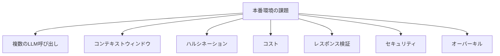

import Quiz from '@/components/content/Quiz.astro'

## 概要

このレクチャーでは，AIエージェントを本番環境に統合する際の主要な課題を解説します．コンテキストウィンドウ，ハルシネーション，コスト，セキュリティなど，実際の運用で直面する問題とその対策を学びます．

## 課題1: 複数のLLM呼び出し

エージェントはLLMを推論エンジンとして使用するため，各ステップでLLM呼び出しが必要です．これらは逐次的な呼び出しとなり，各呼び出しが前の結果を待つ必要があります．タスクの複雑さに応じて，実行時間が大幅に延びる可能性があります．

対策としてセマンティックキャッシュやLLMキャッシュの活用が考えられます．

## 課題2: コンテキストウィンドウ

各推論ステップで大きなプロンプトをLLMに送信します．現在のLLMは約32kトークンを処理できますが，実際のアプリケーションでは簡単にこの制限を超えます．100kトークンを扱えるモデルも存在しますが，「Lost in the Middle」問題（中間部分の情報を忘れる傾向）が発生します．

| 呼び出し回数 | 計算 | 正確率 |
|---|---|---|
| 1回目 | - | 0.9 |
| 2回目 | 0.9 × 0.9 | 0.81 |
| 3回目 | 0.81 × 0.9 | 0.73 |
| 4回目 | 0.73 × 0.9 | 0.66 |
| 5回目 | 0.66 × 0.9 | 0.59 |
| 6回目 | 0.59 × 0.9 | 0.53 |

## 課題3: ハルシネーション

LLMは統計的な生物であり，正しい回答を得られる確率は完全ではありません．正解確率が0.9だとしても，6回の逐次呼び出しで正確な結果を得る確率は約0.59に低下します（乗法法則）．

対策としてツール選択に特化したLLMのファインチューニングが挙げられます．

## 課題4: コスト

エージェントのプロンプトは非常に大きく，これを大規模に実行するとコストが急増します．特にGPT-4のような高性能モデルは低速かつ高額です．

対策:
- セマンティックキャッシュの活用
- ツール選択のための検索拡張（Retrieval Augmentation for Tool Selection）

## 課題5: レスポンスの検証

LLMの応答が正しい形式でない場合，アプリケーションが破損する可能性があります．堅牢な検証メカニズムの構築が必要ですが，テストは非常に複雑な課題です．

## 課題6: セキュリティ

エージェントにデータベースクエリやAPI呼び出しなどの権限を付与するため，悪意のあるユーザーによるプロンプトインジェクションやAPIキーの漏洩が深刻な問題となります．

対策:
- 最小権限の原則を遵守する
- プロンプトにガードレールを設定する
- LLM Guardなどのオープンソースソリューションを活用する

## 課題7: オーバーキル

決定論的に実装できる処理にエージェントを使うのは過剰です．Pythonで確定的に実装できるなら，エージェントの使用は推奨されません．

## まとめ

- エージェントの本番運用にはコンテキストウィンドウ，ハルシネーション，コストなど多くの課題がある
- 逐次的なLLM呼び出しにより，正確性が急速に低下する可能性がある
- セキュリティ対策として最小権限の原則とガードレールが重要
- 決定論的に解決できる問題にはエージェントを使わない判断も重要

<Quiz questions={[
  {
    question: "エージェントの逐次LLM呼び出しにおいて，各ステップの正解確率が0.9の場合，6回の呼び出し後の全体正確率はおよそどれくらいですか？",
    options: [
      "約0.90",
      "約0.75",
      "約0.59",
      "約0.30"
    ],
    answer: 2,
    explanation: "乗法法則により，0.9の6乗で約0.53〜0.59となります．逐次呼び出しが増えるほど正確性は急速に低下します．"
  },
  {
    question: "「Lost in the Middle」問題とは何ですか？",
    options: [
      "LLMが最初のトークンを忘れる問題",
      "LLMがコンテキストの中間部分の情報を忘れる傾向",
      "LLMが最後のトークンを無視する問題",
      "LLMがすべてのコンテキストを忘れる問題"
    ],
    answer: 1,
    explanation: "「Lost in the Middle」問題は，大きなコンテキストを扱う際にLLMが中間部分の情報を忘れる傾向がある現象です．"
  },
  {
    question: "LLMアプリケーションのセキュリティ対策として最も重要な原則は何ですか？",
    options: [
      "最大権限の原則",
      "最小権限の原則",
      "デフォルト許可の原則",
      "オープンアクセスの原則"
    ],
    answer: 1,
    explanation: "最小権限の原則を遵守し，エージェントに必要最低限の権限のみを付与することがセキュリティ対策として最も重要です．"
  },
  {
    question: "エージェントの使用が「オーバーキル」と判断される場合はどのような時ですか？",
    options: [
      "タスクが複雑すぎる場合",
      "外部APIとの連携が必要な場合",
      "決定論的にPythonで実装できる処理の場合",
      "複数のツールが必要な場合"
    ],
    answer: 2,
    explanation: "決定論的に実装できる処理にエージェントを使うのは過剰です．Pythonで確定的に実装できるなら，エージェントの使用は推奨されません．"
  },
  {
    question: "ハルシネーション対策としてレクチャーで紹介された手法はどれですか？",
    options: [
      "コンテキストウィンドウの拡大",
      "ツール選択に特化したLLMのファインチューニング",
      "モデルの温度を0に設定する",
      "応答の文字数を制限する"
    ],
    answer: 1,
    explanation: "ツール選択に特化したLLMのファインチューニングにより，正しいツールを選択する確率を高めることがハルシネーション対策として紹介されました．"
  }
]} />
