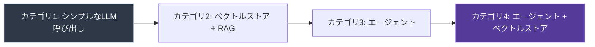

import Quiz from '@/components/content/Quiz.astro'

## 概要

このレクチャーでは，LLMアプリケーションの開発ランドスケープを4つのカテゴリに分類し，それぞれの特徴と実例を紹介します．

## カテゴリ1: シンプルなLLM呼び出し

入力をLLMに送り，レスポンスを受け取り，少し加工してユーザーに表示するだけのアプリケーションです．シンプルですが大きな価値を提供できます．

例: 子供向けストーリー生成アプリ（テーマを入力すると，絵付きの物語を生成）

## カテゴリ2: ベクトルストアとRAG

ベクトルストアとRetrieval Augmented Generation（RAG）パターンを組み合わせ，セマンティック検索で関連データを取得して，特定ドメインの質問に回答するアプリケーションです．

例: Quiver（セカンドブレイン）- PDF，データベース，動画，チャット履歴をすべてインデックス化し，チャットで質問できる

## カテゴリ3: エージェント

LLMの推論エンジンを活用し，非決定論的なコード実行を行うエージェント型アプリケーションです．

例: Torq社のSocratesエージェント（セキュリティアラートを自動トリアージ・修復）

## カテゴリ4: エージェント + ベクトルストア

エージェントとベクトルストアを組み合わせ，長期記憶とセマンティック検索を活用する高度なアプリケーションです．

例: AutoGPT，GPT Engineer，BabyAGI（自律型エージェントの先駆け的プロジェクト）

## まとめ

- すべてのLLMアプリケーションは4つのカテゴリのいずれかに分類できる
- シンプルなLLM呼び出しから自律型エージェントまで，複雑さのスペクトラムが存在する
- エージェントとベクトルストアの組み合わせが最も高度な構成
- 自律型エージェント（AutoGPTなど）はまだ発展途上

<Quiz questions={[
  {
    question: "LLMアプリケーションの4つのカテゴリの中で最もシンプルなものはどれですか？",
    options: [
      "エージェント + ベクトルストア",
      "ベクトルストアとRAG",
      "シンプルなLLM呼び出し",
      "エージェント"
    ],
    answer: 2,
    explanation: "シンプルなLLM呼び出しは，入力をLLMに送り，レスポンスを受け取り，少し加工してユーザーに表示するだけの最もシンプルなカテゴリです．"
  },
  {
    question: "RAGパターンの主な目的は何ですか？",
    options: [
      "LLMの応答速度を向上させる",
      "LLMのパラメータを更新する",
      "セマンティック検索で関連データを取得し，特定ドメインの質問に回答する",
      "LLMの学習コストを削減する"
    ],
    answer: 2,
    explanation: "RAGパターンは，ベクトルストアとセマンティック検索を組み合わせて関連データを取得し，特定ドメインの質問に正確に回答するために使われます．"
  },
  {
    question: "Quiverアプリケーションが採用しているカテゴリはどれですか？",
    options: [
      "シンプルなLLM呼び出し",
      "ベクトルストアとRAG",
      "エージェント",
      "エージェント + ベクトルストア"
    ],
    answer: 1,
    explanation: "Quiverは「セカンドブレイン」と呼ばれ，PDF，データベース，動画等をインデックス化し，RAGパターンでセマンティック検索を行うベクトルストア + RAGのカテゴリです．"
  },
  {
    question: "AutoGPT，GPT Engineer，BabyAGIに共通する特徴は何ですか？",
    options: [
      "シンプルなLLM呼び出しのみを使用している",
      "エージェントとベクトルストアを組み合わせた自律型エージェント",
      "ベクトルストアのみを使用している",
      "人間の介入なしに学習データを更新する"
    ],
    answer: 1,
    explanation: "AutoGPT，GPT Engineer，BabyAGIは，エージェントとベクトルストアを組み合わせた自律型エージェントの先駆け的プロジェクトです．"
  },
  {
    question: "エージェント型アプリケーションの特徴として正しいものはどれですか？",
    options: [
      "決定論的なコード実行を行う",
      "ベクトルストアは使用しない",
      "LLMの推論エンジンを活用した非決定論的なコード実行",
      "外部ツールは使用しない"
    ],
    answer: 2,
    explanation: "エージェント型アプリケーションはLLMの推論エンジンを活用し，非決定論的なコード実行を行い，どのツールをいつ使用するかをLLMが判断します．"
  }
]} />
