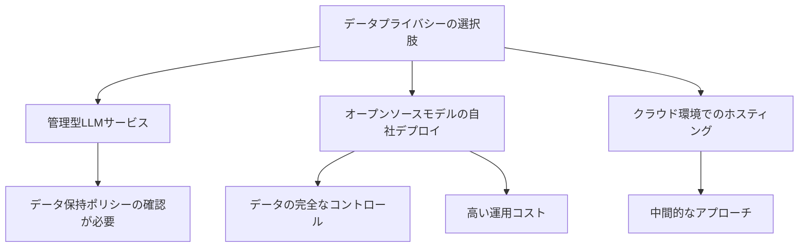

import Quiz from '@/components/content/Quiz.astro'

## 概要

このレクチャーでは，管理型LLMを本番環境で使用する際のプライバシーとデータ保持に関する重要な考慮事項を解説します．エンタープライズ向けAPIにおけるデータの取り扱いについて知っておくべき基本事項を学びます．

## データのトレーニング利用について

多くの企業が懸念するのは，送信したデータがLLMの次期モデルのトレーニングに使われるかどうかです．主要なLLMベンダーの多くは，デフォルトではトレーニング目的でデータを使用しないことを保証しています．オプトインで許可することは可能です．

これはエンタープライズにとって非常に重要です．なぜなら:
- 組織の機密データの漏洩を防ぐ必要がある
- 顧客データの保護に法的義務がある場合が多い

## データ保持ポリシー

ベンダーによってデータ保持ポリシーは異なります．例えばOpenAIの場合:
- 不正利用の検出のため，リクエストを30日間保持する可能性がある
- 一部の顧客にはゼロリテンションポリシーが利用可能
- データはログも永続化もされず，サービング目的のみに使用される

## 厳格な規制が必要な組織

銀行や保険会社など，厳格なプライバシー規制のある組織では，ベンダーの保証だけでは不十分な場合があります．

### 選択肢1: オープンソースモデルの自社デプロイ

メリット: データの完全なコントロール

デメリット:
- スケーラビリティ，可用性，耐久性の管理が必要
- GPUホスティングのコスト
- セキュリティ脆弱性への対応
- 運用チームの維持

### 選択肢2: クラウド環境でのホスティング

クラウドプロバイダーの管理サービスを利用してオープンソースLLMをデプロイする中間的なアプローチです．運用負担をクラウドプロバイダーに移しつつ，自社のクラウド環境でのセキュリティコントロールを維持できます．

## まとめ

- 主要LLMベンダーはデフォルトでトレーニングにデータを使用しない保証を提供
- データ保持ポリシーはベンダーにより異なり，確認が必要
- 厳格な規制のある組織にはオープンソースモデルの自社デプロイが選択肢
- 法律の専門家やプライバシーチームとの相談が不可欠

<Quiz questions={[
  {
    question: "主要なLLMベンダーは，エンタープライズAPI経由で送信されたデータをデフォルトでどのように扱いますか？",
    options: [
      "次期モデルのトレーニングに自動的に使用する",
      "トレーニング目的でデータを使用しないことを保証する",
      "データを無期限に保存する",
      "データを第三者に販売する"
    ],
    answer: 1,
    explanation: "主要なLLMベンダーの多くは，デフォルトではトレーニング目的でデータを使用しないことを保証しています．オプトインで許可することは可能です．"
  },
  {
    question: "OpenAIのデータ保持ポリシーにおいて，不正利用検出のためにリクエストが保持される可能性がある期間は？",
    options: [
      "7日間",
      "30日間",
      "90日間",
      "1年間"
    ],
    answer: 1,
    explanation: "OpenAIの場合，不正利用の検出のため，リクエストを30日間保持する可能性があります．"
  },
  {
    question: "銀行や保険会社などの厳格な規制がある組織がオープンソースモデルを自社デプロイする主な理由は何ですか？",
    options: [
      "管理型LLMサービスより安価だから",
      "パフォーマンスが優れているから",
      "データの完全なコントロールを確保するため",
      "最新のモデルにアクセスできるから"
    ],
    answer: 2,
    explanation: "厳格な規制がある組織では，ベンダーの保証だけでは不十分な場合があり，自社デプロイによりデータの完全なコントロールを確保するために選択します．"
  },
  {
    question: "オープンソースモデルの自社デプロイのデメリットとして挙げられていないものはどれですか？",
    options: [
      "GPUホスティングのコスト",
      "スケーラビリティの管理が必要",
      "モデルの性能が管理型より低い",
      "セキュリティ脆弱性への対応"
    ],
    answer: 2,
    explanation: "自社デプロイのデメリットとして挙げられているのは，スケーラビリティ等の管理，GPUコスト，セキュリティ脆弱性対応，運用チームの維持です．モデル性能の低さは挙げられていません．"
  },
  {
    question: "クラウド環境でのホスティングの利点は何ですか？",
    options: [
      "完全に無料で利用できる",
      "運用負担をクラウドプロバイダーに移しつつ，セキュリティコントロールを維持できる",
      "データ保持ポリシーが不要になる",
      "LLMの性能が自動的に向上する"
    ],
    answer: 1,
    explanation: "クラウド環境でのホスティングは，運用負担をクラウドプロバイダーに移しつつ，自社のクラウド環境でのセキュリティコントロールを維持できる中間的なアプローチです．"
  }
]} />
