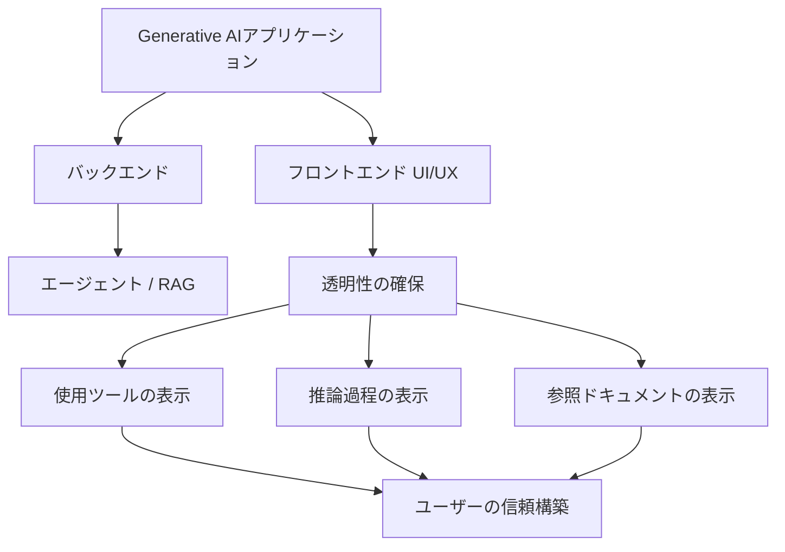

import Quiz from '@/components/content/Quiz.astro'

## 概要

このレクチャーでは，生成AIアプリケーションのユーザーインターフェースとユーザーエクスペリエンスの重要性を解説し，CopilotKitというオープンソースプロジェクトを紹介します．

## Generative UIの重要性

バックエンドの構築（エージェントやRAGシステムの開発）は課題の一部に過ぎません．ユーザーとの信頼構築には透明性が不可欠です．

- エージェントがどのツールを使っているか
- なぜそのツールを選んだか（推論過程）
- RAGアプリケーションでどのドキュメントを参照したか

この透明性が，ユーザーと生成AIアプリケーション間の信頼を構築します．

## CopilotKit

CopilotKitは，生成AIアプリケーション向けの美しいインターフェースと自然なUXを構築するためのオープンソースプロジェクトです．

### LangGraphとの統合

CopilotKitはLangGraphアプリケーションとシームレスに統合する「Co-Agents」を提供します．LangGraphアプリケーションには多くの動的な要素があります．

- 常に変化するState
- 中間結果
- 並列実行されるノード
- Human-in-the-loopの実装

CopilotKitはこれらすべてに対応するコンポーネントを提供しています．

## まとめ

- 生成AIアプリケーションのUI/UXは信頼構築に不可欠
- 透明性（使用ツール，推論過程，参照ドキュメント）がユーザーの信頼を高める
- CopilotKitはLangGraphとの統合に優れたGenerative UIコンポーネントを提供

<Quiz questions={[
  {
    question: "Generative UIにおいて，ユーザーの信頼を構築するために最も重要な要素は何ですか？",
    options: [
      "美しいデザイン",
      "高速な応答速度",
      "透明性（使用ツール，推論過程，参照ドキュメントの表示）",
      "多言語対応"
    ],
    answer: 2,
    explanation: "ユーザーとの信頼構築には透明性が不可欠であり，エージェントのツール使用状況，推論過程，参照ドキュメントを明示することが重要です．"
  },
  {
    question: "CopilotKitが統合をサポートしている主なバックエンドフレームワークはどれですか？",
    options: [
      "TensorFlow",
      "LangGraph",
      "PyTorch",
      "Hugging Face"
    ],
    answer: 1,
    explanation: "CopilotKitはLangGraphアプリケーションとシームレスに統合する「Co-Agents」を提供しています．"
  },
  {
    question: "LangGraphアプリケーションの動的な要素として挙げられていないものはどれですか？",
    options: [
      "常に変化するState",
      "並列実行されるノード",
      "Human-in-the-loop",
      "自動スケーリング"
    ],
    answer: 3,
    explanation: "LangGraphアプリケーションの動的な要素として挙げられているのは，State，中間結果，並列実行ノード，Human-in-the-loopです．自動スケーリングは含まれていません．"
  },
  {
    question: "生成AIアプリケーションの開発において，バックエンド以外に重要なものは何ですか？",
    options: [
      "データベースの最適化",
      "美しいユーザーインターフェースと自然なユーザーエクスペリエンス",
      "より多くのGPUリソース",
      "より大きなモデルの使用"
    ],
    answer: 1,
    explanation: "バックエンドの構築は課題の一部に過ぎず，ユーザーとの信頼構築のために美しいUIと自然なUXの構築も不可欠です．"
  },
  {
    question: "CopilotKitはどのような種類のプロジェクトですか？",
    options: [
      "商用のクラウドサービス",
      "LLMプロバイダー",
      "オープンソースプロジェクト",
      "有料のデザインツール"
    ],
    answer: 2,
    explanation: "CopilotKitは，生成AIアプリケーション向けの美しいインターフェースと自然なUXを構築するためのオープンソースプロジェクトです．"
  }
]} />
