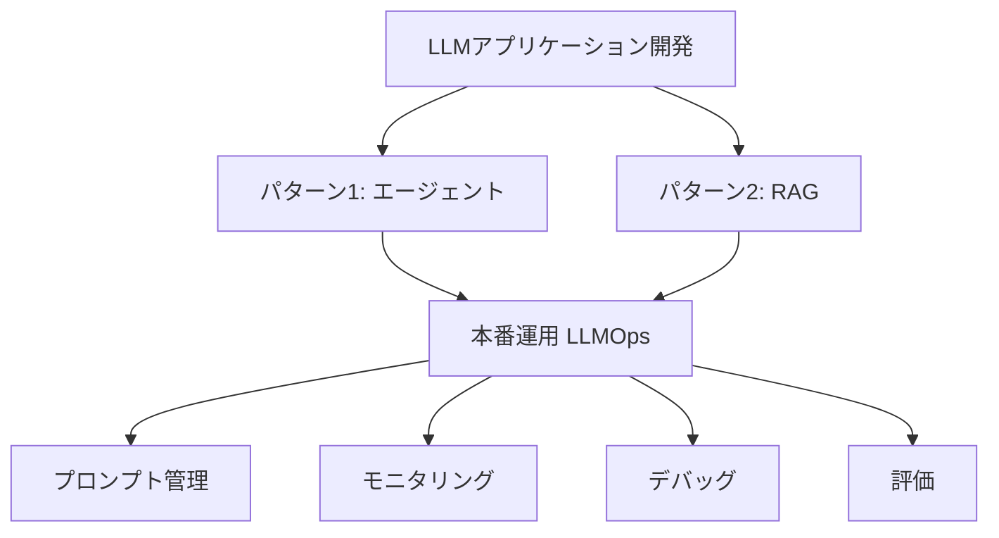

import Quiz from '@/components/content/Quiz.astro'

## 概要

このレクチャーでは，コースの総括と，LLMアプリケーション開発の学習を継続するためのリソースやアドバイスを紹介します．

## コースの振り返り

コースでは2つの重要なパターンをカバーしました．

1. エージェント: LLMの推論能力を活用し，非決定論的なアクションを実行
2. RAG（検索拡張生成）: ベクトルストア，セマンティック検索，エンベディングを活用してプロプライエタリデータと対話

## LLMOps（LLM運用）

本番環境でのLLMアプリケーションには以下が必要です．

- プロンプト管理: LLMの変更に応じたプロンプトの調整
- モニタリング: レスポンス速度，レイテンシ，コストの監視
- デバッグ: LLMが期待する応答を返さない原因の特定
- 評価: LLMの応答品質の自動評価

### 推奨ツール

- LangSmith: LangChainによる統合プラットフォーム（デバッグ，テスト，評価，モニタリング）
- Pezzo: オープンソースの代替（プロンプト管理，トレーシング，モニタリング）

## LLMセキュリティ

本番環境では以下のセキュリティ脅威に注意が必要です．

- プロンプトインジェクション
- エージェントによる不正なデータアクセス
- 新しい攻撃ベクトルへの対応

## 継続的な学習リソース

- LangChainブログ: 毎週更新される新しいアイデアと実装
- Twitter: 研究者やコミュニティからの最新情報

## まとめ

- LLMアプリケーションはエージェントとRAGの2パターンに大別される
- 本番運用にはLLMOps（プロンプト管理，モニタリング，デバッグ，評価）が不可欠
- セキュリティは本番環境で特に重要な課題
- LangChainブログとTwitterが継続学習の主要リソース

<Quiz questions={[
  {
    question: "コースでカバーされた2つの重要なパターンはどれですか？",
    options: [
      "ファインチューニングとプロンプトエンジニアリング",
      "エージェントとRAG（検索拡張生成）",
      "画像生成と音声認識",
      "モニタリングとデバッグ"
    ],
    answer: 1,
    explanation: "コースではエージェント（LLMの推論能力を活用した非決定論的アクション実行）とRAG（ベクトルストア，セマンティック検索を活用したデータとの対話）の2パターンをカバーしました．"
  },
  {
    question: "LLMOpsに含まれる要素として正しくないものはどれですか？",
    options: [
      "プロンプト管理",
      "モニタリング",
      "モデルの学習",
      "評価"
    ],
    answer: 2,
    explanation: "LLMOpsにはプロンプト管理，モニタリング，デバッグ，評価が含まれます．モデルの学習はLLMOpsの範囲外です．"
  },
  {
    question: "LangSmithの機能として正しいものはどれですか？",
    options: [
      "LLMモデルのトレーニング",
      "デバッグ，テスト，評価，モニタリングの統合プラットフォーム",
      "フロントエンドのデザインツール",
      "データベースの管理ツール"
    ],
    answer: 1,
    explanation: "LangSmithはLangChainによる統合プラットフォームで，デバッグ，テスト，評価，モニタリングの機能を提供します．"
  },
  {
    question: "本番環境のLLMセキュリティで注意すべき脅威はどれですか？",
    options: [
      "ネットワークの遅延",
      "プロンプトインジェクション",
      "ディスク容量の不足",
      "ブラウザの互換性"
    ],
    answer: 1,
    explanation: "プロンプトインジェクションは本番環境のLLMアプリケーションにおける主要なセキュリティ脅威の一つです．"
  },
  {
    question: "Pezzoの特徴として正しいものはどれですか？",
    options: [
      "LangChainが開発した商用ツール",
      "オープンソースのLLM運用ツール",
      "LLMモデルそのもの",
      "フロントエンドフレームワーク"
    ],
    answer: 1,
    explanation: "PezzoはLangSmithのオープンソースの代替であり，プロンプト管理，トレーシング，モニタリングの機能を提供します．"
  }
]} />
