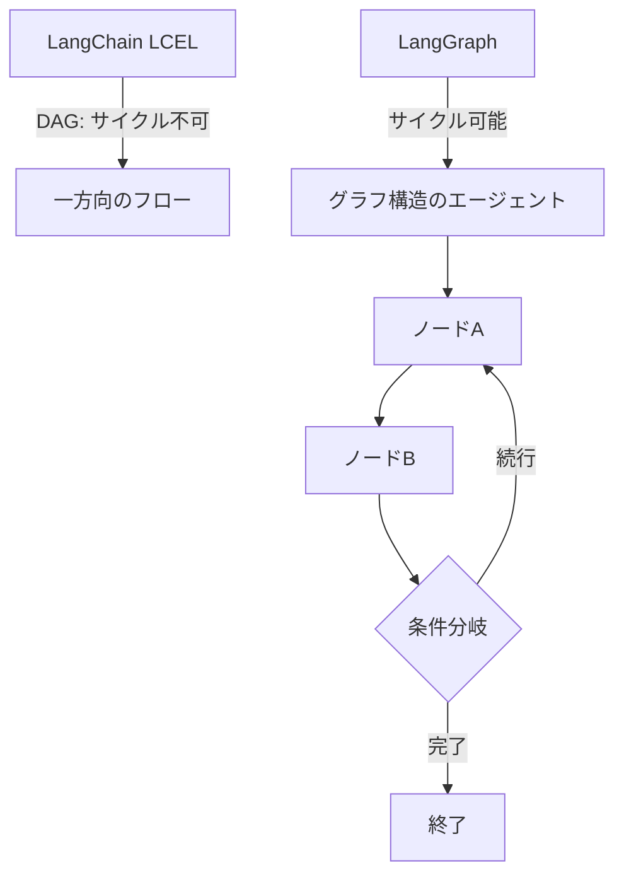

import Quiz from '@/components/content/Quiz.astro'

## 概要

このレクチャーでは，LangGraphとは何か，なぜ必要なのか，LangChainとの違いを解説します．LangGraphはグラフ構造でエージェントを構築する強力なフレームワークであり，サイクル（循環）を可能にすることで複雑なエージェントシステムを実現します．

## LangChainの限界

LangChainはRAGアプリケーションやエージェントの構築に優れたフレームワークですが，LangChain Expression Language（LCEL）では非巡回グラフ（DAG）しか作成できません．つまり，サイクル（あるノードから開始ノードに戻る処理）を実装できません．

ReActアルゴリズムのようなサイクルが必要な実装は，LangChain内ではwhile文によるアドホックな実装に頼っていました．

## LangGraphが解決する問題

LangGraphはサイクルを可能にします．この機能により:

- 複雑なエージェントに必要な自由度を実現
- 開発者がフローを定義し，LLMがフロー内のナビゲーションを決定
- フローAとフローBの選択，終了，開始地点への回帰などを柔軟に実装

## フローエンジニアリングとの関係

LangGraphはフローエンジニアリングの概念を実現するフレームワークです．開発者がプログラムのフローを定義し，LLMをブレンドして，フロー内のナビゲーション（どの方向に進むか）を決定させることができます．

## まとめ

- LangGraphはグラフ構造でエージェントを構築するフレームワーク
- LangChainのLCELでは実現できないサイクル（循環処理）を可能にする
- 開発者がフローを制御しつつ，LLMにナビゲーションの決定を委ねる
- フローエンジニアリングの概念を実装するための基盤

<Quiz questions={[
  {
    question: "LangChainのLCELでは実現できない機能で，LangGraphが解決したものは何ですか？",
    options: [
      "LLMの呼び出し",
      "ベクトルストアとの連携",
      "サイクル（循環処理）",
      "プロンプトテンプレートの作成"
    ],
    answer: 2,
    explanation: "LangChainのLCELでは非巡回グラフ（DAG）しか作成できませんが，LangGraphはサイクル（循環処理）を可能にします．"
  },
  {
    question: "LangGraphでエージェントを構築する際の基本構造は何ですか？",
    options: [
      "リスト構造",
      "ツリー構造",
      "グラフ構造（ノードとエッジ）",
      "スタック構造"
    ],
    answer: 2,
    explanation: "LangGraphはグラフ構造でエージェントを構築するフレームワークであり，ノードとエッジで処理の流れを表現します．"
  },
  {
    question: "フローエンジニアリングとLangGraphの関係として正しいものはどれですか？",
    options: [
      "フローエンジニアリングはLangGraphの前身である",
      "LangGraphはフローエンジニアリングの概念を実現するフレームワークである",
      "フローエンジニアリングはLangGraphの一機能である",
      "両者に関係はない"
    ],
    answer: 1,
    explanation: "LangGraphはフローエンジニアリングの概念を実現するフレームワークであり，開発者がフローを定義し，LLMにナビゲーションの決定を委ねることができます．"
  },
  {
    question: "LangChainでのReActアルゴリズムの実装の問題点は何でしたか？",
    options: [
      "実装が不可能だった",
      "while文によるアドホックな実装に頼っていた",
      "パフォーマンスが悪かった",
      "Pythonでは実装できなかった"
    ],
    answer: 1,
    explanation: "ReActアルゴリズムのようなサイクルが必要な実装は，LangChain内ではwhile文によるアドホックな実装に頼っていました．"
  },
  {
    question: "LangGraphにおけるLLMの役割はどれですか？",
    options: [
      "すべての処理を自律的に実行する",
      "コードを自動生成する",
      "開発者が定義したフロー内のナビゲーション（方向性）を決定する",
      "データベースを直接操作する"
    ],
    answer: 2,
    explanation: "LangGraphでは開発者がフローを定義し，LLMがそのフロー内のナビゲーション（どの方向に進むか）を決定します．"
  }
]} />
