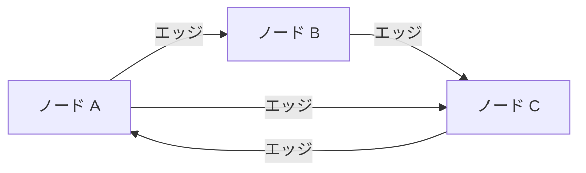

import Quiz from '@/components/content/Quiz.astro'

## 概要

このレクチャーでは，LangGraphの基盤となるグラフデータ構造と状態機械の概念を解説します．

## グラフとは

グラフは関係性を表現する数学的オブジェクトで，ノード（頂点）とそれらを接続するエッジで構成されます．ソーシャルネットワーク，交通マップ，クラウドセキュリティの攻撃ベクトルなど，幅広い分野で活用されています．

## 状態機械とは

状態機械は，状態とそれらの間の遷移で構成される計算モデルです．異なる状態と遷移ルールを定義することで，複雑な条件やシーケンスを管理できます．

状態機械はグラフとして表現できます:
- 状態 = ノード
- 遷移 = エッジ

## LangGraphへの接続

LangGraphは，ノードとエッジを使ってフローを記述し，強力で洗練されたエージェントアプリケーションを構築するためのライブラリです．

## まとめ

- グラフはノード（頂点）とエッジで関係性を表現するデータ構造
- 状態機械は状態と遷移で構成される計算モデルで，グラフとして表現可能
- LangGraphはこれらの概念を活用してエージェントアプリケーションを構築する

<Quiz questions={[
  {
    question: "グラフを構成する2つの基本要素は何ですか？",
    options: [
      "関数とクラス",
      "ノード（頂点）とエッジ",
      "ステートとアクション",
      "入力と出力"
    ],
    answer: 1,
    explanation: "グラフはノード（頂点）とそれらを接続するエッジで構成される数学的オブジェクトです．"
  },
  {
    question: "状態機械をグラフとして表現する場合，状態とノードの関係は？",
    options: [
      "状態はエッジに対応する",
      "状態はノードに対応する",
      "状態はグラフ全体に対応する",
      "状態とノードに直接の関係はない"
    ],
    answer: 1,
    explanation: "状態機械はグラフとして表現でき，状態がノードに，遷移がエッジに対応します．"
  },
  {
    question: "グラフが活用される分野として正しくないものはどれですか？",
    options: [
      "ソーシャルネットワーク",
      "交通マップ",
      "テキスト編集",
      "クラウドセキュリティの攻撃ベクトル"
    ],
    answer: 2,
    explanation: "グラフはソーシャルネットワーク，交通マップ，クラウドセキュリティの攻撃ベクトルなどの関係性の表現に活用されます．テキスト編集は一般的にグラフの応用分野ではありません．"
  },
  {
    question: "状態機械の特徴として正しいものはどれですか？",
    options: [
      "状態間の遷移は常に一方向のみ",
      "異なる状態と遷移ルールを定義して複雑な条件やシーケンスを管理できる",
      "状態の数は常に2つに限られる",
      "遷移ルールを事前に定義する必要がない"
    ],
    answer: 1,
    explanation: "状態機械は，異なる状態と遷移ルールを定義することで，複雑な条件やシーケンスを管理できる計算モデルです．"
  },
  {
    question: "LangGraphがグラフの概念を採用している理由は何ですか？",
    options: [
      "グラフが最も処理速度が速いから",
      "ノードとエッジでフローを記述し，エージェントアプリケーションを構築するのに適しているから",
      "グラフ以外のデータ構造が存在しないから",
      "すべてのプログラミング言語がグラフをサポートしているから"
    ],
    answer: 1,
    explanation: "LangGraphはノードとエッジを使ってフローを記述し，強力で洗練されたエージェントアプリケーションを構築するためにグラフの概念を採用しています．"
  }
]} />
