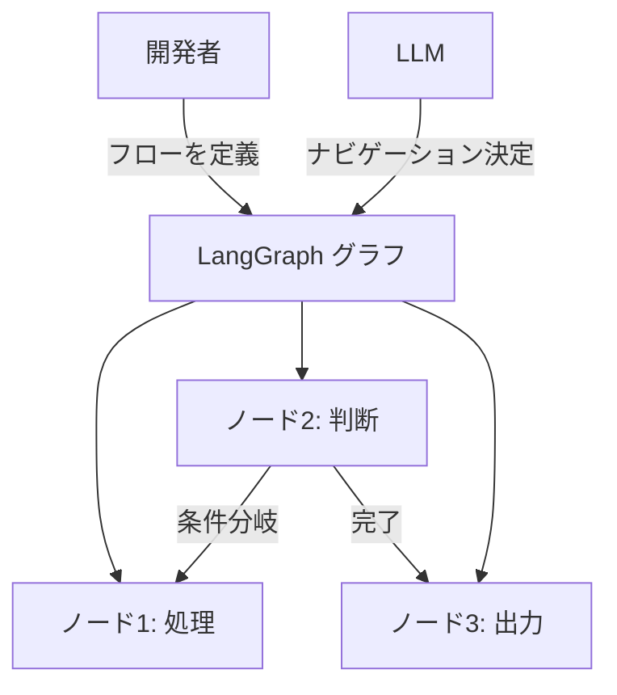

import Quiz from '@/components/content/Quiz.astro'

## 概要

このレクチャーでは，フローエンジニアリングという新しい概念を解説します．AI駆動の意思決定プロセスを組み込んだソフトウェアのフローを体系的に設計する手法です．

## フローエンジニアリングとは

フローエンジニアリングは，AI駆動の意思決定プロセスを組み込んだソフトウェア開発のための体系的かつ戦略的なアプローチです．

主な特徴:
- 明確に定義されたステップの流れを通じてAIを導く
- 線形だけでなく，複雑な意思決定ノードや反復サイクルを含む
- 人間の開発プロセスを模倣した計画・テストフェーズを組み込む

## AutoGPTの問題とフローエンジニアリング

AutoGPTなどの自律型エージェントの問題は長期計画にありました．ゴールを受け取って自らタスクを分解・実行する方式は，LLMが制御不能になりやすい問題を抱えていました．

フローエンジニアリングでは:
- 開発者がタスクと範囲を定義する
- LLMはその範囲内で作業する
- LLMは出力の品質判断やフローのナビゲーションなどの決定を行える
- ただし，開発者がフローの青写真（設計図）を提供する

## LangGraphの役割

LangGraphはフローエンジニアリングの実装基盤です．

- 完全自律エージェントとLangChainチェーンの中間に位置
- 状態機械でステップを定義し，LLMをステップ内の処理やナビゲーション決定に活用
- ノードとエッジ（サイクル含む）でグラフを定義

## 将来のAIソフトウェア開発の時間配分（予測）

- 60%: フローエンジニアリングとアーキテクチャ設計
- 35%: ファインチューニング
- 5%: プロンプトエンジニアリング

## まとめ

- フローエンジニアリングはAI駆動の意思決定フローを体系的に設計する手法
- 開発者がフローを定義し，LLMがフロー内で判断を行う中間的アプローチ
- LangGraphはフローエンジニアリングの実装基盤
- 将来のAI開発ではフローエンジニアリングが最も時間を占めると予測される

<Quiz questions={[
  {
    question: "フローエンジニアリングの定義として最も適切なものはどれですか？",
    options: [
      "LLMのパラメータを調整する技術",
      "AI駆動の意思決定プロセスを組み込んだソフトウェアフローを体系的に設計するアプローチ",
      "プロンプトの最適化手法",
      "コードのリファクタリング手法"
    ],
    answer: 1,
    explanation: "フローエンジニアリングは，AI駆動の意思決定プロセスを組み込んだソフトウェア開発のための体系的かつ戦略的なアプローチです．"
  },
  {
    question: "AutoGPTなどの自律型エージェントの主な問題は何でしたか？",
    options: [
      "処理速度が遅い",
      "長期計画においてLLMが制御不能になりやすい",
      "コストが高すぎる",
      "Pythonでしか動作しない"
    ],
    answer: 1,
    explanation: "AutoGPTなどの自律型エージェントの問題は長期計画にあり，ゴールを受け取って自らタスクを分解・実行する方式はLLMが制御不能になりやすい問題を抱えていました．"
  },
  {
    question: "フローエンジニアリングにおいて，LLMが行える決定として正しいものはどれですか？",
    options: [
      "フローの設計図を作成する",
      "出力の品質判断やフローのナビゲーション",
      "新しいツールを開発する",
      "開発者の指示を無視して自律的に動作する"
    ],
    answer: 1,
    explanation: "フローエンジニアリングではLLMは出力の品質判断やフローのナビゲーションなどの決定を行えますが，フローの設計図は開発者が提供します．"
  },
  {
    question: "将来のAIソフトウェア開発の時間配分予測で，最も多くの時間を占めるとされているのは？",
    options: [
      "プロンプトエンジニアリング（60%）",
      "ファインチューニング（60%）",
      "フローエンジニアリングとアーキテクチャ設計（60%）",
      "テスト（60%）"
    ],
    answer: 2,
    explanation: "将来のAIソフトウェア開発では，フローエンジニアリングとアーキテクチャ設計が60%，ファインチューニングが35%，プロンプトエンジニアリングが5%と予測されています．"
  },
  {
    question: "LangGraphとフローエンジニアリングの関係として正しいものはどれですか？",
    options: [
      "LangGraphはフローエンジニアリングの代替手法である",
      "フローエンジニアリングはLangGraphの一機能に過ぎない",
      "LangGraphはフローエンジニアリングの実装基盤である",
      "両者に関係はない"
    ],
    answer: 2,
    explanation: "LangGraphはフローエンジニアリングの実装基盤であり，開発者がフローを定義し，LLMをステップ内の処理やナビゲーション決定に活用できます．"
  }
]} />
