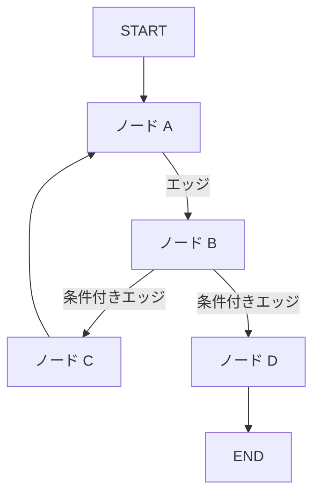

import Quiz from '@/components/content/Quiz.astro'

## 概要

このレクチャーでは，LangGraphのコアコンポーネントであるノード，エッジ，条件付きエッジ，ステートについて解説します．

## 3つのコアコンポーネント

### 1. ノード（Nodes）

ノードはPython関数です．決定論的コード，LLM呼び出し，エージェント呼び出しなど，任意のコードを実行できます．各ノードは現在のグラフステートを入力として受け取り，更新されたステートを返します．

### 2. エッジ（Edges）

エッジはノード間を接続し，グラフの実行フローを定義します．

### 3. 条件付きエッジ（Conditional Edges）

動的にノードAまたはノードBに遷移するかを決定します．LLMの判断に基づく非決定論的なフロー制御を実現します．

## 組み込みノード

- STARTノード: グラフ実行のエントリーポイント
- ENDノード: グラフ実行の終了点

## ステート（Agent State）

ステートはグラフ全体で共有される辞書で，以下の特徴を持ちます．

- ノードの実行結果，一時的な結果，チャット履歴などを保持
- グラフ内のすべてのノードとエッジからアクセス可能
- ローカル（実行中のみ）または永続ストレージに保存可能
- 各ノードはステートを入力として受け取り，更新を返す

## その他の重要な概念

- サイクリックグラフ: ループの実装が可能（LangChainでは困難だった）
- Human-in-the-loop: 人間のフィードバックに基づくフロー制御
- 永続化: ステートの永続的な保存による堅牢性と障害耐性

## まとめ

- LangGraphの3つのコアコンポーネント: ノード，エッジ，条件付きエッジ
- ノードは任意のPython関数，エッジはフロー制御，条件付きエッジは動的な分岐
- ステートはグラフ全体で共有される辞書で，すべてのノードからアクセス可能
- サイクリックグラフ，Human-in-the-loop，永続化をサポート

<Quiz questions={[
  {
    question: "LangGraphのノードとは何ですか？",
    options: [
      "データベースのテーブル",
      "Python関数であり，任意のコードを実行できる",
      "LLMモデルそのもの",
      "設定ファイル"
    ],
    answer: 1,
    explanation: "ノードはPython関数であり，決定論的コード，LLM呼び出し，エージェント呼び出しなど任意のコードを実行できます．"
  },
  {
    question: "条件付きエッジの役割は何ですか？",
    options: [
      "ノードの実行を遅延させる",
      "動的にノードAまたはノードBに遷移するかを決定する",
      "ステートをリセットする",
      "グラフを終了させる"
    ],
    answer: 1,
    explanation: "条件付きエッジは動的にノードAまたはノードBに遷移するかを決定し，LLMの判断に基づく非決定論的なフロー制御を実現します．"
  },
  {
    question: "LangGraphのステート（Agent State）の特徴として正しくないものはどれですか？",
    options: [
      "グラフ全体で共有される辞書",
      "すべてのノードとエッジからアクセス可能",
      "ノードごとに独立して管理される",
      "永続ストレージに保存可能"
    ],
    answer: 2,
    explanation: "ステートはグラフ全体で共有される辞書であり，すべてのノードとエッジからアクセス可能です．ノードごとに独立して管理されるのではありません．"
  },
  {
    question: "LangGraphの組み込みノードにはどのようなものがありますか？",
    options: [
      "INPUTノードとOUTPUTノード",
      "STARTノードとENDノード",
      "BEGINノードとFINISHノード",
      "HEADノードとTAILノード"
    ],
    answer: 1,
    explanation: "LangGraphの組み込みノードはSTARTノード（エントリーポイント）とENDノード（終了点）です．"
  },
  {
    question: "LangGraphの永続化（Persistence）機能の利点は何ですか？",
    options: [
      "グラフの描画が美しくなる",
      "LLMの応答速度が向上する",
      "ステートの永続的な保存による堅牢性と障害耐性",
      "コードの行数が減少する"
    ],
    answer: 2,
    explanation: "永続化によりステートを永続的に保存することで，堅牢性と障害耐性が向上し，Human-in-the-loopの実装も容易になります．"
  }
]} />
