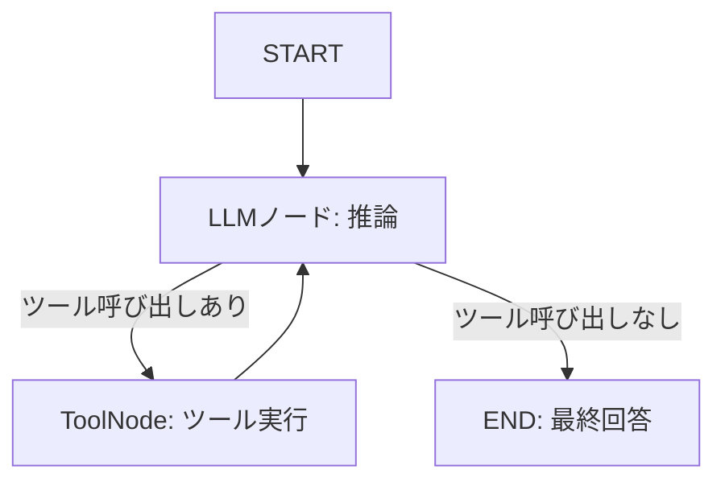

import Quiz from '@/components/content/Quiz.astro'

## 概要

このレクチャーでは，LangGraphを使ってReActエージェントエグゼキュータを実装するハンズオンプロジェクトの概要を説明します．Function CallingとToolNodeを活用した最新のアプローチで実装します．

## プロジェクト概要

ReActアルゴリズムをLangGraphのグラフとして実装します．

- 検索ツールとカスタムツール（triple関数）を使用
- サイクルを持つグラフでエージェントのループを実現
- 「東京の天気は？それを3倍にして」のような複合的な質問に対応

## 重要なポイント

- LangGraphの最新バージョンを使用し，ToolNodeとFunction Callingを活用
- ReActアルゴリズムの基礎を理解していると，LangGraphでの実装がスムーズ
- 基礎の理解が，新しい抽象化レイヤーの深い理解につながる

## まとめ

- LangGraphでReActエージェントを実装するハンズオンプロジェクト
- Function CallingとToolNodeで堅牢なエージェントを構築
- 検索ツールとカスタムツールを組み合わせた実践的な例

<Quiz questions={[
  {
    question: "ReActエージェントのLangGraphでの実装において，サイクルはどのように使われますか？",
    options: [
      "エラーを処理するために使われる",
      "ツール呼び出しの結果をLLMに戻してループさせるために使われる",
      "グラフの描画を最適化するために使われる",
      "ステートを初期化するために使われる"
    ],
    answer: 1,
    explanation: "ReActエージェントでは，ツール呼び出しの結果をLLMに戻して再度推論させるサイクル（ループ）が不可欠です．"
  },
  {
    question: "ToolNodeの役割は何ですか？",
    options: [
      "LLMを呼び出す",
      "グラフを終了させる",
      "LLMが決定したツールを実際に実行する",
      "ステートを永続化する"
    ],
    answer: 2,
    explanation: "ToolNodeはLLMが決定したツール（関数）を実際に実行し，その結果をステートに返すノードです．"
  },
  {
    question: "Function Callingの仕組みとして正しいものはどれですか？",
    options: [
      "LLMが直接外部APIを呼び出す",
      "LLMがどのツールをどの引数で呼び出すべきか判断し，開発者のコードが実際に実行する",
      "開発者が手動でツールを選択する",
      "ツールがLLMを呼び出す"
    ],
    answer: 1,
    explanation: "Function Callingでは，LLMがどのツールをどの引数で呼び出すべきか判断し，実際の実行は開発者のコード側で行われます．"
  },
  {
    question: "このプロジェクトで「東京の天気は？それを3倍にして」という質問に対応できる理由は？",
    options: [
      "LLMが数学計算も得意だから",
      "検索ツールとカスタムツール（triple関数）を組み合わせ，サイクルで複数回ツールを呼び出せるから",
      "事前にすべての回答が登録されているから",
      "単一のツールですべてを処理できるから"
    ],
    answer: 1,
    explanation: "検索ツールで天気を取得し，カスタムツール（triple関数）で3倍にするという複数のツール呼び出しを，サイクルを持つグラフで実現しています．"
  },
  {
    question: "ReActアルゴリズムの基礎を理解することが推奨される理由は何ですか？",
    options: [
      "LangGraphでは使われないから",
      "基礎の理解が新しい抽象化レイヤーの深い理解につながるから",
      "ReActアルゴリズムの方が優れているから",
      "LangGraphの使用が難しくなるから"
    ],
    answer: 1,
    explanation: "基礎の理解があると，LangGraphのような新しい抽象化レイヤーの動作をより深く理解でき，効果的に活用できるようになります．"
  }
]} />
