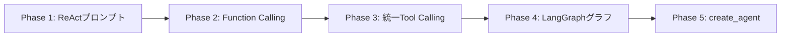

import Quiz from '@/components/content/Quiz.astro'

## 概要

このレクチャーでは，LangChainエージェントの進化の歴史を振り返り，ReActプロンプトからLangGraph v1.0のcreate_agent関数までの道のりを解説します．

## エージェントの進化

### Phase 1: ReActプロンプト

初期のエージェントはReActプロンプトとLangChainのパーシングに依存していました．モデルの能力が不十分で，出力パーシングの信頼性が低いという課題がありました．

### Phase 2: Function Calling

LLMベンダーがFunction Calling機能を提供し始め，ReActプロンプトが不要になりました．ただし，各ベンダーの実装が異なる（function calling vs tool calling，レスポンス内の配置が異なる）という新たな問題が発生．

### Phase 3: LangChainのTool Calling統一インターフェース

LangChainがすべてのベンダーに対応する統一的なtool callingインターフェースを実装し，ベンダー間の差異を吸収しました．

### Phase 4: LangGraphでのグラフベースエージェント

while文ベースのAgentExecutorから，ノード・エッジ・共有ステートを持つグラフ構造に移行．可視性，制御性，デバッグ性が大幅に向上しました．

### Phase 5: LangGraph v1.0とcreate_agent

LangGraph v1.0で`create_agent`関数が導入され，シンプルなインターフェースでReActエージェントを作成可能に．内部的にはLangGraphのグラフとして実装されています．

## LangGraphの主な利点

- 明示的なグラフ構造による可視性
- 自動チェックポイントによるタイムトラベル
- グラフのコンポジション（グラフをノードとして組み込み可能）
- LangSmithとの統合トレーシング

## まとめ

- ReActプロンプト → Function Calling → 統一Tool Calling → LangGraph → create_agentという進化
- 各段階で信頼性，可視性，開発体験が向上
- LangGraph v1.0のcreate_agentはシンプルなインターフェースを提供しつつ，内部はLangGraphグラフ
- 基礎（ReActプロンプト，Function Calling）を理解していると，新しい抽象化の理解が深まる

<Quiz questions={[
  {
    question: "LangChainエージェントの進化の正しい順序はどれですか？",
    options: [
      "Function Calling → ReActプロンプト → LangGraph → create_agent",
      "ReActプロンプト → Function Calling → 統一Tool Calling → LangGraph → create_agent",
      "LangGraph → Function Calling → ReActプロンプト → create_agent",
      "create_agent → LangGraph → Function Calling → ReActプロンプト"
    ],
    answer: 1,
    explanation: "進化の順序は，ReActプロンプト → Function Calling → 統一Tool Calling → LangGraph → create_agentです．"
  },
  {
    question: "初期のReActプロンプトベースのエージェントの主な課題は何でしたか？",
    options: [
      "処理速度が遅い",
      "モデルの能力不足と出力パーシングの信頼性の低さ",
      "コストが高い",
      "ツールを使用できない"
    ],
    answer: 1,
    explanation: "初期のReActプロンプトベースのエージェントは，モデルの能力が不十分で，出力パーシングの信頼性が低いという課題がありました．"
  },
  {
    question: "LangChainの統一Tool Callingインターフェースが解決した問題は何ですか？",
    options: [
      "LLMの応答速度",
      "各ベンダー間のFunction Calling実装の差異",
      "エージェントのセキュリティ",
      "コンテキストウィンドウのサイズ"
    ],
    answer: 1,
    explanation: "各ベンダーのFunction Calling実装が異なる（function calling vs tool calling，レスポンス内の配置の違い）問題を，統一的なインターフェースで吸収しました．"
  },
  {
    question: "LangGraph v1.0のcreate_agent関数の特徴は何ですか？",
    options: [
      "LangGraphとは無関係に動作する",
      "シンプルなインターフェースで，内部的にはLangGraphのグラフとして実装されている",
      "ReActプロンプトを使用する",
      "Function Callingに対応していない"
    ],
    answer: 1,
    explanation: "create_agent関数はシンプルなインターフェースでReActエージェントを作成でき，内部的にはLangGraphのグラフとして実装されています．"
  },
  {
    question: "基礎（ReActプロンプトやFunction Calling）を理解することが重要な理由は何ですか？",
    options: [
      "古い技術を使い続ける必要があるから",
      "基礎を理解していると新しい抽象化の理解が深まるから",
      "create_agentが基礎知識を前提としているから",
      "面接で聞かれるから"
    ],
    answer: 1,
    explanation: "基礎（ReActプロンプト，Function Calling）を理解していると，LangGraphやcreate_agentのような新しい抽象化レイヤーの動作をより深く理解できます．"
  }
]} />
