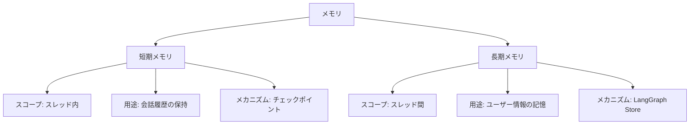
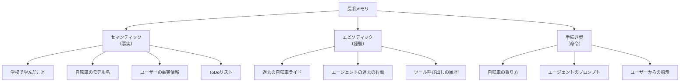

import Quiz from '@/components/content/Quiz.astro'

## 概要

このレクチャーでは，AIエージェントにおけるメモリの概念を認知科学的な定義から出発し，短期メモリと長期メモリの違い，長期メモリの3つのタイプ（セマンティック・エピソディック・手続き型），そしてプロファイルとコレクションという2つのデータ構造について解説します．モジュールの最後に構築する `task_mAIstro` エージェントの基礎となる概念を学びます．

## task_mAIstro のデモ

モジュール5では，Lance氏が自身のために構築した `task_mAIstro` というToDoリスト管理エージェントを紹介し，最終的にゼロから構築します．このエージェントは以下の機能を持ちます:

- ユーザープロファイルの自動更新（名前，居住地など）
- ToDo項目の追加・更新
- 自然言語での対話による操作
- LangGraph Studioでローカル実行（データはローカル保存）

## メモリの定義

認知科学的な定義では，メモリとは「人が情報を保存・検索・使用して，現在と未来を理解するための認知機能」です．

AIアプリケーションの文脈では，メモリは2つの種類に分けられます:

- スレッド内メモリ（短期メモリ）: 1つのチャットセッション内の会話履歴
- スレッド間メモリ（長期メモリ）: すべてのセッションを横断して永続化される情報

## 短期メモリ vs 長期メモリ

| 項目 | 短期メモリ | 長期メモリ |
|------|-----------|-----------|
| スコープ | スレッド内（セッション内） | スレッド間（セッション横断） |
| ユースケース | 会話履歴の保持 | 特定ユーザーの情報をすべてのセッションで記憶 |
| メカニズム | チェックポイント | LangGraph Store |
| 管理手法 | フィルタリング，要約 | プロファイル，コレクション |

短期メモリの管理は主にチャット履歴の管理であり，フィルタリング（古いメッセージの切り捨て）や要約（凝縮表現の生成）といった手法が使われます．

## 長期メモリの3つのタイプ

### セマンティックメモリ（事実）

ユーザーに関する事実やToDoリストの項目など，知識としてのメモリです．CoALA論文では，エージェントにおけるセマンティックメモリとして「ユーザーに関する事実」や「ToDoリスト」が挙げられています．

### エピソディックメモリ（経験）

過去のエージェントの行動やツール呼び出しの履歴など，経験としてのメモリです．Few-shot例としてエージェントに提供することで，将来のツール使用を改善できます．

### 手続き型メモリ（命令）

エージェントのプロンプトやユーザーからの指示など，「どのように行動するか」を定義するメモリです．LLMが自身のプロンプトを書き換える能力を活用し，ユーザーのフィードバックに基づいて命令を更新できます．

## プロファイル vs コレクション

セマンティックメモリ（事実）の構造化には，2つのアプローチがあります:

### プロファイル（単一ドキュメント）

ユーザーの一般情報（名前，興味，居住地など）を1つのドキュメントとして管理します．

- メリット: 単一で取得が容易
- デメリット: サイズが大きくなると管理が困難

### コレクション（リスト形式）

ToDoリストのように，複数のアイテムをリストとして管理します．

- メリット: 各アイテムが小さく，スコープが狭い
- デメリット: リストが大きくなると検索が課題になる

## メモリ更新のタイミング

| 方式 | 説明 | メリット | デメリット |
|------|------|---------|-----------|
| ホットパス | ユーザーとの対話中にリアルタイムで更新 | リアルタイム更新，透明性が高い | レイテンシに影響，複雑なエージェントではパフォーマンス低下 |
| バックグラウンド | 別プロセスで一定間隔で更新 | ユーザー体験への影響が少ない | 更新頻度の調整が必要，即座に利用できない可能性 |

このモジュールでは，ホットパス方式のメモリ更新に焦点を当てます．

## task_mAIstro が使用するメモリタイプ

最終的に構築するエージェントは以下の3種類のメモリを使用します:

1. セマンティックメモリ（プロファイル）: ユーザーの基本情報
2. セマンティックメモリ（コレクション）: ToDoリスト
3. 手続き型メモリ: ToDo作成に関する指示（ユーザーが更新可能）

## まとめ

- メモリは認知科学的には「情報の保存・検索・使用のための認知機能」
- 短期メモリはスレッド内（チェックポイント），長期メモリはスレッド間（LangGraph Store）
- 長期メモリには3タイプ: セマンティック（事実），エピソディック（経験），手続き型（命令）
- 事実の構造化にはプロファイル（単一ドキュメント）とコレクション（リスト）の2つのアプローチ
- メモリ更新はホットパス（リアルタイム）またはバックグラウンドで実行可能

<Quiz questions={[
  {
    question: "短期メモリと長期メモリの主な違いは何ですか？",
    options: [
      "短期メモリは高速で長期メモリは低速",
      "短期メモリはスレッド内，長期メモリはスレッド間でデータを保持する",
      "短期メモリはテキストのみで長期メモリは画像も保存できる",
      "短期メモリはローカルで長期メモリはクラウドに保存される"
    ],
    answer: 1,
    explanation: "短期メモリはスレッド内（セッション内）の会話履歴をチェックポイントで保持し，長期メモリはスレッド間（セッション横断）でLangGraph Storeを使ってデータを永続化します．"
  },
  {
    question: "長期メモリの3つのタイプとして正しい組み合わせはどれですか？",
    options: [
      "入力メモリ，出力メモリ，中間メモリ",
      "セマンティック（事実），エピソディック（経験），手続き型（命令）",
      "テキストメモリ，画像メモリ，音声メモリ",
      "ローカルメモリ，リモートメモリ，ハイブリッドメモリ"
    ],
    answer: 1,
    explanation: "長期メモリはセマンティック（事実：ユーザー情報やToDoなど），エピソディック（経験：過去のエージェント行動），手続き型（命令：プロンプトや指示）の3タイプに分類されます．"
  },
  {
    question: "プロファイルとコレクションの違いについて正しい説明はどれですか？",
    options: [
      "プロファイルはパブリックでコレクションはプライベート",
      "プロファイルは単一ドキュメントとして管理し，コレクションはリスト形式で複数アイテムを管理する",
      "プロファイルは読み取り専用でコレクションは書き込み専用",
      "プロファイルはJSON形式でコレクションはCSV形式"
    ],
    answer: 1,
    explanation: "プロファイルはユーザー情報などを1つのドキュメントとして管理する方式で，コレクションはToDoリストのように複数のアイテムをリストとして管理する方式です．"
  },
  {
    question: "ホットパス方式のメモリ更新の特徴として正しいものはどれですか？",
    options: [
      "バックグラウンドで一定間隔で更新される",
      "ユーザーとの対話中にリアルタイムで更新される",
      "サーバー再起動時にのみ更新される",
      "手動でトリガーしない限り更新されない"
    ],
    answer: 1,
    explanation: "ホットパス方式はユーザーとの対話中にリアルタイムでメモリを更新します．ChatGPTやtask_mAIstroが採用している方式で，リアルタイム性と透明性が高い反面，レイテンシに影響する場合があります．"
  }
]} />
