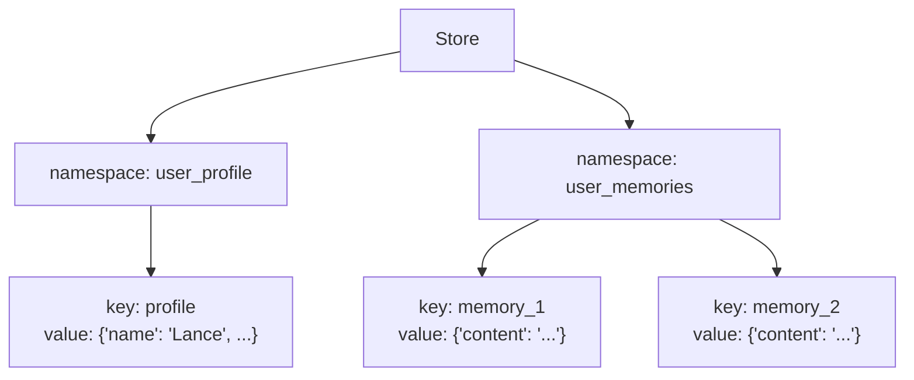
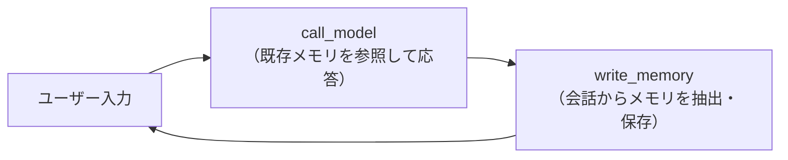

import Quiz from '@/components/content/Quiz.astro'

## 概要

このレクチャーでは，LangGraph Memory Storeの基本的な使い方を学びます．`InMemoryStore` のAPI（`put`，`search`，`get`），名前空間（namespace）とキー（key）の概念を理解し，チェックポインター（短期メモリ）とStore（長期メモリ）を組み合わせたチャットボットを構築します．

## LangGraph Memory Store とは

LangGraph Memory Store は，スレッド間でメモリを保存・取得するためのオープンソースの永続的キーバリューストアです．

```python
from langgraph.store.memory import InMemoryStore

store = InMemoryStore()
```

## ストアの3つの基本概念

ストアにオブジェクトを保存する際は，3つの要素を指定します:

| 要素 | 説明 | 例え |
|------|------|------|
| namespace（名前空間） | データの分類カテゴリ | ディレクトリ |
| key（キー） | データの識別子 | ファイル名 |
| value（値） | 保存するデータ（dict形式） | ファイルの中身 |



## 基本API

### put: オブジェクトの保存

名前空間とキーを指定してデータを保存します．

```python
store.put(
    namespace=("user_profile", "lance123"),
    key="profile",
    value={"name": "Lance", "location": "San Francisco"}
)
```

### search: 名前空間内の検索

指定した名前空間内のオブジェクトを検索します．

```python
# 名前空間内のすべてのオブジェクトを取得
memories = store.search(namespace=("user_profile", "lance123"))
```

### get: 特定オブジェクトの取得

名前空間とキーを指定して特定のオブジェクトを取得します．

```python
# 特定のキーでオブジェクトを取得
profile = store.get(
    namespace=("user_profile", "lance123"),
    key="profile"
)
```

取得結果には，value（値），key（キー），namespace（名前空間），metadata（メタデータ）が含まれます．

## チャットボットへの組み込み

チェックポインター（短期メモリ）とStore（長期メモリ）を組み合わせたチャットボットを構築します．



### call_model ノード

ストアから既存のメモリを取得し，システムプロンプトに組み込んで応答を生成します．

```python
def call_model(state: MessagesState, config: RunnableConfig, *, store: BaseStore):
    # config からユーザーIDを取得
    user_id = config["configurable"]["user_id"]

    # 名前空間とキーでメモリを取得
    namespace = ("memory", user_id)
    key = "user_memory"
    existing_memory = store.get(namespace=namespace, key=key)

    # メモリをシステムプロンプトに組み込み
    if existing_memory:
        memory_content = existing_memory.value.get("memory", "No memory found")
    else:
        memory_content = "No memory found"

    system_msg = f"""You are a helpful assistant with memory.
If you have memory, use it to personalize responses.
Here is your memory: {memory_content}"""

    response = model.invoke([SystemMessage(content=system_msg)] + state["messages"])
    return {"messages": [response]}
```

### write_memory ノード

会話履歴と既存のメモリをLLMに渡し，更新されたメモリを生成してストアに保存します．

```python
def write_memory(state: MessagesState, config: RunnableConfig, *, store: BaseStore):
    user_id = config["configurable"]["user_id"]
    namespace = ("memory", user_id)
    key = "user_memory"

    # 既存メモリを取得
    existing_memory = store.get(namespace=namespace, key=key)
    existing_content = existing_memory.value.get("memory", "") if existing_memory else ""

    # LLMでメモリを更新
    prompt = f"""Review the chat history and update user information.
Existing memory: {existing_content}"""

    new_memory = model.invoke(
        [SystemMessage(content=prompt)] + state["messages"]
    )

    # ストアに保存
    store.put(namespace=namespace, key=key, value={"memory": new_memory.content})
```

### グラフの構築

チェックポインターとストアの両方を指定してグラフをコンパイルします．

```python
from langgraph.checkpoint.memory import MemorySaver

builder = StateGraph(MessagesState)
builder.add_node("call_model", call_model)
builder.add_node("write_memory", write_memory)
builder.add_edge(START, "call_model")
builder.add_edge("call_model", "write_memory")
builder.add_edge("write_memory", END)

# チェックポインター（短期）+ Store（長期）で構築
checkpointer = MemorySaver()
graph = builder.compile(checkpointer=checkpointer, store=store)
```

## 実行例

```python
# スレッド1: ユーザー情報の提供
config = {"configurable": {"thread_id": "thread-1", "user_id": "lance123"}}
graph.invoke(
    {"messages": [HumanMessage(content="Hi! I'm Lance. I like biking around SF.")]},
    config=config
)

# スレッド2（新しいスレッド，同じユーザー）: メモリが引き継がれる
config2 = {"configurable": {"thread_id": "thread-2", "user_id": "lance123"}}
graph.invoke(
    {"messages": [HumanMessage(content="Where should I go biking?")]},
    config=config2
)
# → San Francisco周辺のバイキングスポットを提案（メモリからユーザー情報を取得）
```

スレッド2ではユーザーが居住地を伝えていないにもかかわらず，ストアに保存されたメモリからSan Franciscoの情報を取得し，パーソナライズされた応答を生成します．

## LangSmith での確認

LangSmithでトレースを確認すると，`call_model` ノードのシステムプロンプトにメモリが組み込まれていることが分かります．新しいスレッドでもストアからメモリが読み込まれ，応答のパーソナライズに使用されます．

## LangGraph Studio での可視化

LangGraph Studioのメモリタブでは，ストアに保存されたメモリを名前空間ごとに確認できます:

- 名前空間: `memory` → ユーザーID
- キー: `user_memory`
- 値: ユーザープロファイル情報

## まとめ

- LangGraph Store はスレッド間でメモリを永続化するキーバリューストア
- `put`（保存），`search`（検索），`get`（取得）の3つのAPIで操作
- 名前空間（namespace）でデータを分類し，キー（key）で個別のデータを識別
- `builder.compile(checkpointer=..., store=...)` でチェックポインター（短期）とStore（長期）を統合
- ユーザーIDで名前空間を管理し，パーソナライズされた応答を実現

<Quiz questions={[
  {
    question: "LangGraph Storeにオブジェクトを保存する際に必要な3つの要素は何ですか？",
    options: [
      "ユーザーID，パスワード，データ",
      "名前空間（namespace），キー（key），値（value）",
      "テーブル名，カラム名，データ型",
      "ファイル名，拡張子，内容"
    ],
    answer: 1,
    explanation: "LangGraph Storeでは名前空間（ディレクトリのようなもの），キー（ファイル名のようなもの），値（dict形式のデータ）の3つを指定してオブジェクトを保存します．"
  },
  {
    question: "チェックポインター（短期メモリ）とStore（長期メモリ）を統合するには，どのようにグラフをコンパイルしますか？",
    options: [
      "builder.compile(memory=store)",
      "builder.compile(checkpointer=checkpointer, store=store)",
      "builder.compile(short_term=checkpointer, long_term=store)",
      "builder.compile(storage=store)"
    ],
    answer: 1,
    explanation: "builder.compile()にcheckpointerパラメータとstoreパラメータの両方を渡すことで，短期メモリ（チェックポインター）と長期メモリ（Store）を統合したグラフを構築できます．"
  },
  {
    question: "Storeの名前空間（namespace）にユーザーIDを含める理由は何ですか？",
    options: [
      "セキュリティのため暗号化する必要があるから",
      "ユーザーごとにメモリを分離し，パーソナライズされた応答を提供するため",
      "データベースのテーブル名として使用するため",
      "APIキーの認証に必要だから"
    ],
    answer: 1,
    explanation: "名前空間にユーザーIDを含めることで，各ユーザーのメモリを分離して管理でき，新しいスレッドでも同じユーザーIDのメモリを取得してパーソナライズされた応答を生成できます．"
  },
  {
    question: "新しいスレッドでユーザーが居住地を伝えていなくても，チャットボットがSan Franciscoのおすすめを提案できる理由は何ですか？",
    options: [
      "モデルがデフォルトでSan Franciscoを提案するようにプログラムされているから",
      "前のスレッドの会話がチェックポインターに保存されているから",
      "Storeに保存された長期メモリからユーザー情報を取得しているから",
      "ユーザーのIPアドレスから位置情報を取得しているから"
    ],
    answer: 2,
    explanation: "Storeに保存された長期メモリ（ユーザーがSan Franciscoに住んでいるという情報）が名前空間とユーザーIDに基づいて取得され，新しいスレッドのシステムプロンプトに組み込まれるため，パーソナライズされた応答が可能になります．"
  }
]} />
