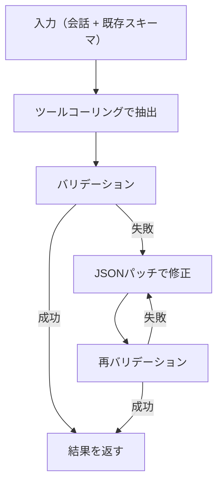

import Quiz from '@/components/content/Quiz.astro'

## 概要

このレクチャーでは，メモリを文字列ではなく構造化されたスキーマとして管理する方法を学びます．`with_structured_output` による構造化出力の基本を紹介した後，Trustcallライブラリが解決する2つの課題と，JSONパッチによる差分更新・バリデーション自動リトライの仕組みを解説します．

## 構造化されたメモリスキーマ

前回のレクチャーではメモリを単純な文字列として保存していました．しかし実際のアプリケーションでは，特定のスキーマに従った構造化されたデータとしてメモリを管理したい場合が多くあります．

### TypedDictによるスキーマ定義

```python
from typing import TypedDict

class UserProfile(TypedDict):
    user_name: str
    interests: list[str]

# インスタンスの作成
profile = UserProfile(user_name="Lance", interests=["biking", "bakeries"])

# dictとしてStoreに直接保存可能
store.put(namespace=("memory", user_id), key="user_profile", value=profile)
```

## with_structured_output

LangChainのチャットモデルインターフェースには `with_structured_output` メソッドがあり，出力をスキーマに従った構造に強制できます．

```python
from langchain_openai import ChatOpenAI

model = ChatOpenAI(model="gpt-4o")
model_with_structure = model.with_structured_output(UserProfile)

# 非構造化メッセージから構造化データを抽出
result = model_with_structure.invoke(
    [HumanMessage(content="Hi, I'm Lance. I like to bike.")]
)
# → UserProfile(user_name='Lance', interests=['biking'])
```

内部的には多くの場合，ツールコーリングを使用してスキーマへの準拠を強制しています．

## with_structured_output の限界

複雑なスキーマ（深いネスト，多数のフィールド）を使用すると，`with_structured_output` が失敗する場合があります:

```python
# 複雑なPydanticモデルの例
class ComplexProfile(BaseModel):
    personal_info: PersonalInfo
    contact: ContactInfo
    preferences: Preferences
    # ... 多くのネストされたフィールド

try:
    result = model_with_structure.invoke(messages)
except ValidationError as e:
    print(f"バリデーションエラー: {e}")
```

## Trustcall が解決する2つの課題

### 課題1: 複雑なスキーマの抽出が困難

`with_structured_output` は，スキーマが複雑になるほど信頼性が低下します．

### 課題2: 毎回全体を再生成すると情報が失われる

前回のチャットボットでは，メモリを更新するたびにスキーマ全体を再生成していました:

- トークンの無駄遣い（小さな変更でも全体を再生成）
- 大きなスキーマで情報が失われるリスク

## Trustcall の仕組み

Trustcallは，LangChainエンジニアが開発したJSONスキーマ更新のためのオープンソースライブラリです．



### 基本的な使い方

```python
from trustcall import create_extractor

# Pydanticモデルでスキーマを定義
class UserProfile(BaseModel):
    user_name: str
    interests: list[str]

# エクストラクターの作成
extractor = create_extractor(
    model,
    tools=[UserProfile],
    tool_choice="UserProfile"  # このスキーマへの抽出を強制
)

# 抽出の実行
result = extractor.invoke({
    "messages": [
        SystemMessage(content="Extract the user profile from the conversation."),
        HumanMessage(content="I'm Lance. I like biking around SF.")
    ]
})
```

### 結果の構造

Trustcallの結果には3つの要素が含まれます:

| 要素 | 説明 |
|------|------|
| `messages` | ツールコールを含むAIメッセージのリスト |
| `responses` | パースされたPydanticオブジェクト |
| `response_metadata` | 更新時のメタデータ（json_doc_idなど） |

## JSONパッチによる差分更新

Trustcallの大きな利点は，スキーマ全体を再生成する代わりに，JSONパッチ（差分のみ）を生成して更新する点です．

```python
# 既存のプロファイルを更新
result = extractor.invoke({
    "messages": [
        SystemMessage(content="Update the existing JSON doc."),
        HumanMessage(content="I also enjoy eating at bakeries.")
    ],
    "existing": {
        "UserProfile": schema.model_dump()  # 既存のスキーマを渡す
    }
})
# → interests に "bakeries" が追加される（他のフィールドは保持）
```

### バリデーション + リトライの自動化

1. ツールコーリングでスキーマを抽出
2. バリデーションを実行
3. エラーがあれば `PatchFunctionErrors` ツールで修正
4. 再バリデーション
5. 成功するまで繰り返し

## LangSmith での確認

LangSmithでTrustcallのトレースを確認すると，以下のステップが可視化されます:

1. `extract`: スキーマの抽出（ツールコーリング）
2. `validate`: バリデーションの実行
3. `patch`（エラー時）: JSONパッチによる修正
4. 再バリデーション

## Trustcall を使ったチャットボットの改良

```python
def write_memory(state: MessagesState, config: RunnableConfig, *, store: BaseStore):
    user_id = config["configurable"]["user_id"]
    namespace = ("memory", user_id)

    # 既存メモリの取得
    existing = store.get(namespace=namespace, key="user_profile")
    existing_profile = {
        "UserProfile": existing.value
    } if existing else None

    # Trustcallで更新
    result = extractor.invoke({
        "messages": [
            SystemMessage(content="Update the user profile."),
            *state["messages"]
        ],
        "existing": existing_profile
    })

    # 更新されたプロファイルをStoreに保存
    updated_profile = result["responses"][0].model_dump()
    store.put(namespace=namespace, key="user_profile", value=updated_profile)
```

### with_structured_output との違い

| 項目 | with_structured_output | Trustcall |
|------|----------------------|-----------|
| 複雑なスキーマ | 失敗する場合がある | 自動リトライで対応 |
| 更新方式 | 全体を再生成 | JSONパッチで差分更新 |
| 情報の保持 | 再生成時に情報喪失のリスク | 差分更新で情報を保持 |
| バリデーション | なし | 自動バリデーション + リトライ |

## まとめ

- `with_structured_output` はシンプルなスキーマの構造化出力に有効
- 複雑なスキーマや頻繁な更新にはTrustcallが適している
- TrustcallはJSONパッチによる差分更新で情報喪失を防ぐ
- バリデーションとリトライの自動化で信頼性を向上
- `create_extractor` でスキーマを指定し，`tool_choice` で抽出を強制
- LangSmithでTrustcallの内部動作を可視化できる

<Quiz questions={[
  {
    question: "with_structured_outputが使用している主な仕組みは何ですか？",
    options: [
      "正規表現によるパターンマッチング",
      "ツールコーリング（多くのプロバイダの場合）",
      "テンプレートエンジン",
      "データベースクエリ"
    ],
    answer: 1,
    explanation: "with_structured_outputは内部的にツールコーリングを使用して，モデルの出力を指定されたスキーマに準拠させています．プロバイダによってはJSONモードを使用する場合もあります．"
  },
  {
    question: "Trustcallが解決する2つの主な課題は何ですか？",
    options: [
      "処理速度の向上とコスト削減",
      "複雑なスキーマの抽出困難と，全体再生成による情報喪失",
      "セキュリティの向上とアクセス制御",
      "多言語対応とローカライゼーション"
    ],
    answer: 1,
    explanation: "Trustcallは，(1) 複雑なスキーマでwith_structured_outputが失敗する問題と，(2) 毎回スキーマ全体を再生成することによるトークンの無駄遣いと情報喪失の問題を解決します．"
  },
  {
    question: "TrustcallのJSONパッチによる更新の利点は何ですか？",
    options: [
      "データベースとの互換性が高い",
      "変更部分のみを更新するため，既存情報を保持しつつ効率的に更新できる",
      "暗号化されたデータを扱える",
      "リアルタイム同期が可能"
    ],
    answer: 1,
    explanation: "JSONパッチは変更が必要な部分のみを指定するため，スキーマ全体を再生成する必要がなく，既存の情報を保持しながら効率的に更新できます．"
  },
  {
    question: "Trustcallでバリデーションエラーが発生した場合，どのような処理が行われますか？",
    options: [
      "エラーを無視して続行する",
      "処理を中断してエラーを返す",
      "PatchFunctionErrorsツールで修正を試み，再バリデーションを実行する",
      "別のモデルに切り替えてリトライする"
    ],
    answer: 2,
    explanation: "Trustcallはバリデーションエラーが発生すると，PatchFunctionErrorsという内部ツールを使用してJSONパッチで修正を試み，再バリデーションを実行します．このループを成功するまで繰り返します．"
  }
]} />
