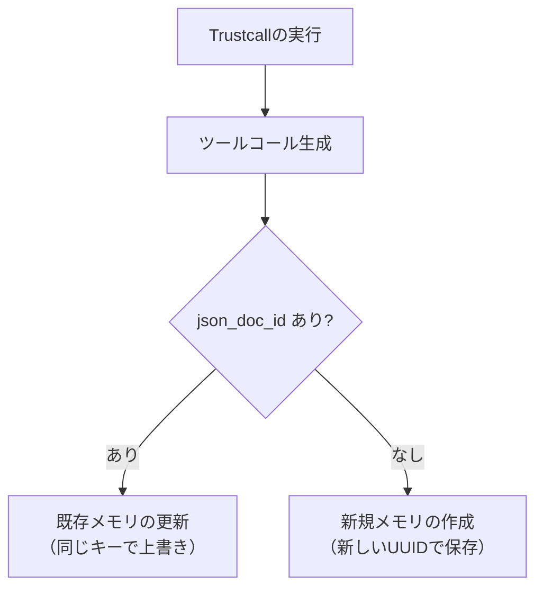
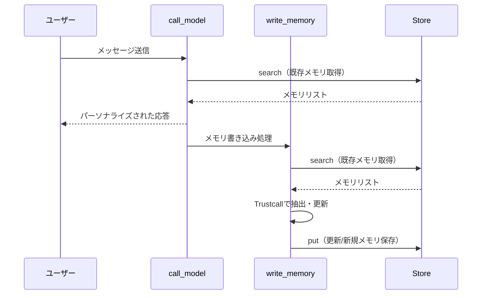

import Quiz from '@/components/content/Quiz.astro'

## 概要

このレクチャーでは，プロファイル（単一ドキュメント）に対して，コレクション（リスト形式）のメモリスキーマの設計と管理方法を学びます．UUIDキーによる複数メモリの管理，Trustcallの `enable_inserts=True` による新規追加と既存更新の仕組み，`json_doc_id` による既存メモリの特定について解説します．

## プロファイル vs コレクション

前回のレクチャーではプロファイル（単一ドキュメント）としてメモリを管理しました．このレクチャーでは，コレクション（リスト形式）のメモリ管理を扱います．

| 方式 | プロファイル | コレクション |
|------|------------|------------|
| 構造 | 単一ドキュメント | 複数アイテムのリスト |
| キー | 固定（常に同じキーで上書き） | 各アイテムにUUIDを割り当て |
| 用途 | ユーザー情報 | ToDoリスト，メモリコレクション |
| 更新 | 既存の上書き | 追加・更新の両方 |

## コレクションスキーマの設計

```python
from pydantic import BaseModel

class Memory(BaseModel):
    content: str

# with_structured_outputで抽出
model_with_structure = model.with_structured_output(list[Memory])
result = model_with_structure.invoke(
    [HumanMessage(content="I'm Lance. I like to bike.")]
)
# → [Memory(content="My name is Lance"), Memory(content="I like to bike")]
```

## UUIDキーによる複数メモリの管理

コレクションでは，各メモリにユニークなUUIDをキーとして割り当ててStoreに保存します．

```python
import uuid

for memory in collection:
    store.put(
        namespace=("memories", user_id),
        key=str(uuid.uuid4()),  # 各メモリに固有のUUID
        value=memory.model_dump()
    )

# 名前空間内のすべてのメモリを検索
all_memories = store.search(namespace=("memories", user_id))
```

プロファイルでは固定キーで常に上書きしていたのに対し，コレクションでは各アイテムに固有のUUIDを割り当てることで，複数のメモリを個別に管理できます．

## Trustcall の enable_inserts

Trustcallの `enable_inserts=True` を使うと，既存メモリの更新と新規メモリの追加を同時に処理できます．

```python
from trustcall import create_extractor

extractor = create_extractor(
    model,
    tools=[Memory],
    tool_choice="Memory",
    enable_inserts=True  # 新規追加を有効化
)
```

### 新規メモリの抽出

```python
result = extractor.invoke({
    "messages": [
        SystemMessage(content="Extract memories from the conversation."),
        HumanMessage(content="I had a great bike ride in SF this morning.")
    ]
})
# → Memory(content="Had a bike ride in SF this morning")
```

### 既存メモリの更新 + 新規追加

既存のメモリをタプル形式（ID，ツール名，dict）で渡すと，Trustcallが自動的に更新と新規追加を判断します．

```python
# 既存メモリをタプル形式で準備
existing_memories = [
    (memory_id, "Memory", memory_dict)
    for memory_id, memory_dict in stored_memories
]

result = extractor.invoke({
    "messages": [
        SystemMessage(content="Update and extract memories."),
        HumanMessage(content="After my ride, I ate a croissant at Tartine.")
    ],
    "existing": existing_memories
})
```

## json_doc_id による既存メモリの特定



Trustcallのレスポンスメタデータに `json_doc_id` が含まれている場合，それは既存のメモリが更新されたことを示します:

- `json_doc_id` あり: 既存メモリの更新（そのIDのキーで上書き保存）
- `json_doc_id` なし: 新規メモリの作成（新しいUUIDで保存）

```python
for response, metadata in zip(result["responses"], result["response_metadata"]):
    doc_id = metadata.get("json_doc_id")
    if doc_id:
        # 既存メモリの更新 → 同じキーで上書き
        key = doc_id
    else:
        # 新規メモリの作成 → 新しいUUID
        key = str(uuid.uuid4())

    store.put(
        namespace=("memories", user_id),
        key=key,
        value=response.model_dump()
    )
```

## コレクション型チャットボットの構築

### call_model ノード

プロファイル方式との違いは，`get`（単一取得）ではなく `search`（リスト取得）を使う点です．

```python
def call_model(state: MessagesState, config: RunnableConfig, *, store: BaseStore):
    user_id = config["configurable"]["user_id"]
    namespace = ("memories", user_id)

    # searchでリストとして取得（プロファイルではgetを使用）
    existing_memories = store.search(namespace=namespace)

    # メモリをプロンプトにフォーマット
    formatted_memories = "\n".join(
        f"- {mem.value.get('content', '')}" for mem in existing_memories
    )

    system_msg = f"""You are a helpful assistant with memory.
Existing memories: {formatted_memories}"""

    response = model.invoke([SystemMessage(content=system_msg)] + state["messages"])
    return {"messages": [response]}
```

### write_memory ノード

```python
def write_memory(state: MessagesState, config: RunnableConfig, *, store: BaseStore):
    user_id = config["configurable"]["user_id"]
    namespace = ("memories", user_id)

    # 既存メモリをタプル形式で取得
    existing = store.search(namespace=namespace)
    existing_memories = [
        (mem.key, "Memory", mem.value) for mem in existing
    ]

    # Trustcallで更新 + 新規追加
    result = extractor.invoke({
        "messages": [
            SystemMessage(content="Extract and update memories."),
            *state["messages"]
        ],
        "existing": existing_memories
    })

    # 結果をStoreに保存
    for response, metadata in zip(result["responses"], result["response_metadata"]):
        doc_id = metadata.get("json_doc_id")
        key = doc_id if doc_id else str(uuid.uuid4())
        store.put(namespace=namespace, key=key, value=response.model_dump())
```

## 実行フロー



## まとめ

- コレクションは複数のメモリをリスト形式で管理する方式
- 各メモリにUUIDキーを割り当てて個別に管理
- Trustcallの `enable_inserts=True` で新規追加と既存更新を同時に処理
- `json_doc_id` の有無で既存更新か新規作成かを判断
- プロファイルでは `get`，コレクションでは `search` でメモリを取得
- コレクション方式はToDoリストなど，アイテムが増減するデータに適している

<Quiz questions={[
  {
    question: "プロファイル方式とコレクション方式の主な違いは何ですか？",
    options: [
      "プロファイルはJSON，コレクションはXML",
      "プロファイルは単一ドキュメントで固定キー，コレクションは複数アイテムでUUIDキー",
      "プロファイルは読み取り専用，コレクションは書き込み専用",
      "プロファイルはサーバー側，コレクションはクライアント側"
    ],
    answer: 1,
    explanation: "プロファイルは単一ドキュメントを固定キーで管理し常に上書きする方式です．コレクションは複数アイテムをそれぞれユニークなUUIDキーで管理し，追加・更新の両方が可能です．"
  },
  {
    question: "Trustcallのenable_inserts=Trueを設定すると何ができるようになりますか？",
    options: [
      "データベースへの直接挿入",
      "既存メモリの更新に加えて，新規メモリの追加も同時に処理できる",
      "メモリの自動削除",
      "バッチ処理の有効化"
    ],
    answer: 1,
    explanation: "enable_inserts=Trueを設定すると，Trustcallは既存のメモリを更新するだけでなく，新しいメモリをリストに追加することも同時に処理できるようになります．"
  },
  {
    question: "Trustcallのレスポンスメタデータにjson_doc_idが含まれている場合，何を意味しますか？",
    options: [
      "新規メモリが作成された",
      "メモリが削除された",
      "既存のメモリが更新された",
      "バリデーションエラーが発生した"
    ],
    answer: 2,
    explanation: "json_doc_idが含まれている場合，そのIDに対応する既存のメモリが更新されたことを示します．json_doc_idがない場合は新規メモリの作成を意味します．"
  },
  {
    question: "コレクション型チャットボットでメモリを取得する際，プロファイル方式と異なる点は何ですか？",
    options: [
      "APIキーが必要",
      "get（単一取得）ではなくsearch（リスト取得）を使用する",
      "キャッシュが必要",
      "非同期処理が必須"
    ],
    answer: 1,
    explanation: "プロファイル方式ではgetで単一のメモリオブジェクトを取得しますが，コレクション方式ではsearchで名前空間内のすべてのメモリをリストとして取得します．"
  }
]} />
