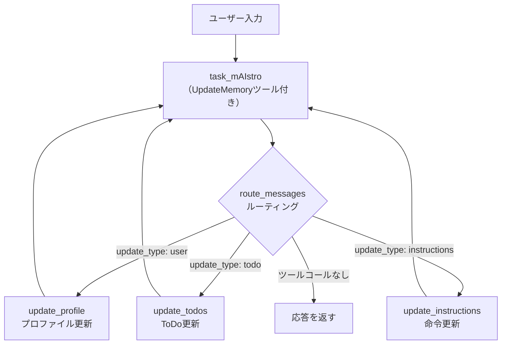
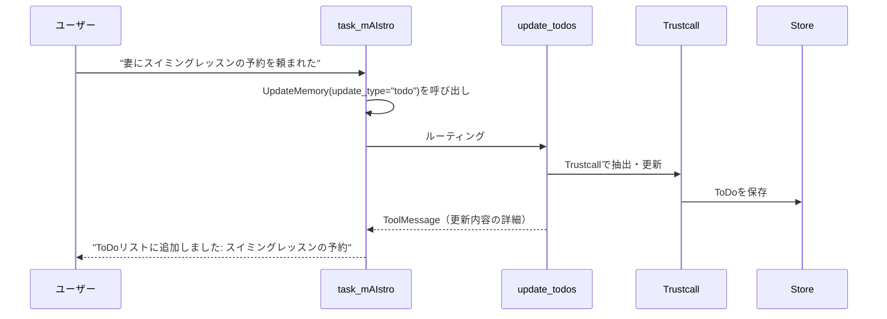

import Quiz from '@/components/content/Quiz.astro'

## 概要

このレクチャーでは，モジュール5の集大成として `task_mAIstro` エージェントをゼロから構築します．3つのメモリタイプ（プロファイル，ToDoコレクション，手続き型命令）を統合し，`UpdateMemory` ツールによるルーティング，Spyリスナーによる更新内容の可視化，ツールメッセージによるフィードバックループを実装します．

## task_mAIstro vs チャットボット

前回までのチャットボットとtask_mAIstroの違い:

| 項目 | チャットボット | task_mAIstro |
|------|-------------|-------------|
| メモリ保存の判断 | 常に会話を振り返って保存 | エージェントが保存するかどうかを判断 |
| メモリの種類 | プロファイルまたはコレクション | プロファイル + コレクション + 手続き型 |
| 制御フロー | 固定 | LLMが判断（エージェント的） |

## 全体アーキテクチャ



## 3つのメモリタイプ

### 1. プロファイル（セマンティックメモリ）

ユーザーの基本情報を単一ドキュメントとして管理します．

```python
class UserProfile(BaseModel):
    name: str | None = None
    location: str | None = None
    job: str | None = None
    connections: list[str] = []  # 家族，友人など
    interests: list[str] = []
```

### 2. ToDoコレクション（セマンティックメモリ）

ToDoアイテムのリストをコレクションとして管理します．

```python
class ToDo(BaseModel):
    task: str
    time_to_complete: str | None = None
    deadline: str | None = None
    solutions: list[str] = []
    status: str = "not started"  # not started, in progress, done
```

### 3. 手続き型命令（手続き型メモリ）

ToDo作成に関するユーザーの指示を管理します．

```python
# 例: "ToDoを作成するときは，地元のビジネスや利用可能なサービスも含めてください"
# → 命令として保存され，以降のToDo作成に反映
```

## UpdateMemory ツール

エージェントがメモリ更新の判断とルーティングを行うためのツールを定義します．

```python
class UpdateMemory(TypedDict):
    """エージェントが更新したいメモリのタイプを指定するツール"""
    update_type: Literal["user", "todo", "instructions"]
```

`update_type` の値に基づいて，対応するメモリ更新ノードにルーティングされます:

- `"user"` → `update_profile` ノード
- `"todo"` → `update_todos` ノード
- `"instructions"` → `update_instructions` ノード

## task_mAIstro ノード

メインのエージェントノードでは，3種類のメモリをすべて取得してシステムプロンプトに組み込みます．

```python
def task_maestro(state: MessagesState, config: RunnableConfig, *, store: BaseStore):
    user_id = config["configurable"]["user_id"]

    # 3種類のメモリを取得
    profile = store.get(("profile", user_id), "user_profile")
    todos = store.search(("todos", user_id))
    instructions = store.get(("instructions", user_id), "user_instructions")

    # フォーマット
    user_profile = profile.value if profile else "No profile found"
    todo_list = format_todos(todos)
    user_instructions = instructions.value if instructions else "No instructions"

    # システムプロンプトにメモリを組み込み
    system_msg = MODEL_SYSTEM_MESSAGE.format(
        profile=user_profile,
        todos=todo_list,
        instructions=user_instructions
    )

    # UpdateMemoryツールをバインドしたモデルで実行
    model_with_tools = model.bind_tools([UpdateMemory])
    response = model_with_tools.invoke(
        [SystemMessage(content=system_msg)] + state["messages"]
    )
    return {"messages": [response]}
```

### システムプロンプトの構造

```
あなたはメモリ機能を持つヘルパーアシスタントです．

現在のユーザープロファイル: {profile}
現在のToDoリスト: {todos}
現在の命令: {instructions}

以下のルールに従ってください:
- 個人情報の場合: UpdateMemoryツールをupdate_type="user"で呼び出す
- ToDoの場合: UpdateMemoryツールをupdate_type="todo"で呼び出す
- 指示の場合: UpdateMemoryツールをupdate_type="instructions"で呼び出す
- プロファイル更新はユーザーに通知しない
- ToDo更新はユーザーに通知する
- 命令更新はユーザーに通知しない
```

## ルーティング（route_messages）

```python
def route_messages(state: MessagesState):
    last_message = state["messages"][-1]

    # ツールコールがない場合 → 直接応答
    if not last_message.tool_calls:
        return END

    # ツールコールの引数からルーティング先を決定
    update_type = last_message.tool_calls[0]["args"]["update_type"]

    if update_type == "user":
        return "update_profile"
    elif update_type == "todo":
        return "update_todos"
    elif update_type == "instructions":
        return "update_instructions"
```

## Spy リスナーによる更新内容の可視化

Trustcallの内部で行われるツールコール（JSONパッチなど）を監視するために，Spyリスナーを使用します．

```python
class Spy:
    """Trustcallの内部ツールコールを監視するリスナー"""
    def __init__(self):
        self.called_tools = []

    def __call__(self, run):
        # ツールコールを収集
        # ...
```

### extract_tool_info 関数

Spyが収集したツールコール情報を人間が読みやすい形式にフォーマットします．

```python
def extract_tool_info(called_tools, schema_name):
    """Trustcallの更新情報をフォーマットして返す"""
    # PatchDocツールの内容を解析
    # 更新された内容，追加された内容を文字列として返す
    # 例: "Updated ToDo: 'Book swim lessons' - Added deadline: end of November"
```

## update_todos ノード（Spy活用）

```python
def update_todos(state: MessagesState, config: RunnableConfig, *, store: BaseStore):
    user_id = config["configurable"]["user_id"]
    namespace = ("todos", user_id)

    # 既存ToDoの取得
    existing = store.search(namespace=namespace)
    existing_memories = [(mem.key, "ToDo", mem.value) for mem in existing]

    # Spyリスナー付きエクストラクターで更新
    spy = Spy()
    extractor_with_spy = todo_extractor.with_listeners(spy)
    result = extractor_with_spy.invoke({
        "messages": state["messages"],
        "existing": existing_memories
    })

    # Storeに保存
    save_to_store(result, namespace, store)

    # Spyから更新情報を取得してツールメッセージとして返す
    tool_info = extract_tool_info(spy.called_tools, "ToDo")
    tool_message = ToolMessage(
        content=tool_info,
        tool_call_id=state["messages"][-1].tool_calls[0]["id"]
    )
    return {"messages": [tool_message]}
```

## ツールメッセージによるフィードバックループ



ツールメッセージでTrustcallの更新内容をエージェントに返すことで，エージェントはユーザーに正確なフィードバックを提供できます．

## update_instructions ノード

手続き型メモリの更新は，LLMにユーザーのフィードバックをもとに命令を書き換えさせます．

```python
def update_instructions(state: MessagesState, config: RunnableConfig, *, store: BaseStore):
    user_id = config["configurable"]["user_id"]
    namespace = ("instructions", user_id)

    # 既存の命令を取得
    existing = store.get(namespace=namespace, key="user_instructions")
    current_instructions = existing.value if existing else ""

    # LLMで命令を更新
    new_instructions = model.invoke([
        SystemMessage(content=f"Update instructions based on feedback. "
                      f"Current: {current_instructions}"),
        *state["messages"]
    ])

    # 保存
    store.put(namespace=namespace, key="user_instructions",
              value=new_instructions.content)

    # ツールメッセージを返す
    return {"messages": [ToolMessage(
        content="Instructions updated.",
        tool_call_id=state["messages"][-1].tool_calls[0]["id"]
    )]}
```

## 実行例

```python
config = {"configurable": {"thread_id": "1", "user_id": "lance123"}}

# 1. プロファイル更新
graph.invoke(
    {"messages": [HumanMessage(content="I'm Lance. I live in SF with my wife.")]},
    config=config
)
# → プロファイルが更新される（ユーザーには通知されない）

# 2. ToDo追加
graph.invoke(
    {"messages": [HumanMessage(content="Wife asked me to book swim lessons.")]},
    config=config
)
# → "ToDoリストに追加しました: スイミングレッスンの予約"

# 3. 命令更新
graph.invoke(
    {"messages": [HumanMessage(content="Always include local businesses in todos.")]},
    config=config
)
# → 命令が更新される（ユーザーには通知されない）

# 4. 新しいToDo（命令が反映される）
graph.invoke(
    {"messages": [HumanMessage(content="I need to fix the door lock.")]},
    config=config
)
# → ToDoに地元の業者情報も含まれる（命令が反映された結果）
```

## まとめ

- task_mAIstroは3つのメモリタイプを統合したエージェント: プロファイル + ToDoコレクション + 手続き型命令
- `UpdateMemory` ツールでエージェントがメモリ更新の種類を判断し，適切なノードにルーティング
- Spyリスナーを使ってTrustcallの更新内容を可視化
- ツールメッセージでフィードバックループを構築し，エージェントが正確な応答を生成
- 手続き型メモリにより，ユーザーの指示がToDo作成ルールに反映される
- メモリスキーマは完全にカスタマイズ可能で，自分のユースケースに合わせて変更できる

<Quiz questions={[
  {
    question: "task_mAIstroが管理する3つのメモリタイプの正しい組み合わせはどれですか？",
    options: [
      "テキスト，画像，音声",
      "プロファイル（ユーザー情報），ToDoコレクション，手続き型命令",
      "短期メモリ，中期メモリ，長期メモリ",
      "入力メモリ，処理メモリ，出力メモリ"
    ],
    answer: 1,
    explanation: "task_mAIstroはプロファイル（セマンティック：ユーザー情報），ToDoコレクション（セマンティック：タスクリスト），手続き型命令（手続き型：ToDo作成ルール）の3つのメモリタイプを管理します．"
  },
  {
    question: "UpdateMemoryツールの役割は何ですか？",
    options: [
      "メモリを直接更新する",
      "エージェントが更新したいメモリのタイプ（user/todo/instructions）を指定し，適切なノードにルーティングする",
      "メモリを削除する",
      "メモリをバックアップする"
    ],
    answer: 1,
    explanation: "UpdateMemoryツールはエージェントがupdate_type（user/todo/instructions）を指定して呼び出し，route_messagesが対応するメモリ更新ノードにルーティングします．"
  },
  {
    question: "Spyリスナーの主な目的は何ですか？",
    options: [
      "セキュリティ監視",
      "パフォーマンス計測",
      "Trustcallの内部ツールコール（JSONパッチなど）を監視し，更新内容を可視化する",
      "エラーログの記録"
    ],
    answer: 2,
    explanation: "SpyリスナーはTrustcallが内部で行うツールコール（PatchDocなど）を収集し，具体的にどのような変更が行われたかを可視化します．この情報はツールメッセージとしてエージェントに返されます．"
  },
  {
    question: "手続き型メモリ（命令更新）が活用される場面はどれですか？",
    options: [
      "ユーザーの名前を記憶するとき",
      "ToDoリストのアイテムを削除するとき",
      "ユーザーが「ToDoを作成するときは地元の業者情報も含めて」と指示したとき",
      "チャット履歴を要約するとき"
    ],
    answer: 2,
    explanation: "手続き型メモリはエージェントの動作ルールをユーザーが指定する場面で活用されます．例えば「地元の業者情報を含める」という指示は命令として保存され，以降のToDo作成に反映されます．"
  },
  {
    question: "ツールメッセージによるフィードバックループが重要な理由は何ですか？",
    options: [
      "APIのレート制限を回避するため",
      "Trustcallの更新内容をエージェントに伝え，ユーザーに正確なフィードバックを提供するため",
      "メモリの暗号化を行うため",
      "データベースのトランザクション管理のため"
    ],
    answer: 1,
    explanation: "ツールメッセージでTrustcallの具体的な更新内容（追加・変更された項目）をエージェントに伝えることで，エージェントはユーザーに正確で具体的なフィードバック（例: 'スイミングレッスンの予約をToDoに追加しました'）を返すことができます．"
  }
]} />
