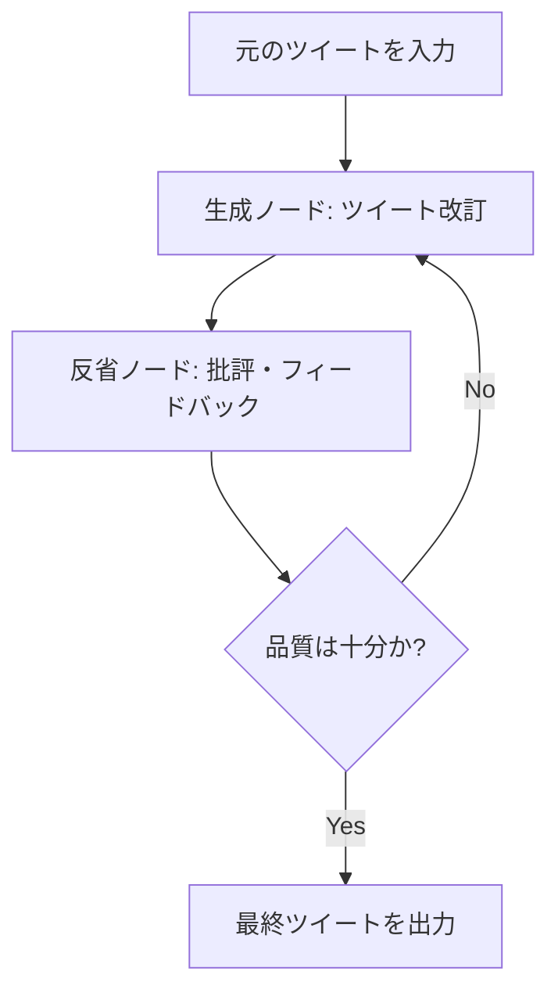

import Quiz from '@/components/content/Quiz.astro'

## 概要

このレクチャーでは，Reflectionエージェントの概要を説明します．LLMが自身の過去のアクションを振り返り，出力の品質を向上させるエージェントを，ツイート改善を例に構築します．

## Reflectionエージェントとは

Reflectionエージェントは，LLMに自身の出力を振り返らせ（reflect），学習と改善を繰り返すことで品質を向上させるツールです．

## プロジェクトの流れ

1. 元のツイートをエージェントに入力
2. Reflectionステップでフィードバック（批評）を生成
3. フィードバックを元にツイートを改訂
4. 改訂されたツイートを再度批評
5. 満足のいく品質になるまで繰り返す

## 実装の特徴

- 100行未満のコードで実装可能
- LangGraphが多くの処理を担う
- 生成と反省のサイクルをグラフで表現

## まとめ

- Reflectionエージェントは自己振り返りによる品質向上を実現
- ツイート改善を題材に，生成→批評→改訂のサイクルを構築
- LangGraphのサイクル機能を活用した簡潔な実装

<Quiz questions={[
  {
    question: "Reflectionエージェントの主な目的は何ですか?",
    options: [
      "LLMが自身の出力を振り返り品質を向上させること",
      "データベースからツイートを検索すること",
      "ユーザーの入力を自動的に翻訳すること",
      "Webスクレイピングでツイートを収集すること"
    ],
    answer: 0,
    explanation: "Reflectionエージェントは，LLMに自身の過去の出力を振り返らせ（reflect），批評と改善のサイクルを通じて品質を向上させるエージェントです．"
  },
  {
    question: "Reflectionエージェントのサイクルで正しい順序はどれですか?",
    options: [
      "批評 → 入力 → 改訂 → 出力",
      "入力 → 改訂 → 出力 → 批評",
      "入力 → 生成 → 批評 → 改訂（繰り返し）",
      "出力 → 批評 → 入力 → 生成"
    ],
    answer: 2,
    explanation: "Reflectionエージェントは，元の入力から生成し，その結果を批評（Reflection）し，フィードバックを基に改訂するサイクルを繰り返します．"
  },
  {
    question: "このプロジェクトで改善対象となるコンテンツは何ですか?",
    options: [
      "ブログ記事",
      "メールの文章",
      "Twitterの投稿（ツイート）",
      "プレゼンテーション資料"
    ],
    answer: 2,
    explanation: "このプロジェクトでは，Twitterの投稿（ツイート）を改善する題材を使ってReflectionエージェントを構築します．"
  },
  {
    question: "Reflectionエージェントの実装に必要なコード量はどのくらいですか?",
    options: [
      "500行以上",
      "約300行",
      "100行未満",
      "約1000行"
    ],
    answer: 2,
    explanation: "LangGraphが多くの処理を担うため，100行未満のコードでReflectionエージェントを実装できます．"
  },
  {
    question: "Reflectionエージェントで品質向上に最も重要な要素はどれですか?",
    options: [
      "大量のトレーニングデータ",
      "高速なGPUリソース",
      "生成と反省の反復サイクル",
      "複数のLLMモデルの並列実行"
    ],
    answer: 2,
    explanation: "Reflectionエージェントの品質向上は，生成→批評→改訂という反復サイクルによって実現されます．このサイクルを繰り返すことで，出力が段階的に改善されます．"
  }
]} />
