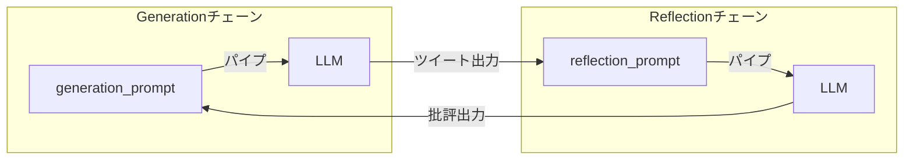

import Quiz from '@/components/content/Quiz.astro'

## 概要

このレクチャーでは，Reflectionエージェントのグラフ内で実行される2つのチェーンを実装します．批評（Reflection）チェーンと生成（Generation）チェーンです．

## Reflectionチェーン（批評チェーン）

```python
reflection_prompt = ChatPromptTemplate.from_messages([
    ("system",
     "You are a viral Twitter influencer. "
     "Generate critique and recommendation for the user's tweet. "
     "Always provide detailed recommendations including requests for "
     "length, virality, style, etc."),
    MessagesPlaceholder(variable_name="messages"),
])
```

ツイートを受け取り，改善のための批評と推奨事項を生成します．

## Generationチェーン（生成チェーン）

```python
generation_prompt = ChatPromptTemplate.from_messages([
    ("system",
     "You are a Twitter techie influencer assistant "
     "tasked with writing excellent Twitter posts. "
     "Generate the best Twitter post possible for the user's request. "
     "If the user provides critique, respond with a revised version "
     "of your previous attempts."),
    MessagesPlaceholder(variable_name="messages"),
])
```

ツイートを生成・改訂し，フィードバックに基づいて改善を繰り返します．

## チェーンの作成



```python
llm = ChatOpenAI()
generate_chain = generation_prompt | llm
reflect_chain = reflection_prompt | llm
```

LCELを使って，プロンプトテンプレートをLLMにパイプします．

## まとめ

- Reflectionチェーンはツイートの批評と改善提案を生成
- Generationチェーンはツイートの生成と改訂を担当
- MessagesPlaceholderで過去の履歴をプロンプトに注入
- LCELでプロンプトとLLMをシンプルに接続

<Quiz questions={[
  {
    question: "Reflectionチェーンの役割は何ですか?",
    options: [
      "ツイートを生成・改訂する",
      "ツイートの批評と改善提案を生成する",
      "ツイートをデータベースに保存する",
      "ツイートの文字数をカウントする"
    ],
    answer: 1,
    explanation: "Reflectionチェーンは，入力されたツイートに対して批評と改善のための推奨事項を生成する役割を担います．"
  },
  {
    question: "MessagesPlaceholderの目的は何ですか?",
    options: [
      "LLMのモデルを切り替える",
      "プロンプトに過去の会話履歴を動的に挿入する",
      "APIキーを安全に保存する",
      "エラーメッセージを表示する"
    ],
    answer: 1,
    explanation: "MessagesPlaceholderは，プロンプトテンプレート内に過去の会話履歴（メッセージリスト）を動的に挿入するためのプレースホルダーです．"
  },
  {
    question: "LCELでチェーンを作成する構文はどれですか?",
    options: [
      "chain = llm.connect(prompt)",
      "chain = prompt | llm",
      "chain = Chain(prompt, llm)",
      "chain = llm.pipe(prompt)"
    ],
    answer: 1,
    explanation: "LCELではパイプ演算子（|）を使って，プロンプトテンプレートをLLMに接続します．prompt | llm の形式でチェーンを作成します．"
  },
  {
    question: "Generationチェーンのシステムプロンプトでの役割設定は何ですか?",
    options: [
      "データサイエンティスト",
      "Twitterテック系インフルエンサーアシスタント",
      "ニュースキャスター",
      "SEOスペシャリスト"
    ],
    answer: 1,
    explanation: "Generationチェーンのシステムプロンプトでは，Twitter techie influencer assistantとして優れたツイートを生成・改訂する役割が設定されています．"
  },
  {
    question: "2つのチェーンが共有するコンポーネントはどれですか?",
    options: [
      "同じシステムプロンプト",
      "同じ出力パーサー",
      "同じLLMインスタンス",
      "同じMessagesPlaceholderの変数名"
    ],
    answer: 3,
    explanation: "両チェーンとも，MessagesPlaceholderでvariable_name='messages'という同じ変数名を使って会話履歴を受け取ります．LLMインスタンスも同じですが，最も重要な共通点はメッセージの受け渡し構造です．"
  }
]} />
