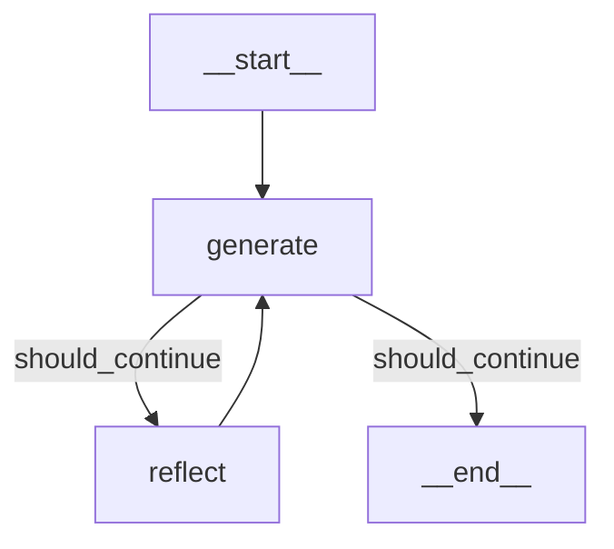

import Quiz from '@/components/content/Quiz.astro'

## 概要

このレクチャーでは，定義したチェーンをLangGraphのグラフとして組み立てます．ステートスキーマの定義，ノードの実装，エッジと条件付きエッジの設定を行い，Reflectionエージェントを完成させます．

## ステートスキーマ

```python
from typing import TypedDict, Annotated
from langgraph.graph import add_messages

class MessageGraph(TypedDict):
    messages: Annotated[list[BaseMessage], add_messages]
```

`add_messages`リデューサーにより，メッセージは置換ではなく追加されます．

## ノードの実装

### 生成ノード

```python
def generation_node(state: MessageGraph):
    response = generate_chain.invoke({"messages": state["messages"]})
    return {"messages": [response]}
```

### 反省ノード

```python
def reflection_node(state: MessageGraph):
    response = reflect_chain.invoke({"messages": state["messages"]})
    return {"messages": [HumanMessage(content=response.content)]}
```

批評の結果をHumanMessageとしてキャストするテクニックを使用します．LLMは人間のフィードバックに応答するよう訓練されているため，批評を人間のメッセージとして扱うことでより良い改訂結果が得られます．

## 条件付きエッジ

```python
def should_continue(state: MessageGraph) -> str:
    if len(state["messages"]) >= 6:
        return END
    return "reflect"
```

メッセージ数が6に達したら終了，それ以外はreflectノードへ遷移します．

## グラフの構築



```python
workflow = StateGraph(MessageGraph)
workflow.add_node("generate", generation_node)
workflow.add_node("reflect", reflection_node)
workflow.set_entry_point("generate")
workflow.add_conditional_edges("generate", should_continue, {END: END, "reflect": "reflect"})
workflow.add_edge("reflect", "generate")
app = workflow.compile()
```

## まとめ

- TypeDictとadd_messagesリデューサーでメッセージ追加型のステートを定義
- 批評結果をHumanMessageにキャストするプロンプトエンジニアリングテクニック
- メッセージ数による停止条件を条件付きエッジで実装
- reflect → generate の確定的エッジでサイクルを構成

<Quiz questions={[
  {
    question: "add_messagesリデューサーの役割は何ですか?",
    options: [
      "メッセージを置換して更新する",
      "メッセージを削除して初期化する",
      "新しいメッセージを既存のリストに追加する",
      "メッセージを暗号化して保存する"
    ],
    answer: 2,
    explanation: "add_messagesリデューサーは，ステートの更新時にメッセージを置換するのではなく，既存のリストに新しいメッセージを追加（append）する動作を実現します．"
  },
  {
    question: "反省ノードで批評結果をHumanMessageにキャストする理由は何ですか?",
    options: [
      "AIMessageだとエラーが発生するため",
      "LLMは人間のフィードバックに応答するよう訓練されているため",
      "HumanMessageの方がトークン数が少ないため",
      "LangGraphの仕様でAIMessageは使用できないため"
    ],
    answer: 1,
    explanation: "LLMは人間との会話やフィードバックに応答するよう訓練されているため，批評をHumanMessageとしてラベル付けすることで，より良い改訂結果が得られるプロンプトエンジニアリングテクニックです．"
  },
  {
    question: "should_continue関数がENDを返す条件は何ですか?",
    options: [
      "ツイートの品質スコアが閾値を超えた時",
      "LLMが終了を判断した時",
      "メッセージ数が6に達した時",
      "実行時間が制限を超えた時"
    ],
    answer: 2,
    explanation: "should_continue関数はメッセージ数が6に達したらENDを返し，それ以外はreflectノードへの遷移を指示します．"
  },
  {
    question: "条件付きエッジ（conditional edge）の特徴はどれですか?",
    options: [
      "常に同じノードに遷移する",
      "ルーティング関数の戻り値に基づいて遷移先が決まる",
      "ランダムに遷移先を選択する",
      "ユーザーの入力に基づいて遷移先が決まる"
    ],
    answer: 1,
    explanation: "条件付きエッジは，ルーティング関数（この場合はshould_continue）の戻り値に基づいて，次に実行するノードを動的に決定します．"
  },
  {
    question: "StateGraphの初期化時に渡すステートスキーマの役割は何ですか?",
    options: [
      "グラフの見た目を定義する",
      "ノード間で共有されるデータ構造と更新方法を定義する",
      "APIキーの認証を行う",
      "LLMのプロンプトテンプレートを設定する"
    ],
    answer: 1,
    explanation: "ステートスキーマは，グラフのノード間で共有されるデータ構造（どのキーがあるか）と，その更新方法（リデューサー）を定義します．全ノードがこのステートにアクセスし，更新します．"
  }
]} />
