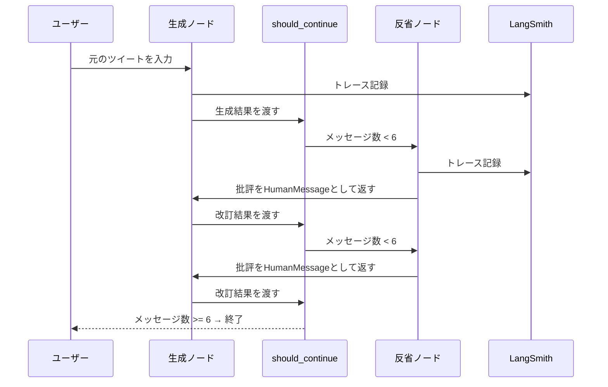

import Quiz from '@/components/content/Quiz.astro'

## 概要

このレクチャーでは，構築したReflectionエージェントを実行し，LangSmithでトレースを分析します．生成→批評→改訂のサイクルが実際にどのように動作するかを確認します．

## グラフの実行

LangChainのTool Calling機能に関する実際のツイートを入力として使用します．

## LangSmithでのトレース分析

トレースでは以下のことが確認できます．

- 実行時間: 約20秒（複数のLLM呼び出しのため）
- 最終プロンプト: すべての履歴（システムメッセージ，ユーザー入力，各イテレーションの生成と批評）を含む
- LangGraphオブジェクト（should_continue，reflectionノードなど）のトレーサビリティ

## 実行フロー

1. システムメッセージで役割を設定
2. ユーザーの元ツイートを入力
3. 生成ノードでツイートを改訂
4. 反省ノードで批評を生成
5. 批評に基づいて再度生成ノードで改訂
6. 停止条件に達するまで繰り返し

## まとめ

- Reflectionエージェントは批評アルゴリズムの簡潔な実装
- LangSmithでノード実行，条件分岐の詳細をリアルタイムで確認可能
- LangChainでも実装可能だが，LangGraphの方が圧倒的にシンプル
- グラフの各ステップとLLM呼び出しの履歴が完全にトレース可能

<Quiz questions={[
  {
    question: "Reflectionエージェントの実行に約20秒かかる理由は何ですか?",
    options: [
      "ネットワーク遅延が大きいため",
      "複数回のLLM API呼び出しが行われるため",
      "LangSmithのトレーシングが重いため",
      "データベースアクセスが多いため"
    ],
    answer: 1,
    explanation: "Reflectionエージェントは生成と批評のサイクルで複数回LLM APIを呼び出すため，合計で約20秒の実行時間がかかります．"
  },
  {
    question: "LangSmithのトレースで確認できないものはどれですか?",
    options: [
      "各ノードの実行時間",
      "LLMへの最終プロンプトの内容",
      "条件分岐の結果",
      "ユーザーのブラウザ情報"
    ],
    answer: 3,
    explanation: "LangSmithではノード実行，プロンプト内容，条件分岐などグラフの実行詳細を確認できますが，ユーザーのブラウザ情報はトレース対象外です．"
  },
  {
    question: "最終プロンプトに含まれる情報はどれですか?",
    options: [
      "システムメッセージのみ",
      "最新のイテレーションの結果のみ",
      "全履歴（システムメッセージ，ユーザー入力，各イテレーションの生成と批評）",
      "ユーザー入力と最終出力のみ"
    ],
    answer: 2,
    explanation: "最終プロンプトにはシステムメッセージ，ユーザーの元入力，各イテレーションでの生成結果と批評の全履歴が含まれます．"
  },
  {
    question: "LangGraphを使う利点として正しいものはどれですか?",
    options: [
      "LangChainでは実装不可能な機能を提供する",
      "LangChainでも実装可能だが，LangGraphの方が圧倒的にシンプル",
      "LangSmithなしでもトレーシングが可能",
      "GPT-4のみ対応している"
    ],
    answer: 1,
    explanation: "Reflectionエージェントの批評サイクルはLangChainでも実装可能ですが，LangGraphを使うと圧倒的にシンプルなコードで実現できます．"
  },
  {
    question: "LangSmithでトレース可能なLangGraphオブジェクトはどれですか?",
    options: [
      "Pythonの標準ライブラリのみ",
      "should_continue関数やreflectionノードなどのグラフオブジェクト",
      "外部APIへのHTTPリクエストのみ",
      ".envファイルの環境変数"
    ],
    answer: 1,
    explanation: "LangSmithはLangGraphのshould_continue関数，reflectionノードなどのグラフオブジェクトのトレーサビリティを提供します．"
  }
]} />
